# JavaWeb学习笔记

### 1.什么是web？


##### 1.1静态web？


web页面无法更新，用户看到的是同一个界面

无法与数据交互，数据无法持久化，用户无法交互

**https走的是443端口**

**http走的是80 端口**


##### 1.2动态web？

web页面随时更新，在不同时间地点，用户看到的界面都不一样

可以访问数据库（与后台进行数据交互）

它的内部原理是？


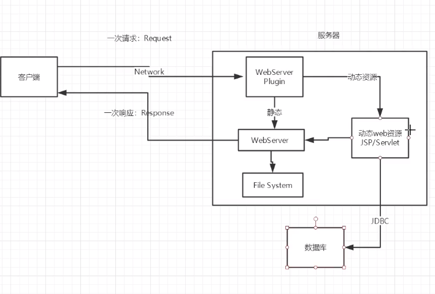

### 2.web服务器

##### 2.1技术讲解


##### 2.2web服务器


**什么是tomcat？**

Tomcat是Apache 软件基金会（Apache Software Foundation）的Jakarta 项目中的一个核心项目，最新的Servlet 和JSP 规范总是能在Tomcat 中得到体现。因为Tomcat 技术先进、性能稳定，而且免费，因而深受Java 爱好者的喜爱并得到了部分软件开发商的认可，成为目前比较流行的Web 应用服务器。

Tomcat 服务器是一个免费的开放源代码的Web 应用服务器，属于轻量级应用[服务器](https://baike.baidu.com/item/服务器)，在中小型系统和并发访问用户不是很多的场合下被普遍使用，是开发和调试JSP 程序的首选。

Tomcat 实际上运行JSP 页面和Servlet。目前Tomcat最新版本为**9.0.27。**

**java**

1.下载安装

2.了解配置文件和目录结构

**jdk/**

java软件开发工具包

bin：执行文件

include：一些c语言写的的头文件，win32：一些系统的底层

**jre/**

java运行时环境

lib：jar包，Java核心jar包：rt.jar 

面试会问：java的根加载机制:那些类从哪里来的-->rt.jar

3 .这个东西的作用

### 3.tomcat

##### 3.1安装tomcat

1.下载安装

2.了解配置文件和目录结构


**webapps：一个文件夹代表一个应用**

3.这个东西时干嘛的：服务器

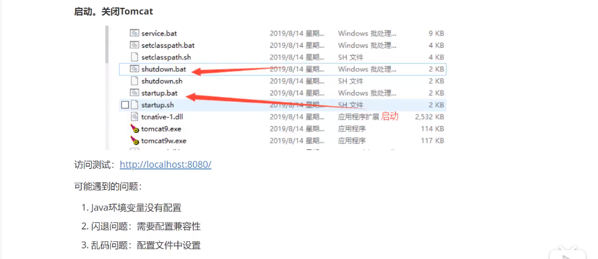

##### 3.2配置

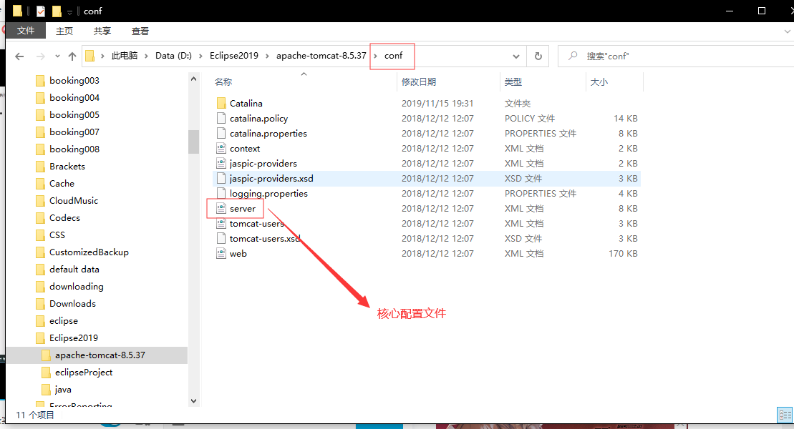

可以配置主机的端口号：

- tomcat的默认端口号为：8080
- mysql：3306
- http：80
- https：443


可以配置主机的名称：需要先去底层映射

- 默认的主机名称为：localhost--->127.0.01
- 默认的网站应用存放地为：webapps；

在C:\Windows\System32\drivers\etc\hosts配置文件下修改

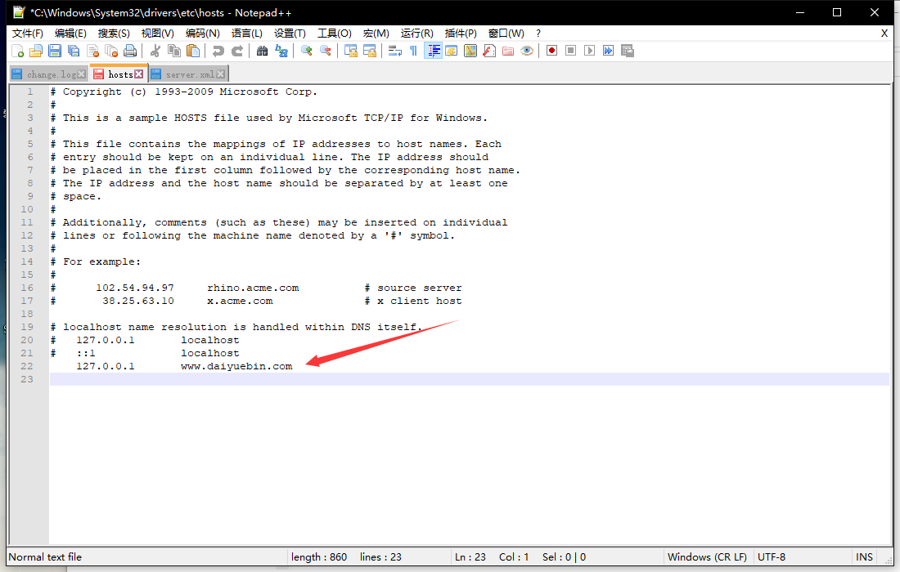

然后在配置文件修改域名


##### 高难度面试题

网站时如何进行访问的?

1.输入一个域名点击回车

2.首先检查本机的C:\Windows\System32\drivers\etc\hosts配置文件下有没有域名的映射

有：直接返回对应的ip地址，在这个地址中，有我们要访问的web程序

没有：去DNS服务器上去找，找到就直接返回，找不到就返回找不到

DNS服务器：全世界的域名都在这里管理

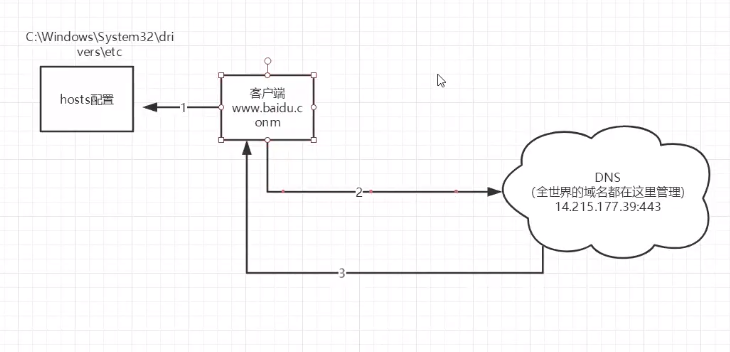

##### 3.3发布一个web网站

不会就先模仿

- 将自己写的网站，放到服务器（Tomcat）中的指定的web应用文件夹(webapps)下，然后就可以进行访问了

  ```java
  --webapps:Tomcat服务器的web目录
      -ROOT
      -dybweb：网站的目录名
      	-WEB-INF
      		-classes:java程序
              -lib:web应用所依赖的jar包
              -web.xml网站配置文件
          -index.html默认的首页
          -static
               -css
                  -style.css
               -js
               -img
           -....
  ```

  

### 4.Http

##### 4.1http是什么？

HTTP（超文本传输协议）是一个简单的请求-响应协议，它通常运行在TCP之上。

- 文本：html，字符串，。。。
- 超文本：图片，音乐，视频，定位
- 端口：80

Https：安全的

- 端口：443

##### 4.2.两个时代

- http1.0
  - HTTP/1.0:客户端可与web服务器连接后，只能获得一个web资源  然后断开链接

- http2.0
  - HTTP/1.1:客户端与web服务器连接后，可获得多个web资源

##### 4.3.Http请求

- 客户端：发送请求（Request）--->服务器

  举例百度：

  ```java
  Request URL: https://www.baidu.com/ 请求地址
  Request Method: GET       请求方法 GET/POST
  Status Code: 200 OK       状态码：请求成功
  Remote Address: 14.215.177.39:443   远程服务器地址  
  
  ```

  ```java
  Accept: text/html,   编码
  Accept-Encoding: gzip,  
  Accept-Language: zh-CN,zh;q=0.9   语言
  Connection: keep-alive    连接状态：保持链接
  ```

  

  ##### 1，请求行

  

  - 请求行中的请求方式：GET
  - 请求方式：**Get，Post**，HEAD,DELETE,PUT,TRACT..
    -  get：请求能够携带的参数较少，大小有限制，会在浏览器的URL地址栏显示数据内容，不安全，但高效
    - post：请求能够携带的数据没有限制，大小也没有限制，不会在URL地址栏上显示信息，安全，但不高效

  ##### 2，消息头

  ```java
  Accept: 告诉浏览器，它所支持的数据类型
  Accept-Encoding: 支持哪种编码格式：GBK,UTF-8,GBK2312,ISO8859-1
  Accept-Language: 告诉浏览器它的语言环境
  Cache-Control：缓存控制
  Connection: 告诉浏览器，请求完成的状态是断开的还是保持连接
  Host：主机。。/
  ```

  

##### 4.4.http响应

- 服务器---响应--->客户端

  百度例子：

  ```java
  Cache-Control: private  缓存类型
  Connection: Keep-Alive  连接状态
  Content-Encoding: gzip  编码格式
  Content-Type: text/html 数据类型
  ```

  

##### 1.响应体

```java
Accept: 告诉浏览器，它所支持的数据类型
Accept-Encoding: 支持哪种编码格式：GBK,UTF-8,GBK2312,ISO8859-1
Accept-Language: 告诉浏览器它的语言环境
Cache-Control：缓存控制
Connection: 告诉浏览器，请求完成的状态是断开的还是保持连接
Host：主机。。/
Refrush:告诉客户端，多久刷新一次
Location：让网页从新定位；     
```

##### 2.响应状态码

200：请求成功

3xx：请求重定向

- 重定向：重新去找我给你的位置；

4xx：找不到资源

- 资源不存在：404；

5xx：服务器代码错误   500，502：网关错误


**常见面试题：当你在浏览器地址栏中输入地址回车到页面出现，浏览器经历了什么（或者说有哪些中间过程）？**

### 5.Maven

1.在javaweb开发中需要大量的jar包，手动导入非常麻烦

2.如何让一个工具帮我们自动导入和配置jar包

Maven由此诞生

##### 5.1Maven项目架构管理工具

maven的核心思想：约定大于配置

- ##### 有约束，不要去违反

  Maven  会规定好你该如何让去编写我们的java代码，必须按照这个规范来；

##### 5.2下载安装Maven


下载安装

##### 5.3配置环境变量

在系统环境变量里面配置

M2_HOME:  D:\java\apache-maven-3.6.3\bin

MAVEN_HOME:  D:\java\apache-maven-3.6.3

在path中添加：%MAVEN_HOME%\bin

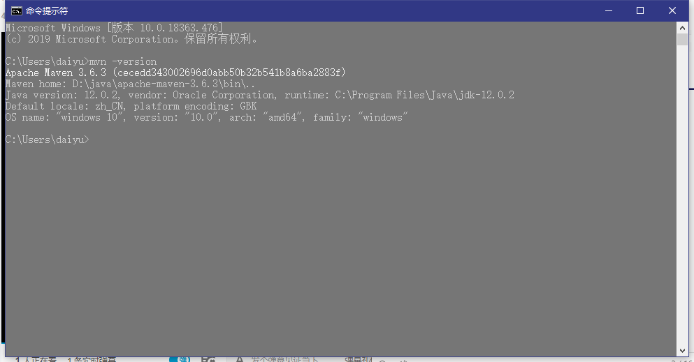

测试：安装配置成功

##### 5.4配置阿里云镜像

- 镜像：mirror

  - 作用：加速下载

  

  镜像

  - 作用：加速下载

- 国内推荐使用阿里云镜像

```xml
<mirror>
　　<id>alimaven</id>
　　<mirrorOf>central</mirrorOf>
　　<name>aliyun maven</name>
　　<url>http://maven.aliyun.com/nexus/content/groups/public/</url>
 </mirror>
```

##### 5.5配置本地仓库

本地仓库，远程仓库

**建议一个本地仓库:Repository****

```xml
	 <localRepository>D:\java\apache-maven-3.5.4\maven-repo</localRepository>
```

##### 5.6Maven在idea中的配置

1.启动idea

2.创建一个MavenWeb项目

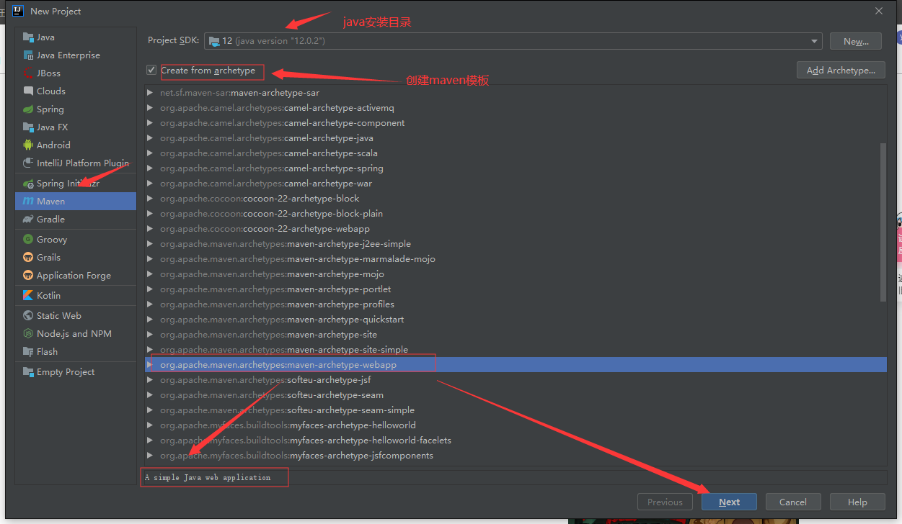

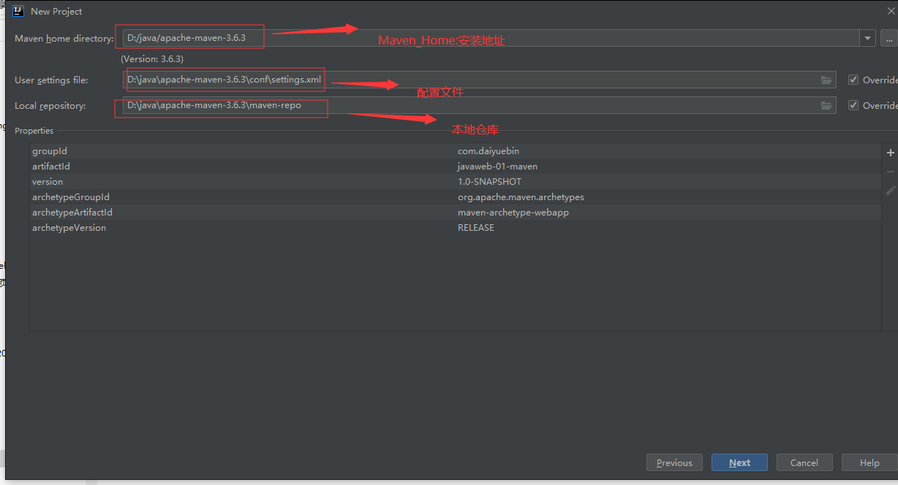

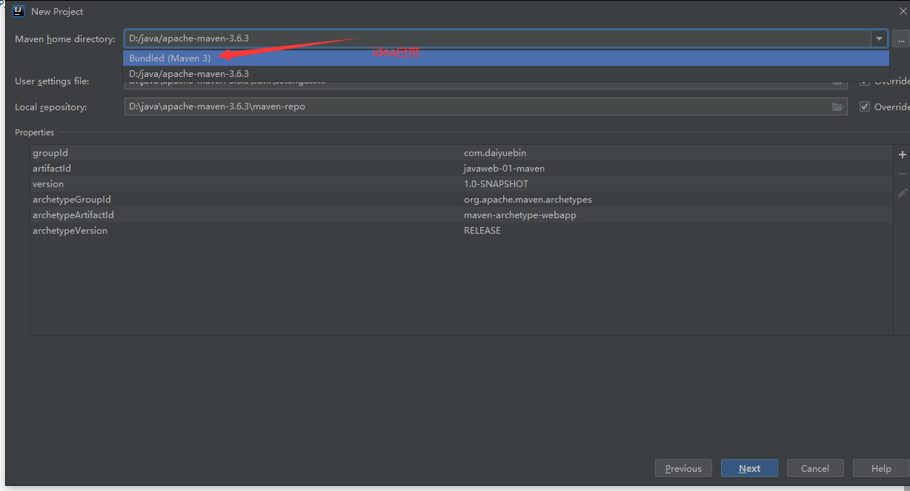

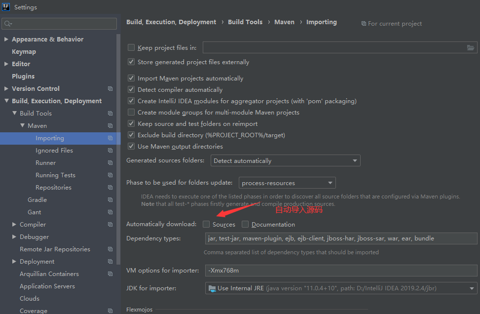

到这里maven项目就算创建成功了

##### 5.7创建一个干净的maven项目


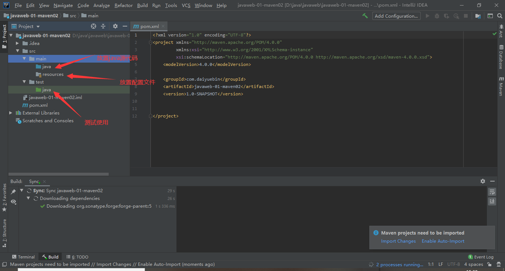只有在web应用下才会有


##### 5.8标记文件夹功能


方式二

