# MYSQL学习笔记续

## 数据库基础续：

### 一 ，约束

 

含义：为了限制表中的数据，以保证表中数据的准确性和可靠性，也可以说一致性； 

**1.六大约束：** 

1.非空：NOT  NULL     用于保证该字段的值不能为空 

2.默认：DEFAULT       保证该字段有默认值 

3.主键：PRIMARY KEY         用于保证该字段的值具有唯一性并且非空，比如学号 员工编号，只要是主键默认非空 

4.唯一：UNIQUE    用于保证字段值唯一，可以为空 比如座位号 

5.检查约束：CHECK(MySQL中不适用)   比如年龄，性别 

6.外键：FOREIGN KEY  用于限制两张的关系，保证该字段的值必须来自主键关联列的值 

在从表添加外键约束，用于引用主表主键的值 ，比如学生的专业编号，员工表的工种编号 


**2.添加约束的时机：** 

​	1.创建表时 

​	2.修改表时 

**3.约束添加的分类：** 

​	1.列级约束 

​	六大约束都支持，但检查约束在mysql中没有效果 

​	2.表级约束 

​	除了非空和默认，其余都可

**4.添加列级约束语法**

注意：列级约束只支持 默认，非空，主键，唯一

语法：

```mysql
#添加列及约束

create table stuinfo(
				id INT PRIMARY KEY,#主键
				stuName VARCHAR(20) NOT NULL,#非空
				seat INT UNIQUE,#唯一
				gender	CHAR(1) CHECK(gender='男'OR gender='女'),
				age INT DEFAULT 18,#默认
				majorid INT  REFERENCES major(id) #添加外键，这样添加不支持；
)
create table major(
				majorId INT PRIMARY KEY,
				majorNmae VARCHAR(20) NOT NULL
				
);
#查看索引
show INDEX from stuinfo
#删表
drop table if exist  表名;
```

**5.添加标级约束语法：**

语法：在各个字段最下面

【CONSTRAINT 约束名】  约束类型（字段名） *注：约束名可以不写，*

```mysql
#添加表级约束
create table stuinfo(
				id INT ,
				stuName VARCHAR(20) NOT NULL,
				seat INT ,
				gender	CHAR(1),
				age INT DEFAULT 18,#默认
				majorid INT,
				CONSTRAINT PK PRIMARY KEY  (id),
				CONSTRAINT UQ UNIQUE(seat),
				CONSTRAINT CK CHECK(gender='男'or gender='女'),
				CONSTRAINT FK_major_stuinfo FOREIGN KEY (id) REFERENCES major(majorId)
		);
```


什么时候添加表级约束，什么时候添加列级约束？

通用写法;

```mysql
CREATE TABLE stuinfo(
							id INT PRIMARY KEY,
							stuName VARCHAR(20) NOT NULL,
							seat INT UNIQUE,
							gender	CHAR(1) CHECK(gender='男' or gender='女'),
							age INT DEFAULT 18,#默认
							majorid INT,
							CONSTRAINT FK_major_stuinfo FOREIGN KEY (majorid) REFERENCES major(majorId)
);
```


**面试：关于主键和唯一的区别**？

主键（PRIMARY KEY）：保证唯一性，不能为空，一张表只能有一个主键，允许组合主键

唯一(UNIQUE):保证唯一性，能为空，一张表可有多个，允许组合主键


什么叫做组合主键：两个字段组成一个主键(一般不推荐使用);

```mysql
create table stuinfo(
				id INT ,
				stuName VARCHAR(20) NOT NULL,
				seat INT ,
				gender	CHAR(1),
				age INT DEFAULT 18,#默认
				majorid INT,
				CONSTRAINT PK PRIMARY KEY  (id,stuName),
				CONSTRAINT UQ UNIQUE(seat),
				CONSTRAINT CK CHECK(gender='男'or gender='女'),
				CONSTRAINT FK_major_stuinfo FOREIGN KEY (majorid) REFERENCES major(majorId)
		);
```

外键（FOREIGN）:

1.要求在从表设置外键关系

2.从表的外键字段的值类型必须和主表的关联的值类型一致或者兼容，名称无要求

3.主表的关联的列类型必须是一个key：（类型：主键或者唯一） 

4.插入数据：先插入主表，再插入从表，  删除数据时：先删除从表，再删除主表；


##### 6.修改表时添加约束

```mysql
#添加非空约束
ALTER TABLE stuinfo1 MODIFY COLUMN stuName varchar(20) not null;
#添加默认约束
ALTER TABLE stuinfo1 MODIFY COLUMN age int default 18;
#添加主键 1.列级 2.表级
ALTER TABLE stuinfo1 MODIFY COLUMN id int PRIMARY KEY;
ALTER TABLE stuinfo1 ADD PRIMARY KEY(id);

#添加唯一  1.列级 2.表级
ALTER TABLE stuinfo1 MODIFY COLUMN seat INT UNIQUE;
ALTER TABLE stuinfo1 ADD UNIQUE(seat);

#添加外键
ALTER TABLE stuinfo1 ADD FOREIGN KEY(majorId) REFERENCES major(majorid);

```

##### 7.修改表时删除约束

```mysql
#删除非空约束
ALTER TABLE stuinfo1 MODIFY COLUMN stuName varchar(20)null;
#删除默认约束
ALTER TABLE stuinfo1 MODIFY COLUMN age int;
#删除主键 
ALTER TABLE stuinfo1 DROP PRIMARY KEY;

#删除唯一  
ALTER TABLE stuinfo1 DROP INDEX seat;


#删除外键
ALTER TABLE stuinfo DROP FOREIGN KEY FK_major_stuinfo;
```

##### 8.表的复制

```MYSQL
#只复制表的结构
CREATE TABLE TAL_NAME LIKE 复制的表名;
#复制表的内容
CREATE TABLE TAL_NAME 
SELECT * FROM 复制的表名;
```

## 数据库高级续：

**查看字符集：**

1.show variables like  "character%";

2.sow variables like  "char%";

**mysql主要配置文件：****

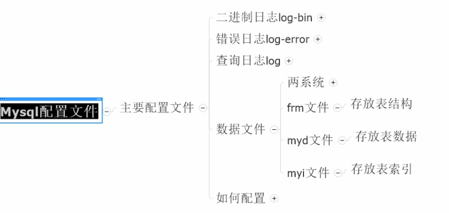

**mysql总体架构**

1.连接层

2.业务逻辑处理服务层

3.可拔插引擎层

4.文件存储层

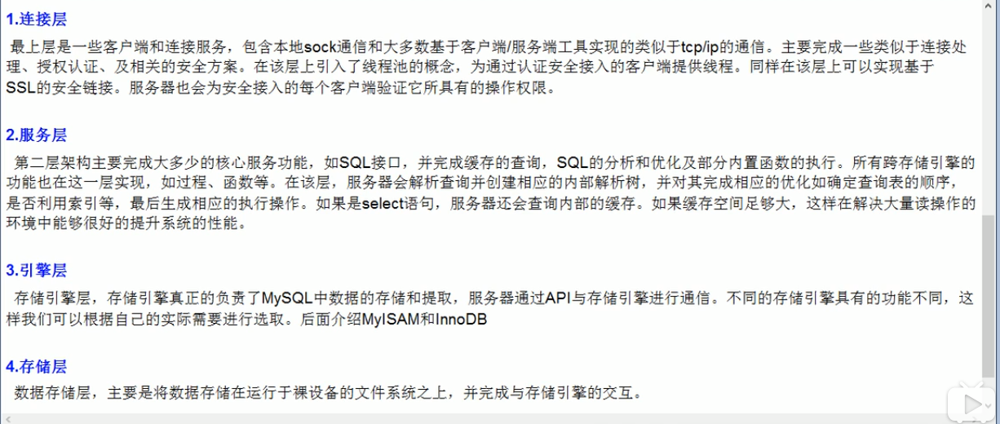


**查看你的mysql默认的存储引擎：**

show variables like "%storage_engine%";

**查看mysql支持哪些引擎：**

show engines;

**MYISAM和InnoDB的区别**

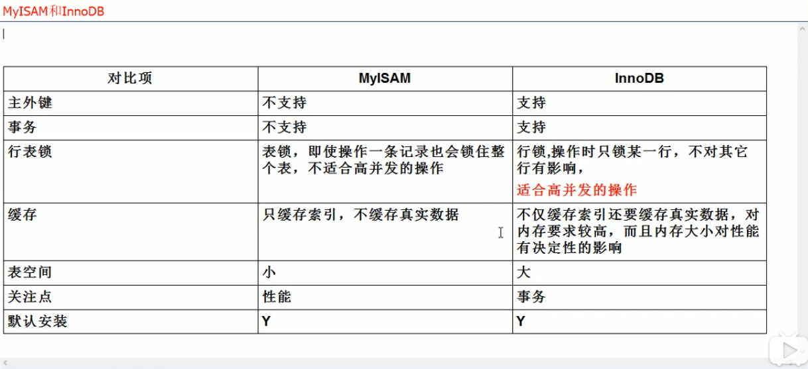

**性能下降SQL执行的慢的原因：**

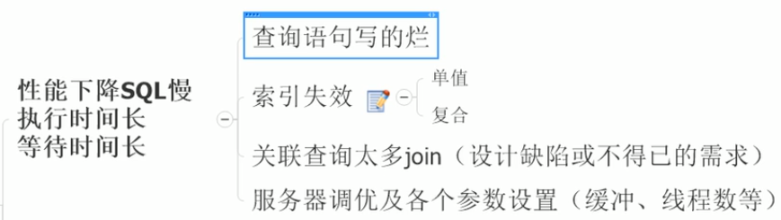


1.手写（手写的操作）

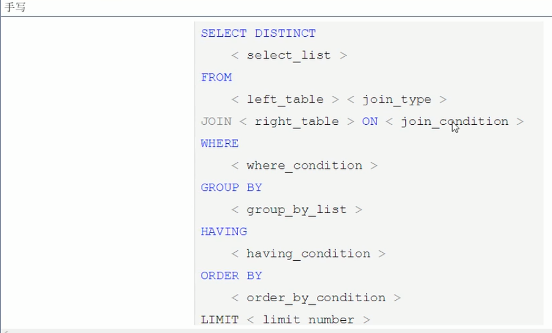

2.机读（机器执行的操作顺序）

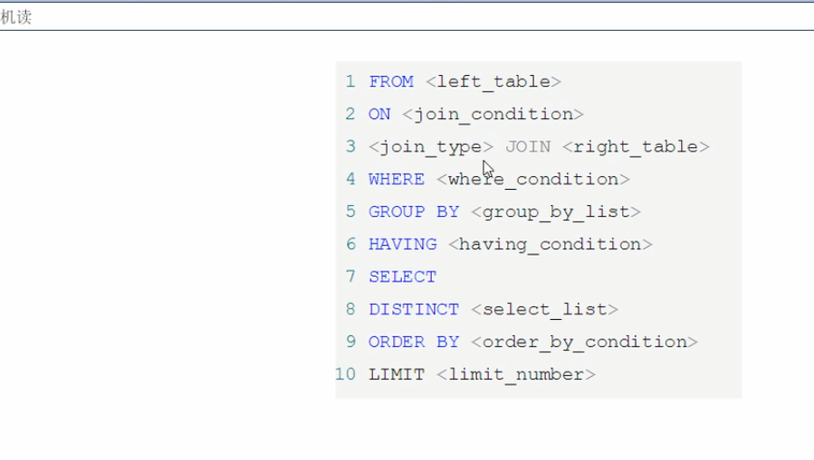

3.总结

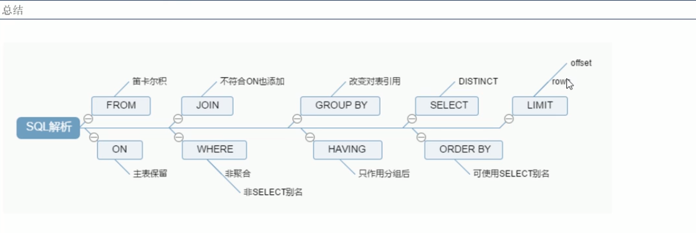

### 二，七种join理论


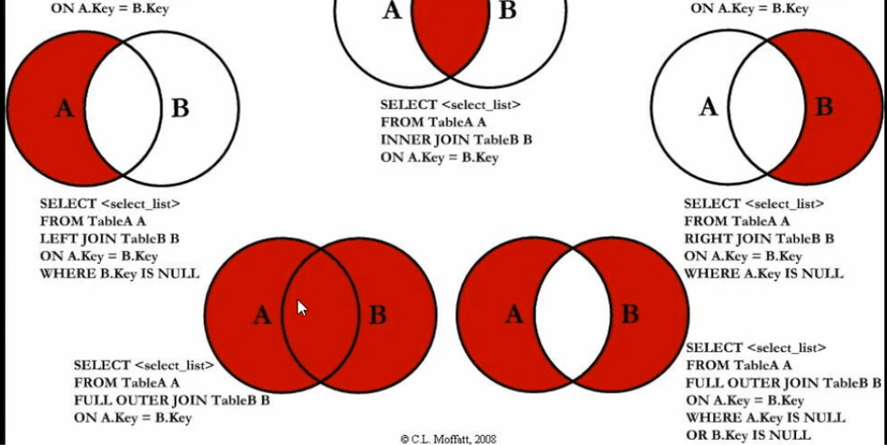

### 三，索引简介

**如何注意索引优化？**

*1.sql语句优化：再使用sql语句时尽量使用到索引*

*2.创建数据结构时优化：建立复合索引时，尽量考虑用户查询时常用的排序方式和组合字段*；*

#### **1.什么是索引**：

- **mysql官方给出的解释是：索引（index）是一种帮助mysql高效获取数据的数据结构**

**索引的本质就是：索引是一种数据结构****


索引的目的在于提高查找效率，可以类比于字典；

比如说你要查找‘mysql’这个词，那么你会先从m开始查，再找y，接下来再查找sql；

如果没有索引你会去从a-z逐个查找；


- **索引可以简单理解为：排好序的快速查找数据结构**

  详解

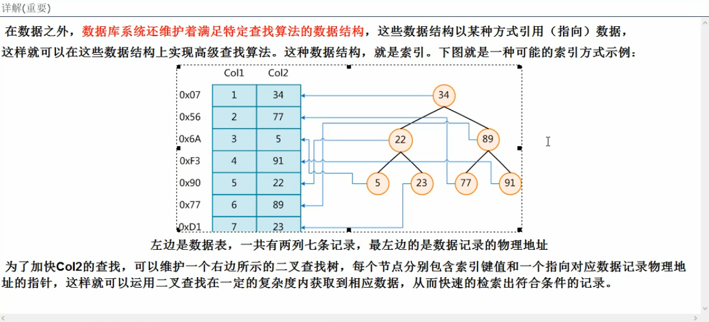

​	结论


- **索引以索引文件的形式存储在磁盘上**


- **我们平常所说的索引（与java开发相关）指的都是B树结构组织的索引；**


#### 2.索引的优势

- 提高数据检索的效率，降低数据库的IO成本
- 降低了数据排序成本，降低了CPU的消耗


#### 3.索引的劣势

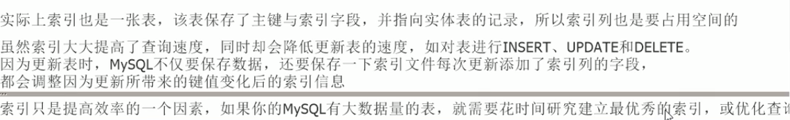

#### 4.索引的分类

- **单值索引**

即一个索引只包含一个列，一个表可包含多个单值索引

- **唯一索引**

索引的值必须唯一，单允许有空值

- **复合索引**

即一个索引包含多个列   

*

- **基本语法**

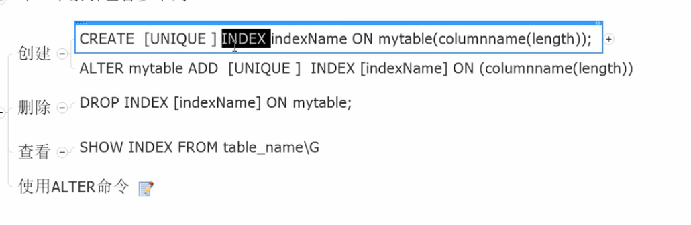

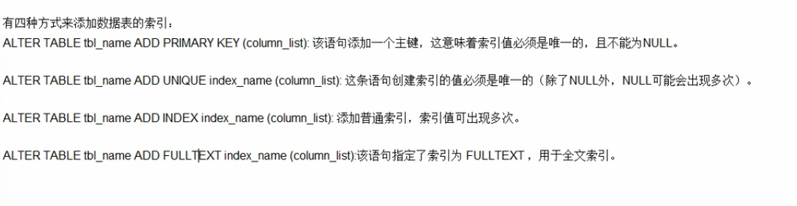


#### 5.索引的结构分类

- **BTree索引**

​		检索原理


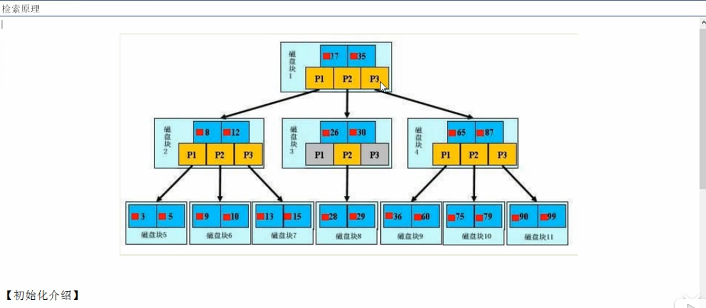

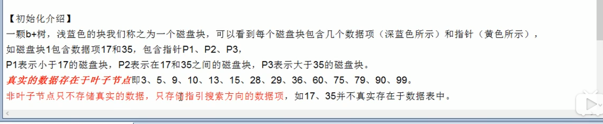

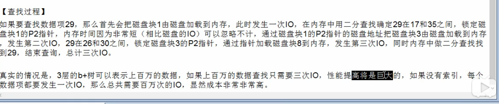

- **Hash索引**

- **full-text全文索引**

- **R-Tree索引**


#### 6.需要建立索引的情况

- **哪些情况需要创建索引**

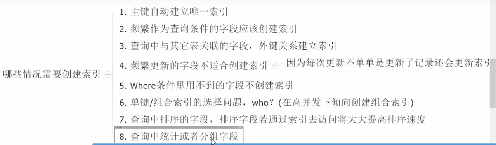

- **哪些情况不需要索引**

  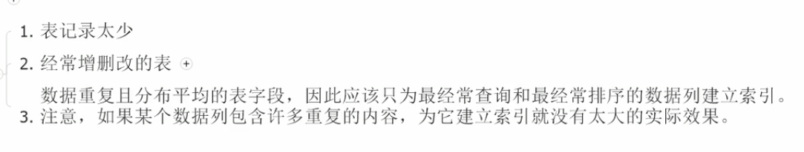

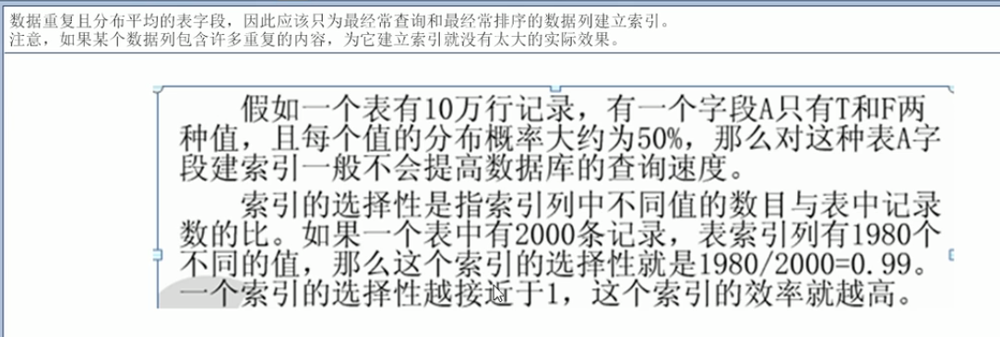

### 四，性能分析

#### **1.mysql query  Optimizer**

​	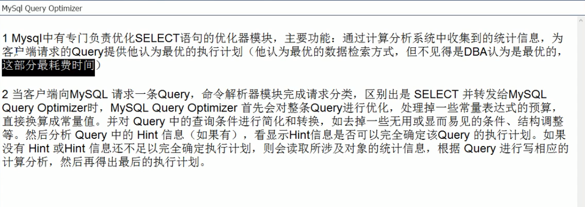

#### **2.MYSQL 常见瓶颈**

​	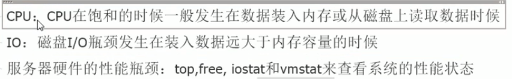

#### **3.Explain**

- **是什么**

  简称：查看执行计划

  使用EXPLAIN关键字可以模拟优化器执行SQL语句，从而知道MYSQL是如何处理你的SQL语句的

  分析你的查询语句或是表结构的性能瓶颈

- **能干嘛**

  - 

-  **怎么玩**

  - **Explain+SQL语句**

  - **各字段所包含的信息**

     #### ***id|select_type|table|type|possible_keys|key|key_len|ref|rows|Extra***

- **各字段解释**

  - **id**：select查询的序列号，包含一组数字，表示查询中执行select子句或操作表的顺序

    - 三种情况

      - id相同执行顺寻由上至下

        - ​	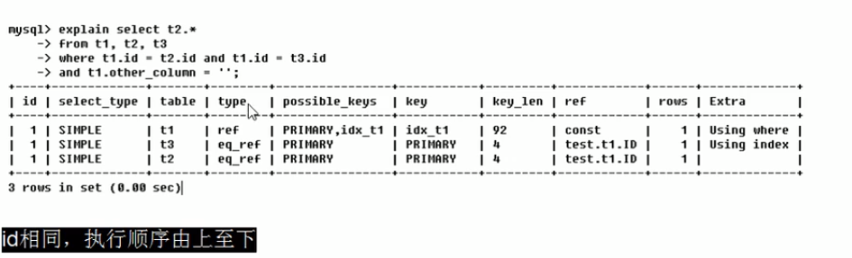

          

      - id不同，如果是子查询，id号会递增，id值越大优先级越高

        - 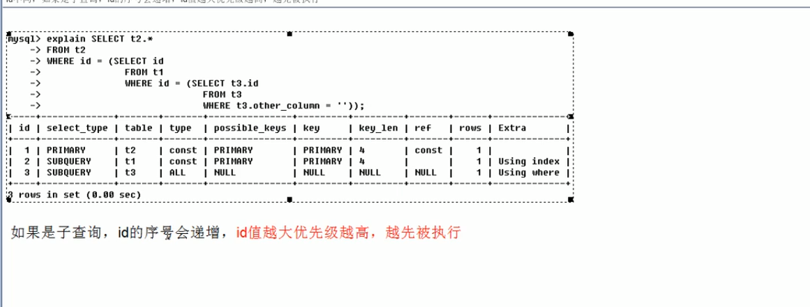

      - id既有相同又有不同：

        - 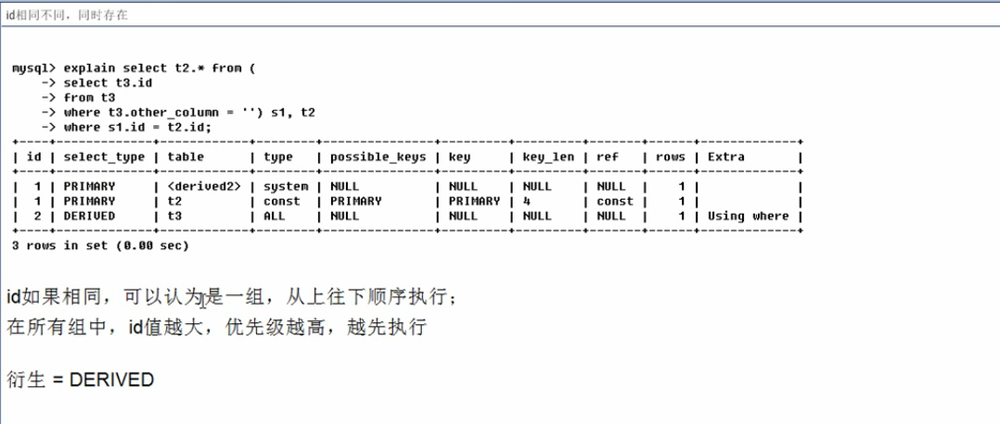

  - **select_type**

    - **显示选择查询类型**
      - 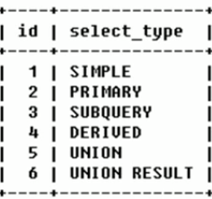
      - SIMPLE:简单的select查询，查询中不包括子查询或者UNION（一般单表查询都为simple）
      - PRIMARY（主查询）:查询中若包含任何复杂的子部分，则在最外层被标记为PRIMARY
      - SUBQUREY（子查询）:在select或where中包含的子查询；
      - DERIVED（衍生查询）:在from列表中包含的子查询会被标记为DERIVED(衍生表），MySQL会对其递归执行这些子查询，把查询结果放在临时表中
      - UNION（联合查询）:若第二个select出现在UNION之后，则被标记为UNION,若UNION包含在from的子查询中，则外层SELECT标记为DERIVED
      - UNION RESULT（联合查询结果）从union表获取结果的select；

  - **table：显示读取的数据是关于哪一张表的**

  - **type**:**显示访问类型**（本次查询所使用的索引的类型 如果为NULL或者ALL则没有使用到索引） 

    - **ALL | index | range | ref | eq_ref | const，system | NULL**

    - 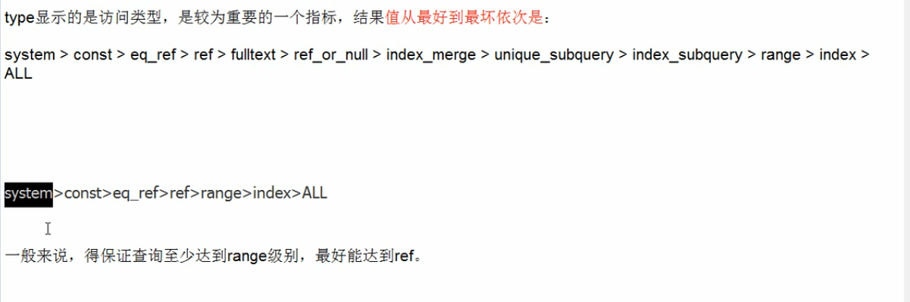

    - ***结果值优劣排序（索引级别排序）：system>const>eq_ref>ref>range>index>ALL***

    - system：系统中的常量

      - 

    - const：表中的常量

      - 
      - 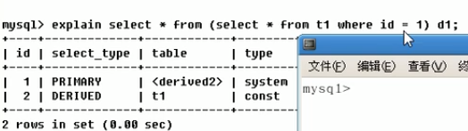

    - eq_ref：查询数据的时候所关联列只有一条数据行与之匹配（ref的特殊情况 ）

      - 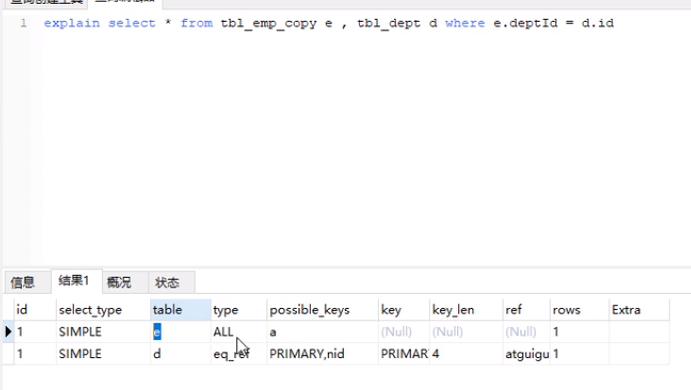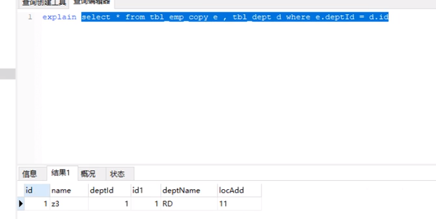
      - 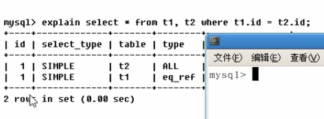

    - ref：查询时查出与之关联列的所有数据行

      ​	在表d 查询的某列每一行数据都与e的某列的数据相关联，二e的那列的字段正好是索引字段

      ​	相当于每次在d查出一个值后关联到e，e查询就相当（索引）常量查询，它们之间的这种关系就叫做ref

      - 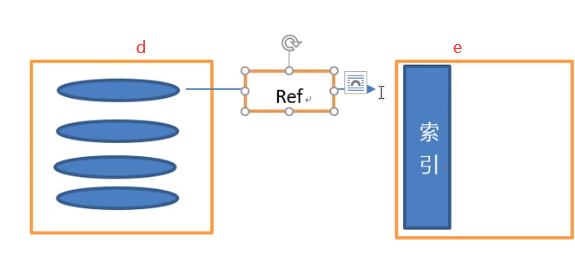

      - 

        **每在d表中查出一条数据就会拿去和e表中的一条数据关联，正好关联的字段是索引字段**

      - 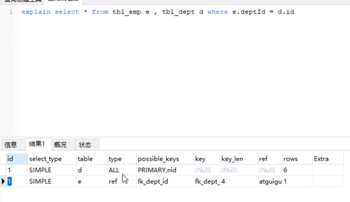

      - 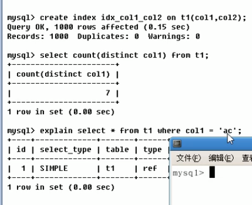

    - range：范围（索引）扫描

      - 
      - 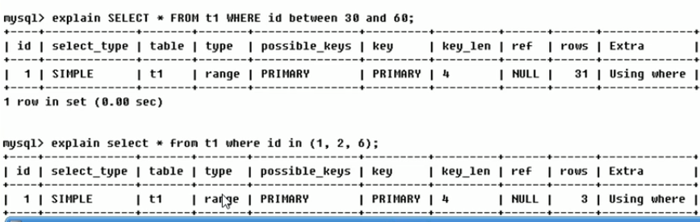

    - index:全表索引扫描

      - 

        id在这里是主键（PRIMARY KRY）所以是索引

      - 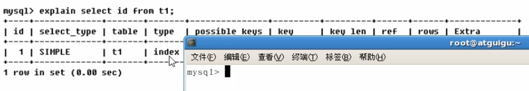

    - ALL：全表扫描

      - 
      - 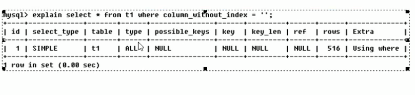

  - **possible_keys,key**

    - possible_keys:MySQL推测可能用到的索引有多少个，为NULL则推测不会用到索引

    - key：查询时实际用到的那个索引，如果结果为NULL，要么没有建索引，要么建了索引没用，还有一种情况时如果查询中使用了覆盖索引，则改索引出现在key列表中；

      覆盖索引：一个索引包含或者覆盖select的所有字段

  - **key_len**

    - 

  - **ref**：显示索引关联的字段是什么

    - 
    - 如果是使用的常数等值查询，这里会显示const，如果是连接查询，被驱动表的执行计划这里会显示驱动表的关联字段，如果是条件使用了表达式或者函数，或者条件列发生了内部隐式转换，这里可能显示为func；	

  - **rows：根据表的统计信息及索引的引用情况，大致估算出找到所需记录所读取的行数**

    - 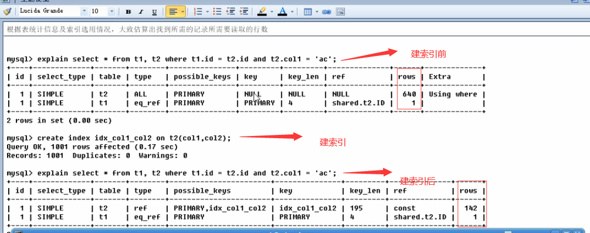

  - **Extra**

    - 包含不适合在其他列中显示但十分重要的额外信息：
- 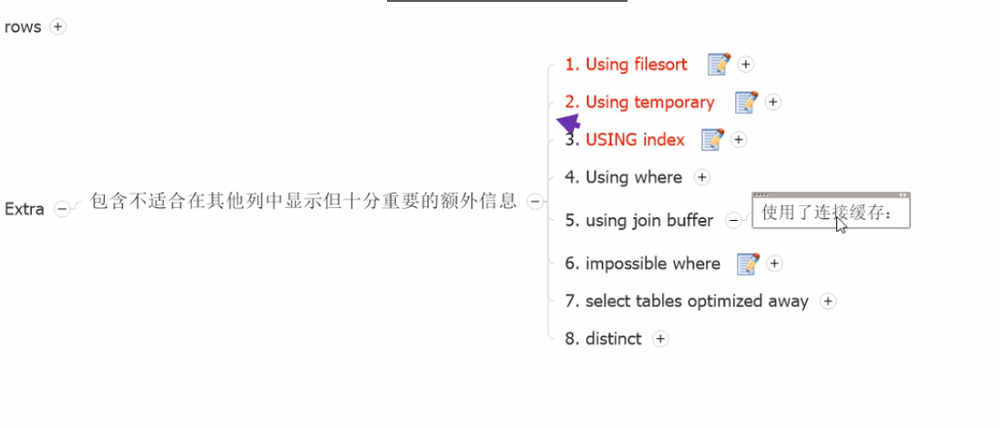
      - Using fileort：文件类排序，（以以下列子：检索出来的事实是不满足order by 要求，需要从新对检索结果进行排序，也就是说索引的排序不满足order by的排序，因为中间没用到col2）
        - 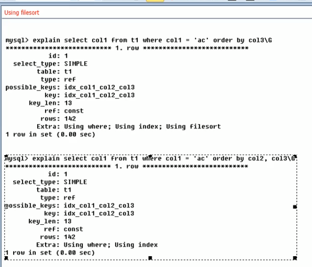

      - Using  temporary：
    
        - 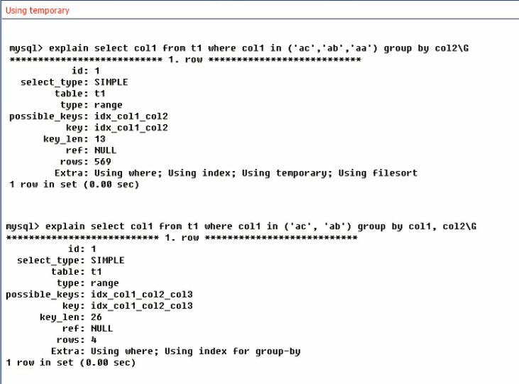
    
      - Using index：只出现Using index （以上列子：从索引中检索出来的结果就是符合order by的排序要求，无需再去表中排序；）
    
        - 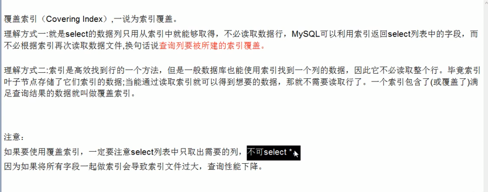 https://blog.csdn.net/jh993627471/article/details/79421363 
    
        - 覆盖所有：**查询列要被所建的索引覆盖，**      简单理解：就是select的数据列只需从索引中即可获得，不需要再去读取数据行，MYSQL可以利用索引就能找到select所要查找的数据并返回，而不必再去根据索引，再次读取数据文件


### 五，索引优化

1，**建表语句**

```mysql
CREATE TABLE IF NOT EXISTS article(
id INT(10) UNSIGNED NOT NULL PRIMARY KEY AUTO_INCREMENT,
author_id INT(10) UNSIGNED NOT NULL,
category_id INT(10) UNSIGNED NOT NULL,
views INT(10) UNSIGNED NOT NULL,
comments INT(10) UNSIGNED NOT NULL,
title VARCHAR(225) NOT NULL,
content TEXT NOT NULL
);

INSERT INTO article (author_id,category_id,views,comments,title,content)
VALUES 
(1,1,1,1,'1','1'),(2,2,2,2,'2','2'),(3,3,3,3,'3','3');

select * from article;
```


2.**案列分析**

(1)单表优化案列

分析

​	

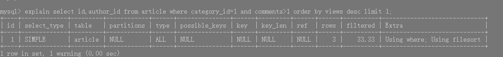


开始优化：

  1.1新建索引+删除索引

 因为where条件中用到了category_id,comments,views，所以我建立一个这个三个字段的复合索引

CREATE INDEX idx_article_ccv ON article(category_id,comments,views);

建立索引我们再次分析：虽然type级别（all-->range）变高了，但是Using filesort还在： 这里出现了范围右边的索引失效，

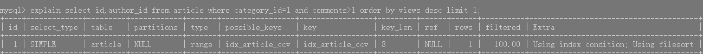

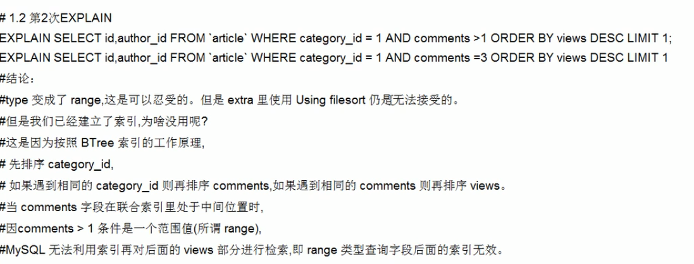

所以我们删掉这个不适合的索引，

drop index idx_article_ccv on article;


1.3建立新的索引：跳过需要查找范围的字段

CREATE INDEX idx_article_cv ON article(category_id,views);

 explain select id,author_id from article where category_id=1 and comments>1 order by views desc limit 1;


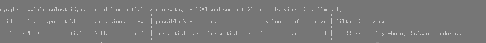

结果提升了type等级至ref，且没有了Using filesort；


（2）两表优化案列

建表语句

```mysql
CREATE TABLE IF NOT EXISTS class(
id INT(10) UNSIGNED NOT NULL AUTO_INCREMENT,
card INT(10) UNSIGNED NOT NULL,
PRIMARY KEY(id)
);

CREATE TABLE IF NOT EXISTS book(
bookid INT UNSIGNED NOT NULL AUTO_INCREMENT,
card INT(10) UNSIGNED NOT NULL,
PRIMARY KEY(bookid)
);


INSERT INTO class (card)  VALUES(FLOOR(1+RAND()*20));#20条数据
INSERT INTO book (card)  VALUES(FLOOR(1+RAND()*20));#20条数据
```


优化分析

explain select * from class left join book on class.card=book.card;

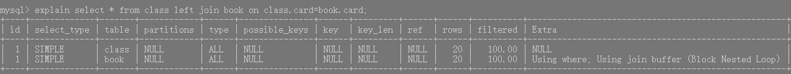

检索结果全是ALL和NULL，所以我们要对其进行优化

1.我们先对连接的表card建立索引，也就是右表book

CREATE INDEX  Y ON book(card);

查看检索结果：

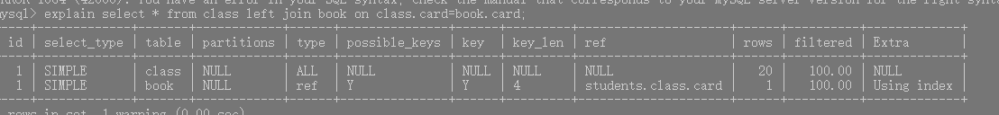

对book表的检索type变成了ref，用到了索引，且只读取了21行数据；

2.我们删掉对右表建立的索引，尝试对左表建立索引

DROP INDEX Y ON book;

CREATE INDEX Y ON class(card);

查看检索结果：

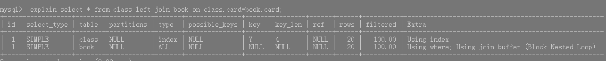

对class检索type变为了index，读取数据行数还是40行，

**结论**

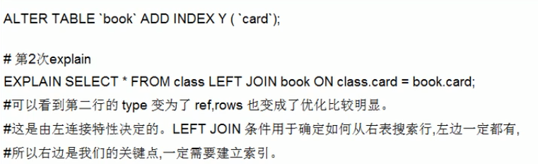


（3）三表优化案列

建表语句

```mysql
CREATE TABLE IF NOT EXISTS phone(
phoneid INT UNSIGNED NOT NULL AUTO_INCREMENT,
card INT(10) UNSIGNED NOT NULL,
PRIMARY KEY(phoneid)
);

#加上前面的两张表，共三张表
INSERT INTO phone(card) VALUES(FLOOR(1+RAND()*20));
```

进行查询

 EXPLAIN SELECT * FROM class LEFT JOIN book on class.card=book.card  LEFT JOIN phone ON class.card=phone.card;

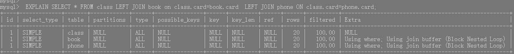


全为NULL；

所以根据前两表的经验，我们分别再book ，和phone表对要进行查询的字段card建立索引

CREATE INDEX  B ON book(card);

CREATE INDEX P ON  phone(card);

优化结果：

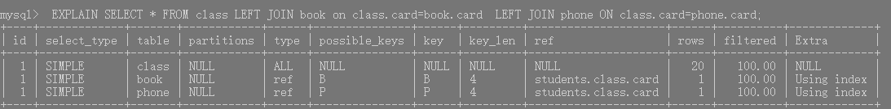

结论：对于join的这种sql语句尽量用小结果集驱动大结果集：A left B ON ...  这里时A的全表左连接B表满足条件的列，所在B表被查询的字段建立索引---小表驱动大表；


### 六，索引失效


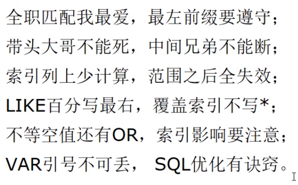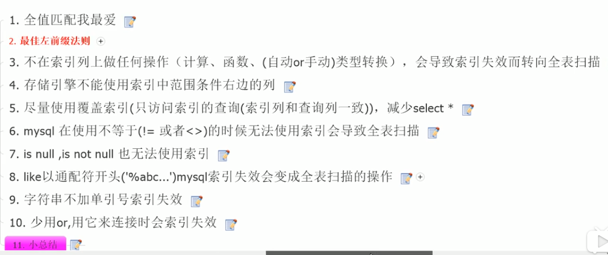

**1.全职匹配我最爱**

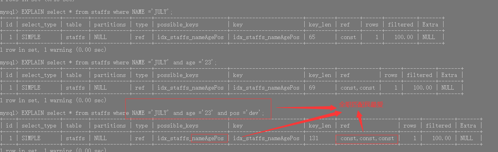


**2.最佳左前缀法则**    (火车跑的快，全靠头来带) 

如果索引了多列，查询的时候从索引的最左列开始，**并且不要跳过索引中间列**

*带头大哥不能死，中间兄虎不能断*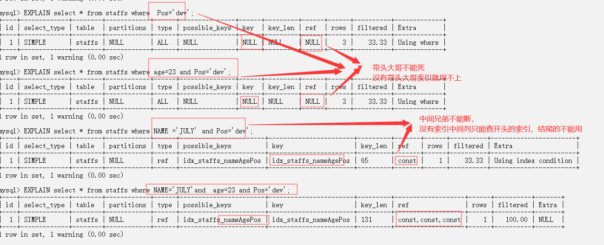

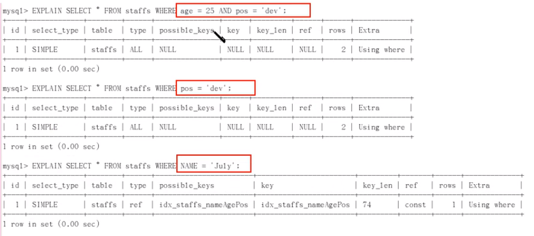


3.不在索引上做任何操作（计算，函数，（自动or手动）类型转换）会导致索引失效而转向全表扫描；

*索引列上少计算*

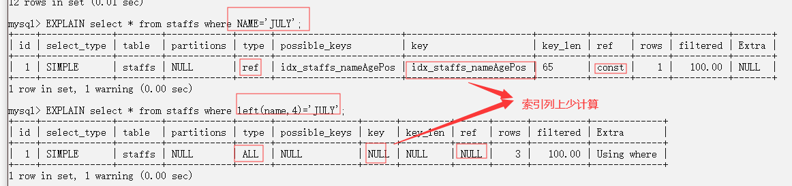


4.存储引擎不能使用索引中条件范围右边的列：就是在复合索引中当索引中的某一字段使用范围查询，那么它右边的索引字段将会失效（不会使用索引）

如图所示，在使用范围后key_len的值与只关联name，age的检索的key_len一样因为后面pos没用上索引

*范围之后全失效*

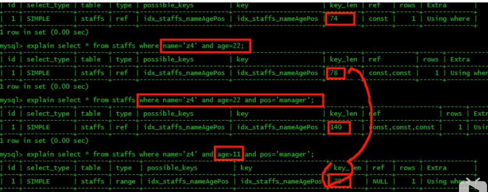

5.尽量使用覆盖索引，只访问索引的查询（索引列和查询列一致），尽量减少使用select*

*覆盖索引不写 星*

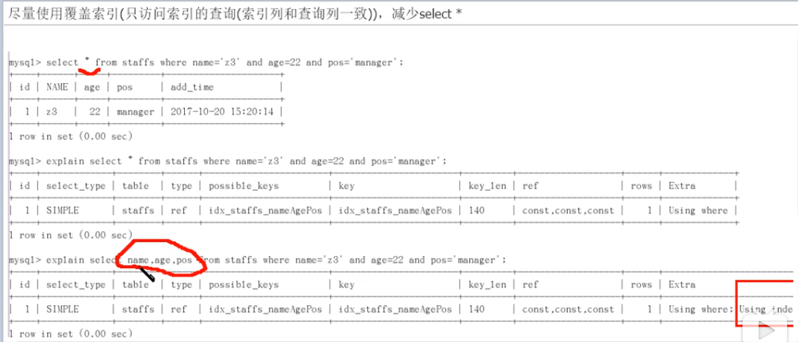

6.mysql在使用不等于（!=或则<>）的时候，有时候会导致无法使用索引导致使用全表扫描

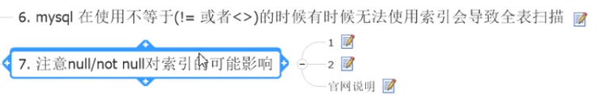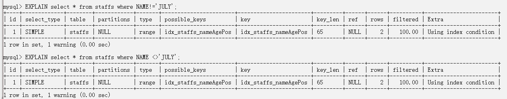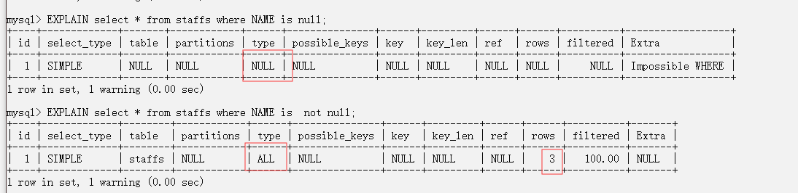

7.like以通配符开头（'%abc'）会使索引失效变成全表扫描（可使用覆盖索引优化查询）

*like*百分写右边*

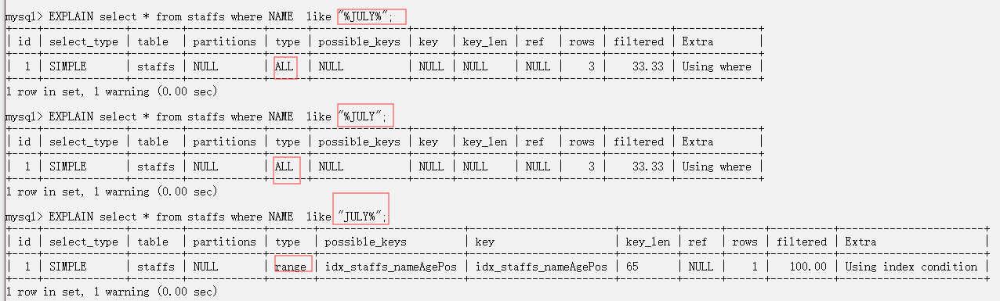

8。字符串不加单引号索引失效

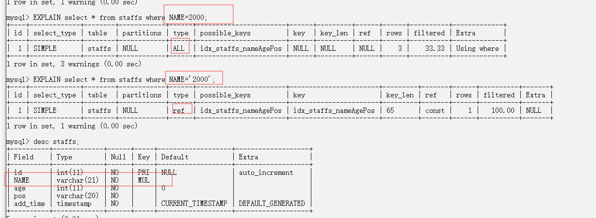

9.少用or，用它会索引失效

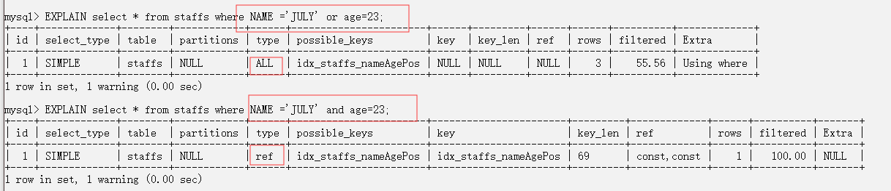


ASCII码中,一个英文字母(不分大小写)占一个字节的空间,一个中文汉字占两个字节的空间 

UTF-8编码中:一个中文等于三个字节,中文标点占三个字节。 一个英文字符等于一个字节,英文标点占一个字节。 Unicode编码:一个英文等于两个字节,一个中文(含繁体)等于两个字节。中文标点占两个字节,英文标点。 

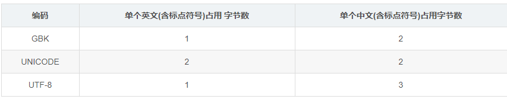