# MYSQL学习笔记续

## 数据库基础续：

### 一 ，约束

 

含义：为了限制表中的数据，以保证表中数据的准确性和可靠性，也可以说一致性； 

**1.六大约束：** 

1.非空：NOT  NULL     用于保证该字段的值不能为空 

2.默认：DEFAULT       保证该字段有默认值 

3.主键：PRIMARY KEY         用于保证该字段的值具有唯一性并且非空，比如学号 员工编号，只要是主键默认非空 

4.唯一：UNIQUE    用于保证字段值唯一，可以为空 比如座位号 

5.检查约束：CHECK(MySQL中不适用)   比如年龄，性别 

6.外键：FOREIGN KEY  用于限制两张的关系，保证该字段的值必须来自主键关联列的值 

在从表添加外键约束，用于引用主表主键的值 ，比如学生的专业编号，员工表的工种编号 


**2.添加约束的时机：** 

​	1.创建表时 

​	2.修改表时 

**3.约束添加的分类：** 

​	1.列级约束 

​	六大约束都支持，但检查约束在mysql中没有效果 

​	2.表级约束 

​	除了非空和默认，其余都可

**4.添加列级约束语法**

注意：列级约束只支持 默认，非空，主键，唯一

语法：

```mysql
#添加列及约束

create table stuinfo(
				id INT PRIMARY KEY,#主键
				stuName VARCHAR(20) NOT NULL,#非空
				seat INT UNIQUE,#唯一
				gender	CHAR(1) CHECK(gender='男'OR gender='女'),
				age INT DEFAULT 18,#默认
				majorid INT  REFERENCES major(id) #添加外键，这样添加不支持；
)
create table major(
				majorId INT PRIMARY KEY,
				majorNmae VARCHAR(20) NOT NULL
				
);
#查看索引
show INDEX from stuinfo
#删表
drop table if exist  表名;
```

**5.添加标级约束语法：**

语法：在各个字段最下面

【CONSTRAINT 约束名】  约束类型（字段名） *注：约束名可以不写，*

```mysql
#添加表级约束
create table stuinfo(
				id INT ,
				stuName VARCHAR(20) NOT NULL,
				seat INT ,
				gender	CHAR(1),
				age INT DEFAULT 18,#默认
				majorid INT,
				CONSTRAINT PK PRIMARY KEY  (id),
				CONSTRAINT UQ UNIQUE(seat),
				CONSTRAINT CK CHECK(gender='男'or gender='女'),
				CONSTRAINT FK_major_stuinfo FOREIGN KEY (id) REFERENCES major(majorId)
		);
```


什么时候添加表级约束，什么时候添加列级约束？

通用写法;

```mysql
CREATE TABLE stuinfo(
							id INT PRIMARY KEY,
							stuName VARCHAR(20) NOT NULL,
							seat INT UNIQUE,
							gender	CHAR(1) CHECK(gender='男' or gender='女'),
							age INT DEFAULT 18,#默认
							majorid INT,
							CONSTRAINT FK_major_stuinfo FOREIGN KEY (majorid) REFERENCES major(majorId)
);
```


**面试：关于主键和唯一的区别**？

主键（PRIMARY KEY）：保证唯一性，不能为空，一张表只能有一个主键，允许组合主键

唯一(UNIQUE):保证唯一性，能为空，一张表可有多个，允许组合主键


什么叫做组合主键：两个字段组成一个主键(一般不推荐使用);

```mysql
create table stuinfo(
				id INT ,
				stuName VARCHAR(20) NOT NULL,
				seat INT ,
				gender	CHAR(1),
				age INT DEFAULT 18,#默认
				majorid INT,
				CONSTRAINT PK PRIMARY KEY  (id,stuName),
				CONSTRAINT UQ UNIQUE(seat),
				CONSTRAINT CK CHECK(gender='男'or gender='女'),
				CONSTRAINT FK_major_stuinfo FOREIGN KEY (majorid) REFERENCES major(majorId)
		);
```

外键（FOREIGN）:

1.要求在从表设置外键关系

2.从表的外键字段的值类型必须和主表的关联的值类型一致或者兼容，名称无要求

3.主表的关联的列类型必须是一个key：（类型：主键或者唯一） 

4.插入数据：先插入主表，再插入从表，  删除数据时：先删除从表，再删除主表；


##### 6.修改表时添加约束

```mysql
#添加非空约束
ALTER TABLE stuinfo1 MODIFY COLUMN stuName varchar(20) not null;
#添加默认约束
ALTER TABLE stuinfo1 MODIFY COLUMN age int default 18;
#添加主键 1.列级 2.表级
ALTER TABLE stuinfo1 MODIFY COLUMN id int PRIMARY KEY;
ALTER TABLE stuinfo1 ADD PRIMARY KEY(id);

#添加唯一  1.列级 2.表级
ALTER TABLE stuinfo1 MODIFY COLUMN seat INT UNIQUE;
ALTER TABLE stuinfo1 ADD UNIQUE(seat);

#添加外键
ALTER TABLE stuinfo1 ADD FOREIGN KEY(majorId) REFERENCES major(majorid);

```

##### 7.修改表时删除约束

```mysql
#删除非空约束
ALTER TABLE stuinfo1 MODIFY COLUMN stuName varchar(20)null;
#删除默认约束
ALTER TABLE stuinfo1 MODIFY COLUMN age int;
#删除主键 
ALTER TABLE stuinfo1 DROP PRIMARY KEY;

#删除唯一  
ALTER TABLE stuinfo1 DROP INDEX seat;


#删除外键
ALTER TABLE stuinfo DROP FOREIGN KEY FK_major_stuinfo;
```

##### 8.表的复制

```MYSQL
#只复制表的结构
CREATE TABLE TAL_NAME LIKE 复制的表名;
#复制表的内容
CREATE TABLE TAL_NAME 
SELECT * FROM 复制的表名;
```

## 数据库高级续：

**查看字符集：**

1.show variables like  "character%";

2.sow variables like  "char%";

**mysql主要配置文件：****


**mysql总体架构**

1.连接层

2.业务逻辑处理服务层

3.可拔插引擎层

4.文件存储层

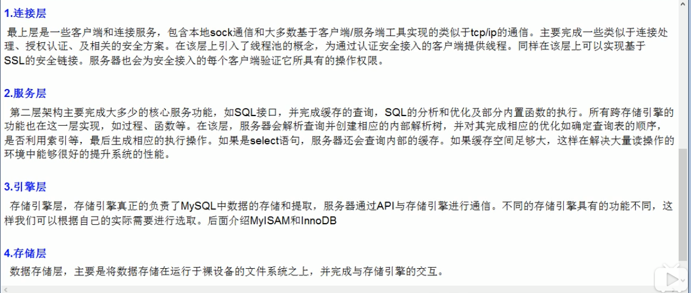


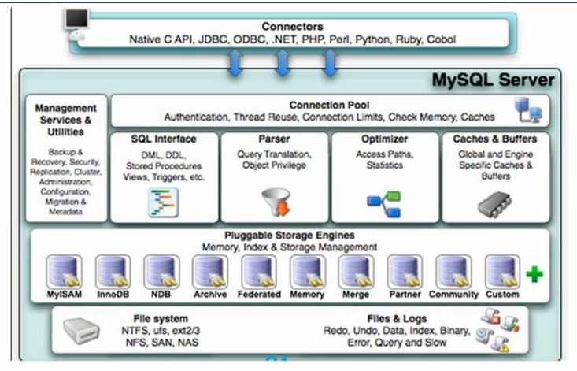

**查看你的mysql默认的存储引擎：**

show variables like "%storage_engine%";

**查看mysql支持哪些引擎：**

show engines;

**MYISAM和InnoDB的区别**

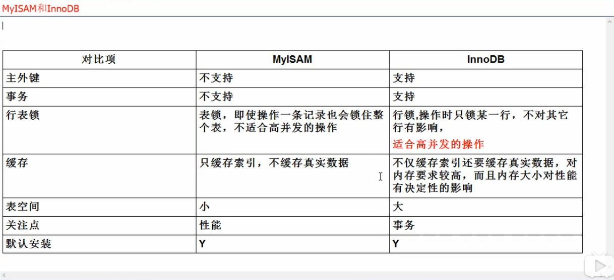

**性能下降SQL执行的慢的原因：**


1.手写（手写的操作）

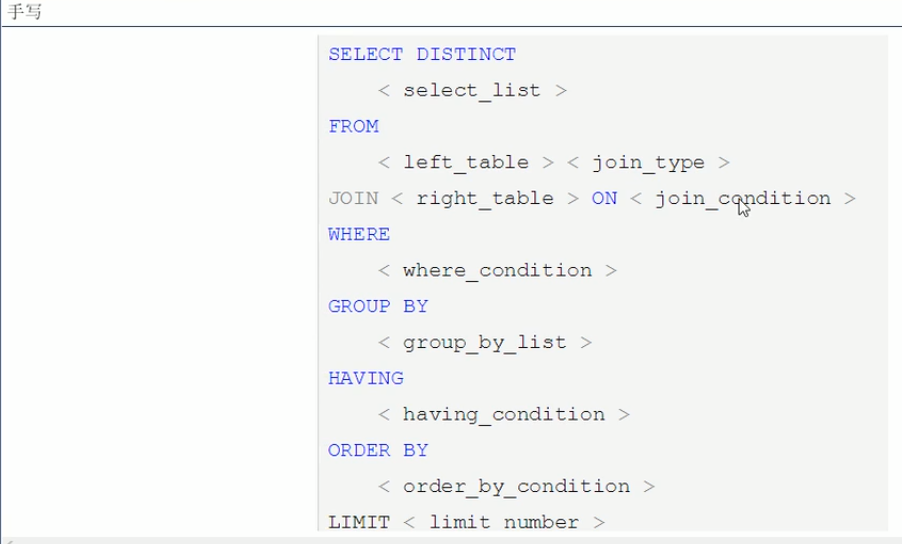

2.机读（机器执行的操作顺序）

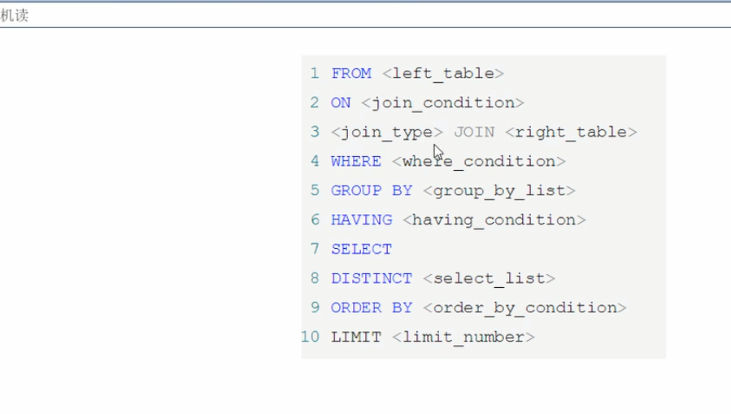

3.总结

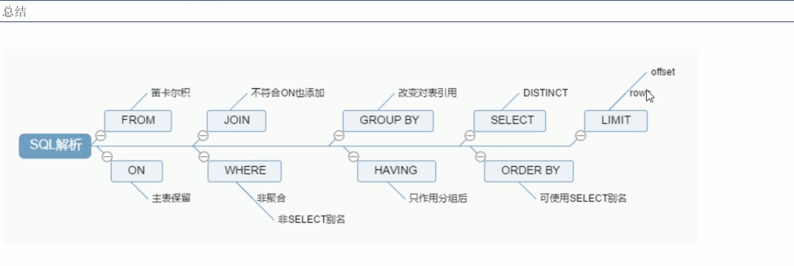

### 二，七种join理论


### 三，索引简介

**如何注意索引优化？**

*1.sql语句优化：再使用sql语句时尽量使用到索引*

*2.创建数据结构时优化：建立复合索引时，尽量考虑用户查询时常用的排序方式和组合字段*；*

#### **1.什么是索引**：

- **mysql官方给出的解释是：索引（index）是一种帮助mysql高效获取数据的数据结构**

**索引的本质就是：索引是一种数据结构****


索引的目的在于提高查找效率，可以类比于字典；

比如说你要查找‘mysql’这个词，那么你会先从m开始查，再找y，接下来再查找sql；

如果没有索引你会去从a-z逐个查找；


- **索引可以简单理解为：排好序的快速查找数据结构**

  详解

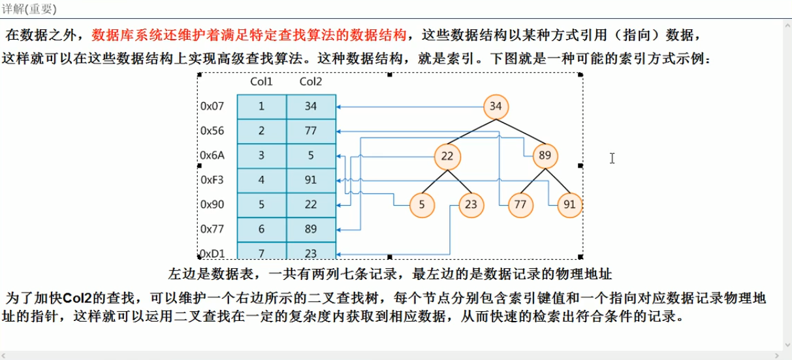

​	结论


- **索引以索引文件的形式存储在磁盘上**


- **我们平常所说的索引（与java开发相关）指的都是B树结构组织的索引；**


#### 2.索引的优势

- 提高数据检索的效率，降低数据库的IO成本
- 降低了数据排序成本，降低了CPU的消耗


#### 3.索引的劣势


#### 4.索引的分类

- **单值索引**

即一个索引只包含一个列，一个表可包含多个单值索引

- **唯一索引**

索引的值必须唯一，单允许有空值

- **复合索引**

即一个索引包含多个列   

*

- **基本语法**

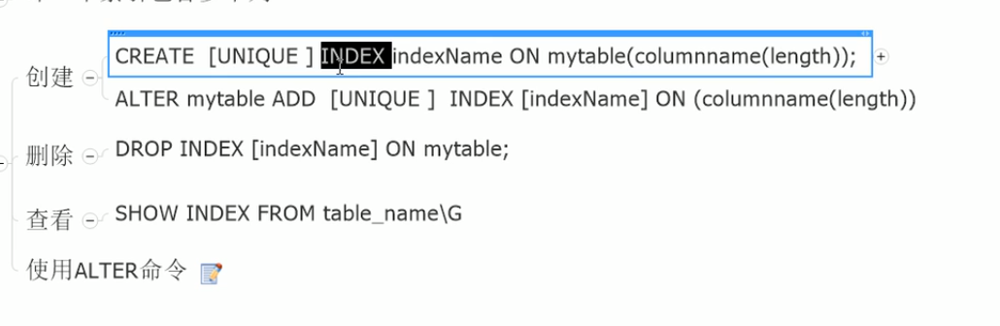

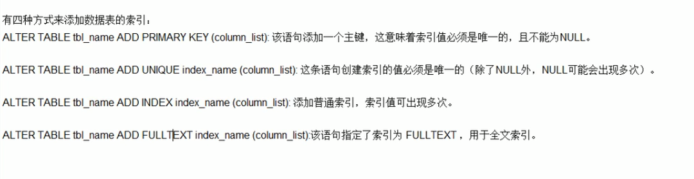


#### 5.索引的结构分类

- **BTree索引**

​		检索原理


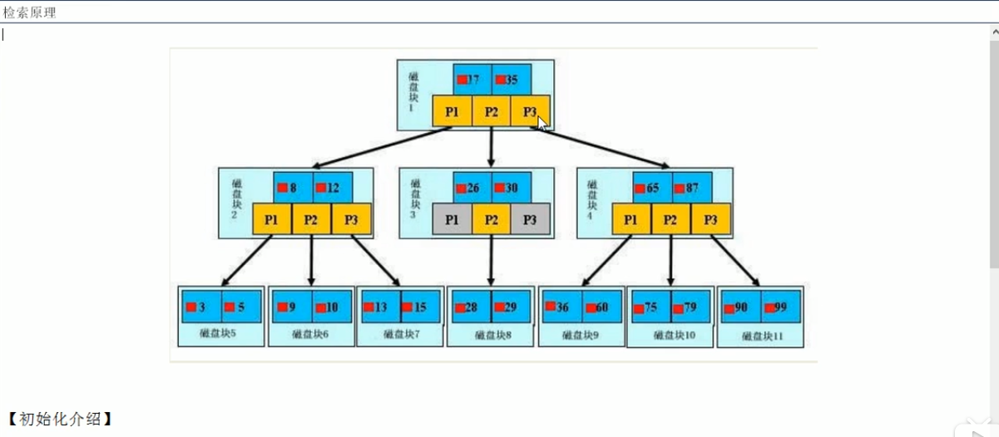


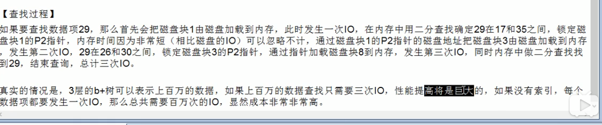

- **Hash索引**

- **full-text全文索引**

- **R-Tree索引**


#### 6.需要建立索引的情况

- **哪些情况需要创建索引**


- **哪些情况不需要索引**

  


### 四，性能分析

#### **1.mysql query  Optimizer**

​	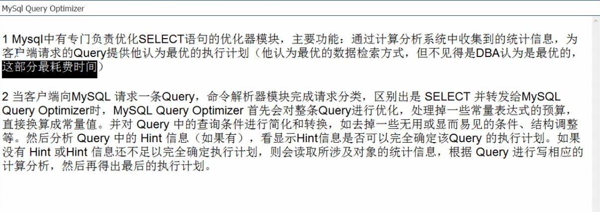

#### **2.MYSQL 常见瓶颈**

​	

#### **3.Explain**

- **是什么**

  简称：查看执行计划

  使用EXPLAIN关键字可以模拟优化器执行SQL语句，从而知道MYSQL是如何处理你的SQL语句的

  分析你的查询语句或是表结构的性能瓶颈

- **能干嘛**

  - 

-  **怎么玩**

  - **Explain+SQL语句**

  - **各字段所包含的信息**

     #### ***id|select_type|table|type|possible_keys|key|key_len|ref|rows|Extra***

- **各字段解释**

  - **id**：select查询的序列号，包含一组数字，表示查询中执行select子句或操作表的顺序

    - 三种情况

      - id相同执行顺寻由上至下

        - ​	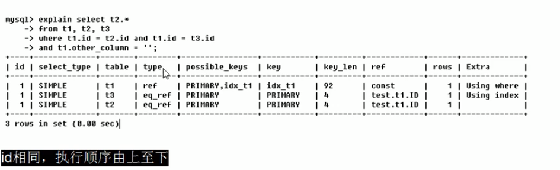

          

      - id不同，如果是子查询，id号会递增，id值越大优先级越高

        - 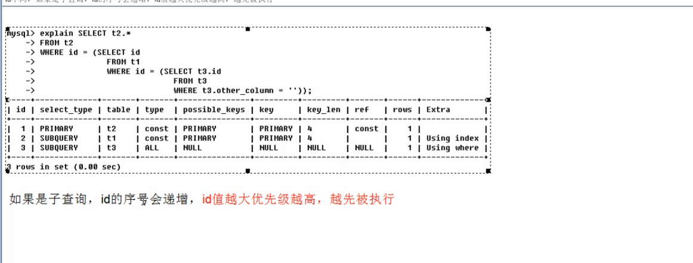

      - id既有相同又有不同：

        - 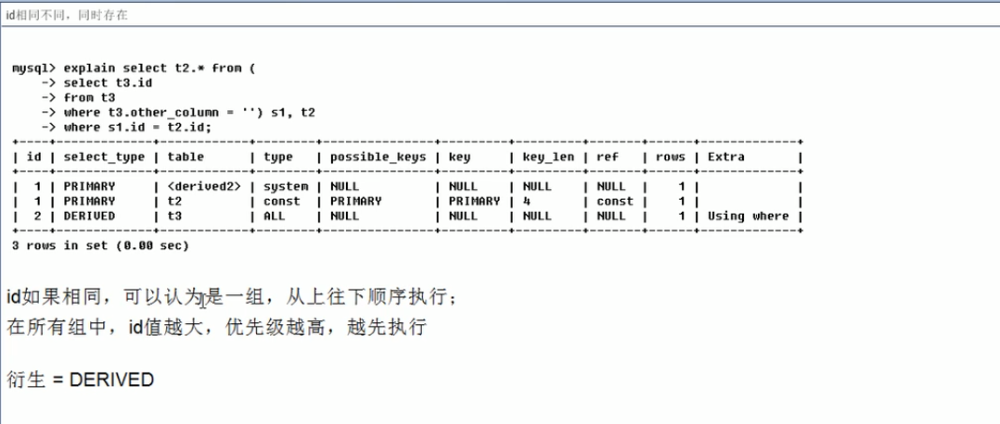

  - **select_type**

    - **显示选择查询类型**
      - 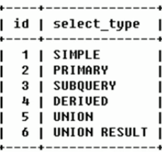
      - SIMPLE:简单的select查询，查询中不包括子查询或者UNION（一般单表查询都为simple）
      - PRIMARY（主查询）:查询中若包含任何复杂的子部分，则在最外层被标记为PRIMARY
      - SUBQUREY（子查询）:在select或where中包含的子查询；
      - DERIVED（衍生查询）:在from列表中包含的子查询会被标记为DERIVED(衍生表），MySQL会对其递归执行这些子查询，把查询结果放在临时表中
      - UNION（联合查询）:若第二个select出现在UNION之后，则被标记为UNION,若UNION包含在from的子查询中，则外层SELECT标记为DERIVED
      - UNION RESULT（联合查询结果）从union表获取结果的select；

  - **table：显示读取的数据是关于哪一张表的**

  - **type**:**显示访问类型**（本次查询所使用的索引的类型 如果为NULL或者ALL则没有使用到索引） 

    - **ALL | index | range | ref | eq_ref | const，system | NULL**

    - 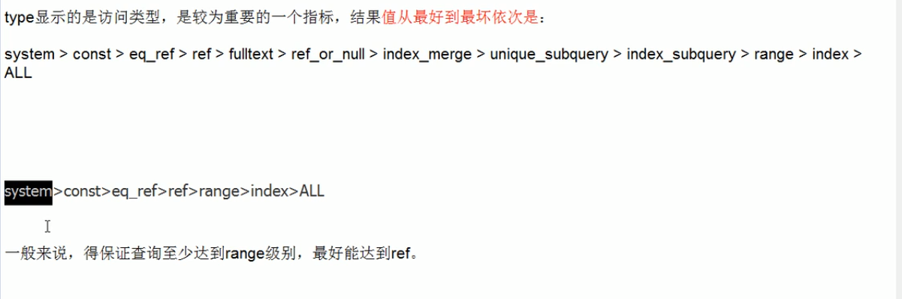

    - ***结果值优劣排序（索引级别排序）：system>const>eq_ref>ref>range>index>ALL***

    - system：系统中的常量

      - 

    - const：表中的常量

      - 
      - 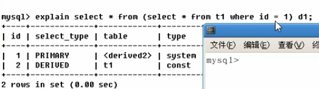

    - eq_ref：查询数据的时候所关联列只有一条数据行与之匹配（ref的特殊情况 ）

      - 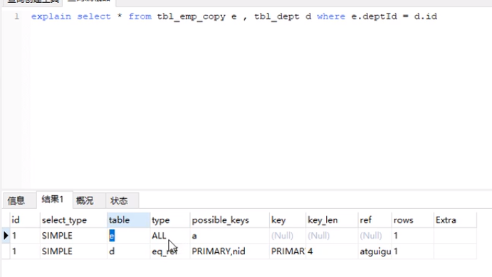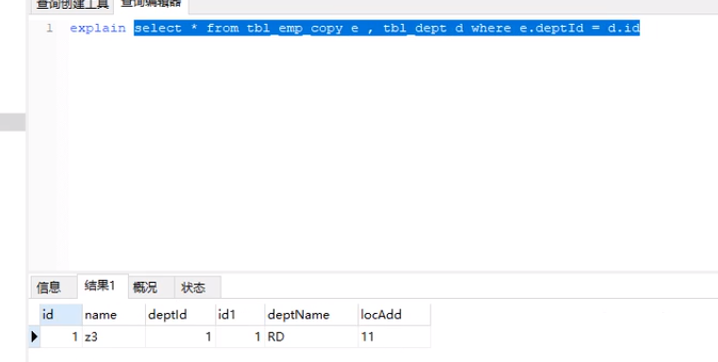
      - 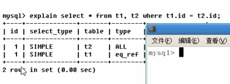

    - ref：查询时查出与之关联列的所有数据行

      ​	在表d 查询的某列每一行数据都与e的某列的数据相关联，二e的那列的字段正好是索引字段

      ​	相当于每次在d查出一个值后关联到e，e查询就相当（索引）常量查询，它们之间的这种关系就叫做ref

      - 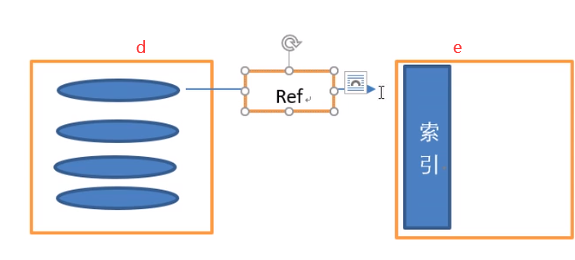

      - 

        **每在d表中查出一条数据就会拿去和e表中的一条数据关联，正好关联的字段是索引字段**

      - 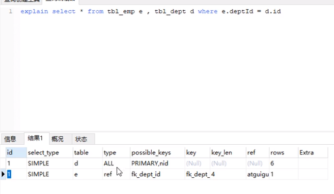

      - 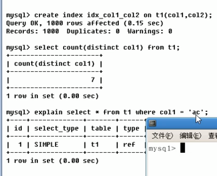

    - range：范围（索引）扫描

      - 
      - 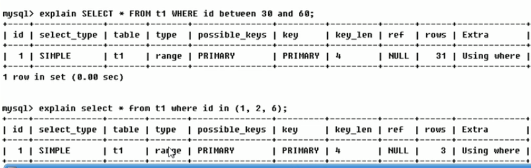

    - index:全表索引扫描

      - 

        id在这里是主键（PRIMARY KRY）所以是索引

      - 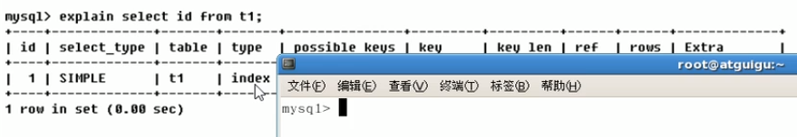

    - ALL：全表扫描

      - 
      - 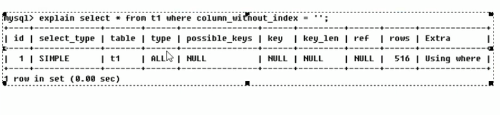

  - **possible_keys,key**

    - possible_keys:MySQL推测可能用到的索引有多少个，为NULL则推测不会用到索引

    - key：查询时实际用到的那个索引，如果结果为NULL，要么没有建索引，要么建了索引没用，还有一种情况时如果查询中使用了覆盖索引，则改索引出现在key列表中；

      覆盖索引：一个索引包含或者覆盖select的所有字段

  - **key_len**

    - 

  - **ref**：显示索引关联的字段是什么

    - 
    - 如果是使用的常数等值查询，这里会显示const，如果是连接查询，被驱动表的执行计划这里会显示驱动表的关联字段，如果是条件使用了表达式或者函数，或者条件列发生了内部隐式转换，这里可能显示为func；	

  - **rows：根据表的统计信息及索引的引用情况，大致估算出找到所需记录所读取的行数**

    - 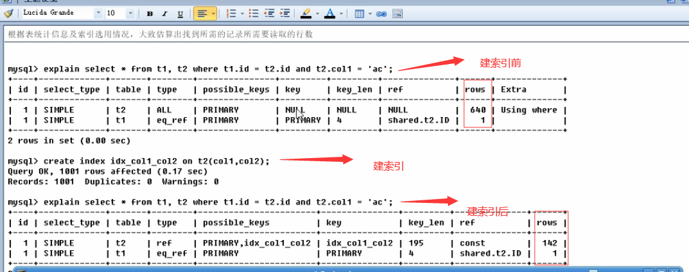

  - **Extra**

    - 包含不适合在其他列中显示但十分重要的额外信息：
- 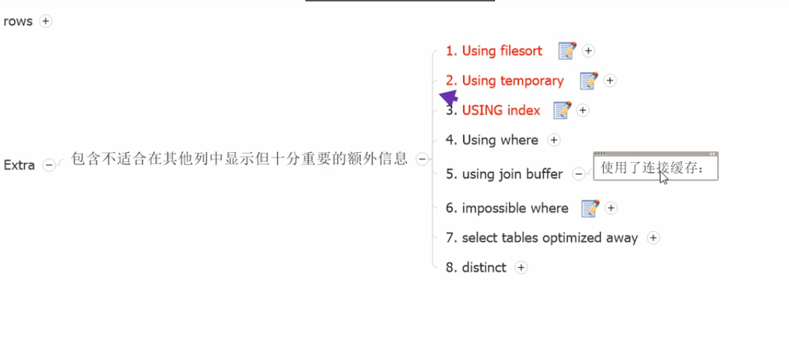
      - Using fileort：文件类排序，（以以下列子：检索出来的事实是不满足order by 要求，需要从新对检索结果进行排序，也就是说索引的排序不满足order by的排序，因为中间没用到col2）
        - 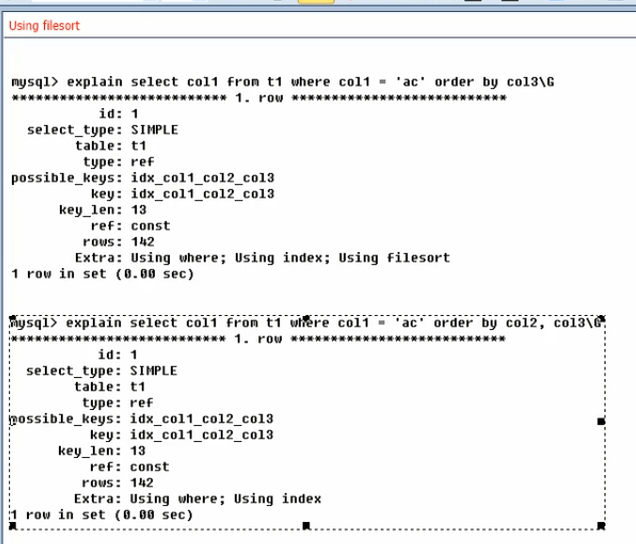

      - Using  temporary：
        
        - 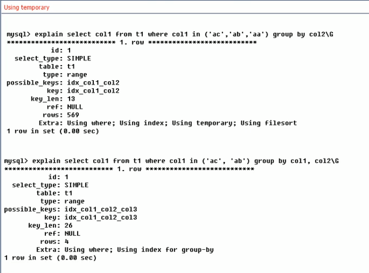
        
      - Using index：只出现Using index （以上列子：从索引中检索出来的结果就是符合order by的排序要求，无需再去表中排序；）
        
        - 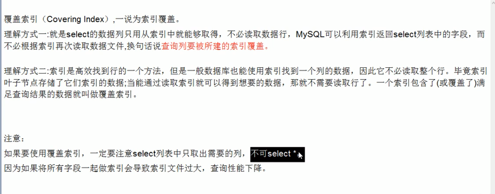 https://blog.csdn.net/jh993627471/article/details/79421363 
        
        - 覆盖所有：**查询列要被所建的索引覆盖，**      简单理解：就是select的数据列只需从索引中即可获得，不需要再去读取数据行，MYSQL可以利用索引就能找到select所要查找的数据并返回，而不必再去根据索引，再次读取数据文件


### 五，索引优化

1，**建表语句**

```mysql
CREATE TABLE IF NOT EXISTS article(
id INT(10) UNSIGNED NOT NULL PRIMARY KEY AUTO_INCREMENT,
author_id INT(10) UNSIGNED NOT NULL,
category_id INT(10) UNSIGNED NOT NULL,
views INT(10) UNSIGNED NOT NULL,
comments INT(10) UNSIGNED NOT NULL,
title VARCHAR(225) NOT NULL,
content TEXT NOT NULL
);

INSERT INTO article (author_id,category_id,views,comments,title,content)
VALUES 
(1,1,1,1,'1','1'),(2,2,2,2,'2','2'),(3,3,3,3,'3','3');

select * from article;
```


2.**案列分析**

(1)单表优化案列

分析

​	


开始优化：

  1.1新建索引+删除索引

 因为where条件中用到了category_id,comments,views，所以我建立一个这个三个字段的复合索引

CREATE INDEX idx_article_ccv ON article(category_id,comments,views);

建立索引我们再次分析：虽然type级别（all-->range）变高了，但是Using filesort还在： 这里出现了范围右边的索引失效，

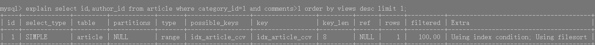

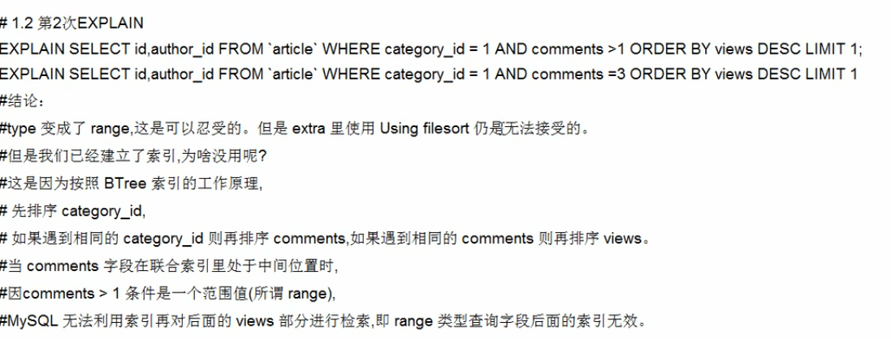

所以我们删掉这个不适合的索引，

drop index idx_article_ccv on article;


1.3建立新的索引：跳过需要查找范围的字段

CREATE INDEX idx_article_cv ON article(category_id,views);

 explain select id,author_id from article where category_id=1 and comments>1 order by views desc limit 1;


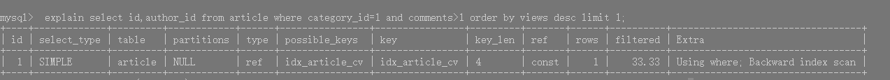

结果提升了type等级至ref，且没有了Using filesort；


（2）两表优化案列

建表语句

```mysql
CREATE TABLE IF NOT EXISTS class(
id INT(10) UNSIGNED NOT NULL AUTO_INCREMENT,
card INT(10) UNSIGNED NOT NULL,
PRIMARY KEY(id)
);

CREATE TABLE IF NOT EXISTS book(
bookid INT UNSIGNED NOT NULL AUTO_INCREMENT,
card INT(10) UNSIGNED NOT NULL,
PRIMARY KEY(bookid)
);


INSERT INTO class (card)  VALUES(FLOOR(1+RAND()*20));#20条数据
INSERT INTO book (card)  VALUES(FLOOR(1+RAND()*20));#20条数据
```


优化分析

explain select * from class left join book on class.card=book.card;

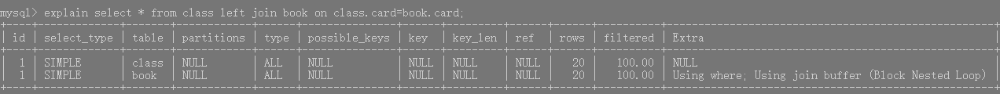

检索结果全是ALL和NULL，所以我们要对其进行优化

1.我们先对连接的表card建立索引，也就是右表book

CREATE INDEX  Y ON book(card);

查看检索结果：

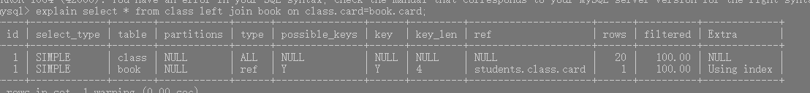

对book表的检索type变成了ref，用到了索引，且只读取了21行数据；

2.我们删掉对右表建立的索引，尝试对左表建立索引

DROP INDEX Y ON book;

CREATE INDEX Y ON class(card);

查看检索结果：

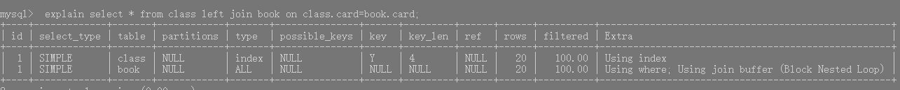

对class检索type变为了index，读取数据行数还是40行，

**结论**


（3）三表优化案列

建表语句

```mysql
CREATE TABLE IF NOT EXISTS phone(
phoneid INT UNSIGNED NOT NULL AUTO_INCREMENT,
card INT(10) UNSIGNED NOT NULL,
PRIMARY KEY(phoneid)
);

#加上前面的两张表，共三张表
INSERT INTO phone(card) VALUES(FLOOR(1+RAND()*20));
```

进行查询

 EXPLAIN SELECT * FROM class LEFT JOIN book on class.card=book.card  LEFT JOIN phone ON class.card=phone.card;

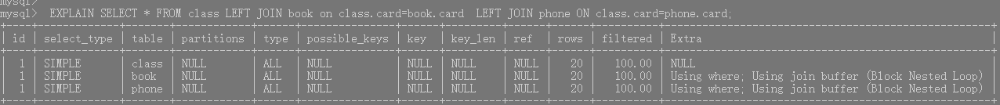


全为NULL；

所以根据前两表的经验，我们分别再book ，和phone表对要进行查询的字段card建立索引

CREATE INDEX  B ON book(card);

CREATE INDEX P ON  phone(card);

优化结果：

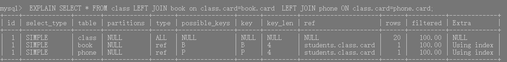

结论：对于join的这种sql语句尽量用小结果集驱动大结果集：A left B ON ...  这里时A的全表左连接B表满足条件的列，所在B表被查询的字段建立索引---小表驱动大表；


### 六，索引失效


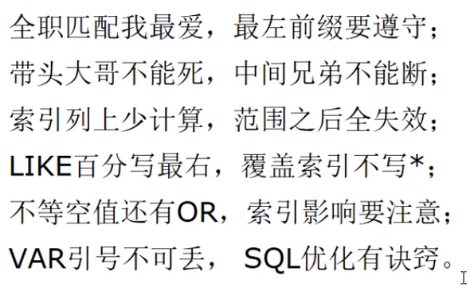

**1.全职匹配我最爱**

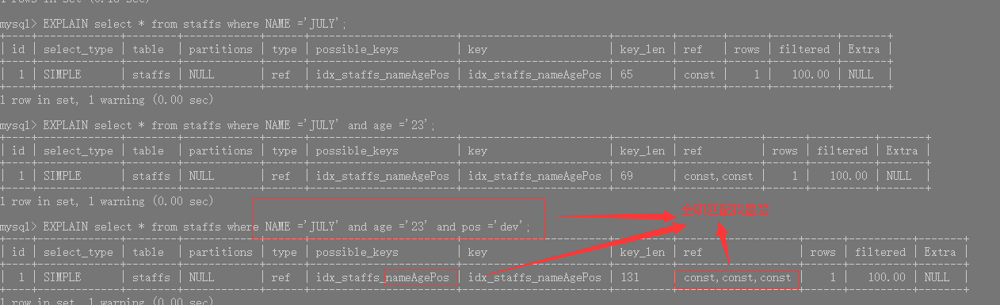


**2.最佳左前缀法则**    (火车跑的快，全靠头来带) 

如果索引了多列，查询的时候从索引的最左列开始，**并且不要跳过索引中间列**

*带头大哥不能死，中间兄虎不能断*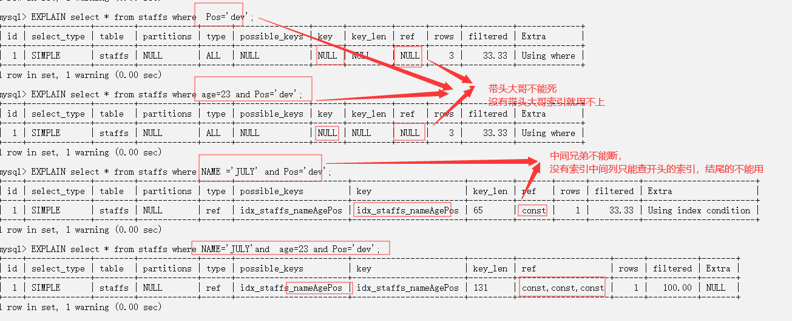

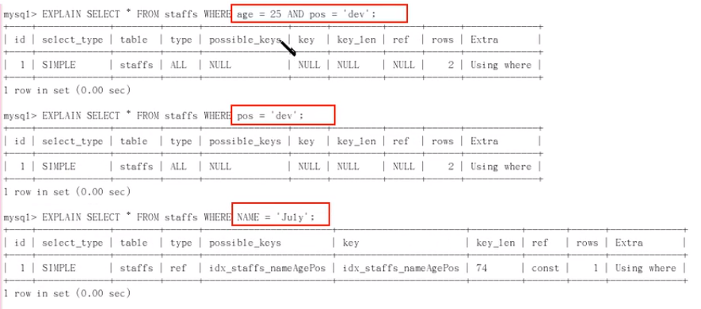


3.不在索引上做任何操作（计算，函数，（自动or手动）类型转换）会导致索引失效而转向全表扫描；

*索引列上少计算*

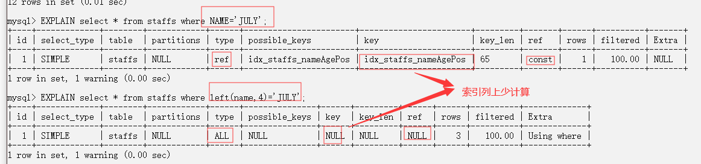


4.存储引擎不能使用索引中条件范围右边的列：就是在复合索引中当索引中的某一字段使用范围查询，那么它右边的索引字段将会失效（不会使用索引）

如图所示，在使用范围后key_len的值与只关联name，age的检索的key_len一样因为后面pos没用上索引

*范围之后全失效*

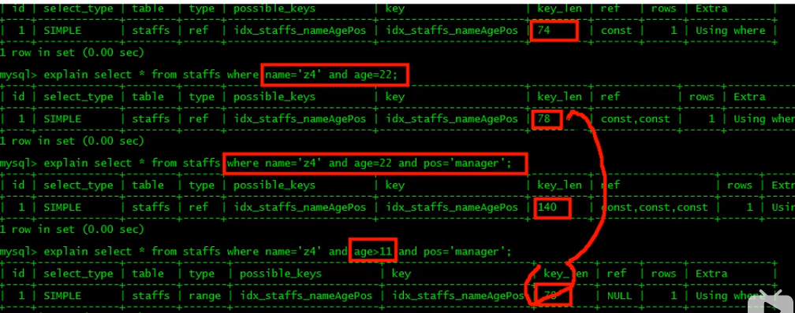

5.尽量使用覆盖索引，只访问索引的查询（索引列和查询列一致），尽量减少使用select*

*覆盖索引不写 星*

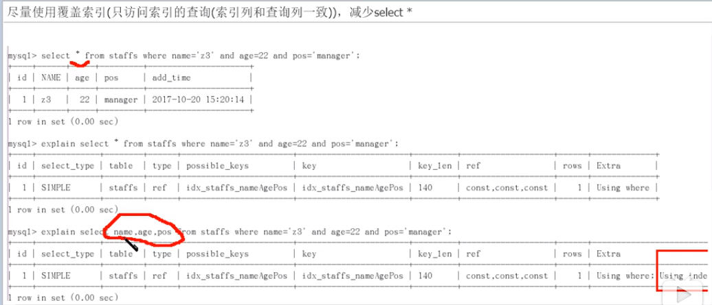

6.mysql在使用不等于（!=或则<>）的时候，有时候会导致无法使用索引导致使用全表扫描

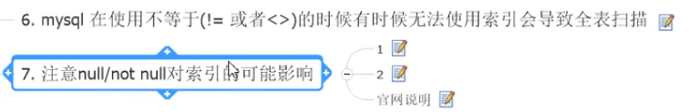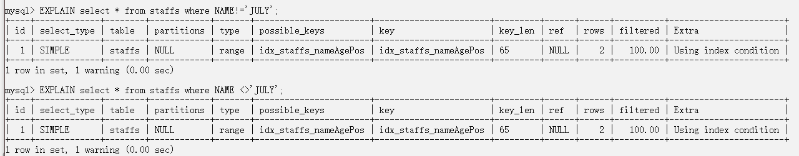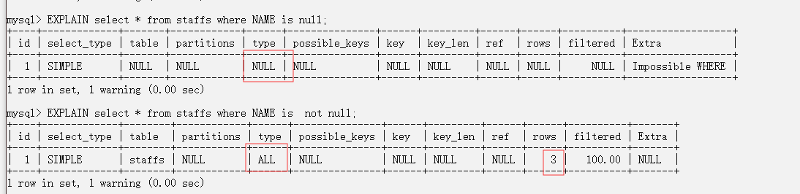

7.like以通配符开头（'%abc'）会使索引失效变成全表扫描（可使用覆盖索引优化查询）

*like*百分写右边*

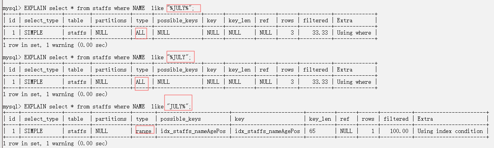

如果like后面跟的是常量如like ‘k%’这里我们知道了是已k开头的常量所以可以使用索引

而以通配符开头如 like ‘%k’，那我们就不知道开头的什么是几个字符；


8。字符串不加单引号索引失效

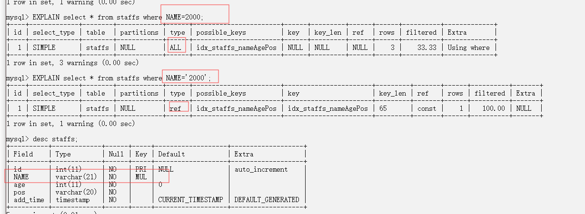

9.少用or，用它会索引失效

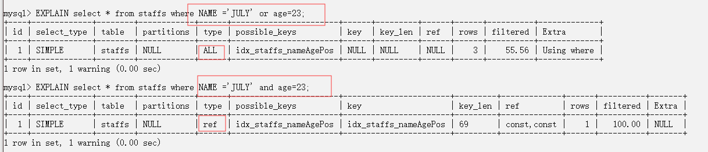

***索引面试题分析***

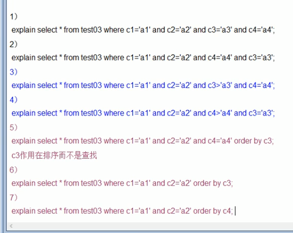

情况1

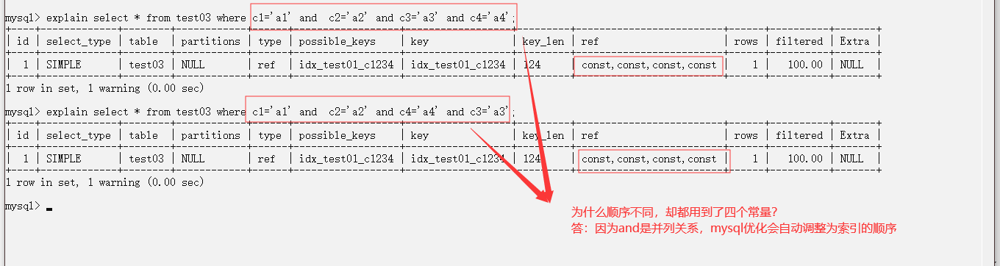

情况2：范围 range

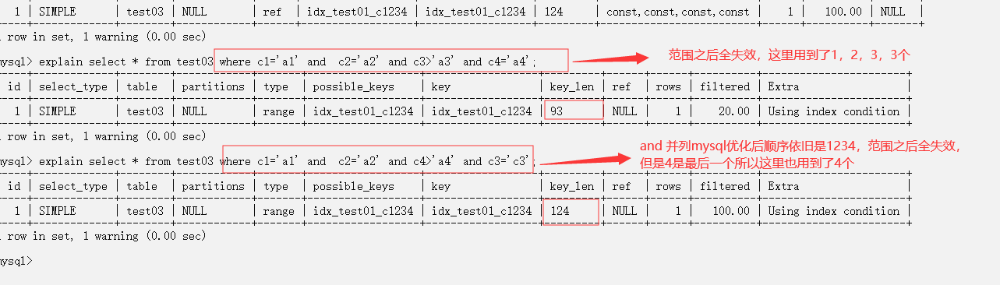

情况3：order by （mysql按照索引的顺序分析优化）

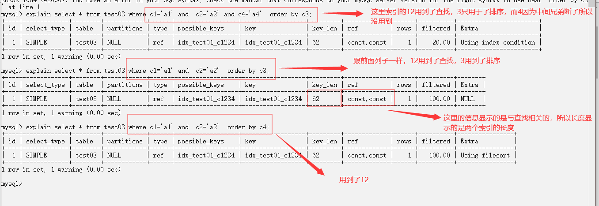

order by （const就一个不需参加排序）

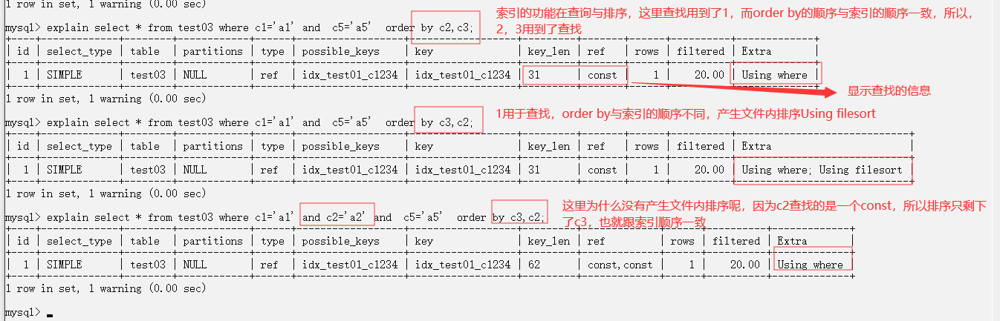

情况4：group by：分组之前必排序（它和order by 的排序法则和索引优化原则几乎一致，除了group by 还有having）

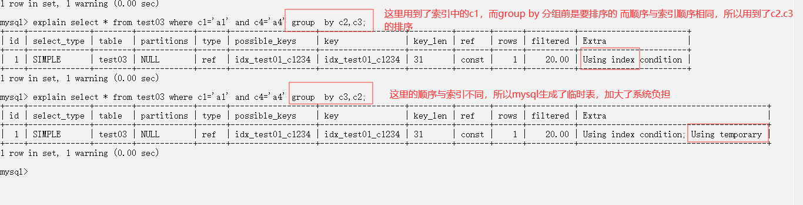

**总结**

​					查询尽量定值然后是根据范围，最后再排序，order by字段范围顺序最好与索引一致

​					group by分组之前基本要排序，索引group by顺序最好与索引一致，不然会系统会自己排序产生临时表


### 七，查询截取分析

相关子查询exists : 是否满足这个条件，是否存在这个条件，为1 则存在，为0则不存在

exists与in的区别 https://blog.csdn.net/jinjiniao1/article/details/92666614 

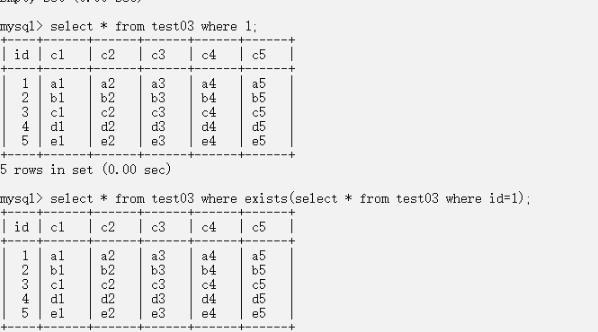

面试：你对SQL的优化有哪些见解，或者说你觉得SQL的优化步骤是什么

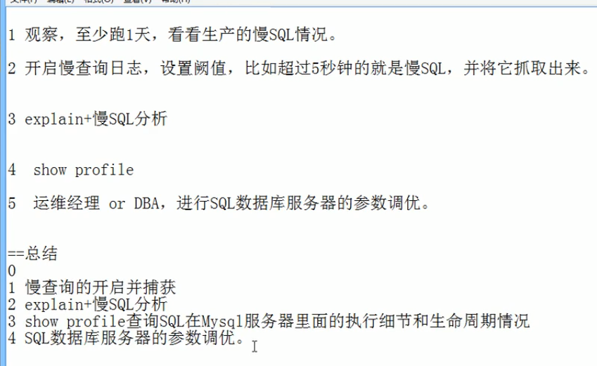


#### 1.**查询优化**

- ​	永远小表驱动大表
  
  - 优化原则：小的数据集驱动大的数据集：如果主查询的数据大于子查询的数据用in性能更好，反之用exists
  
- 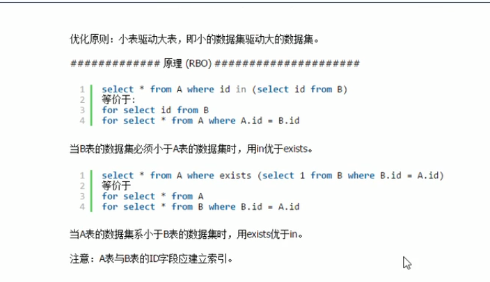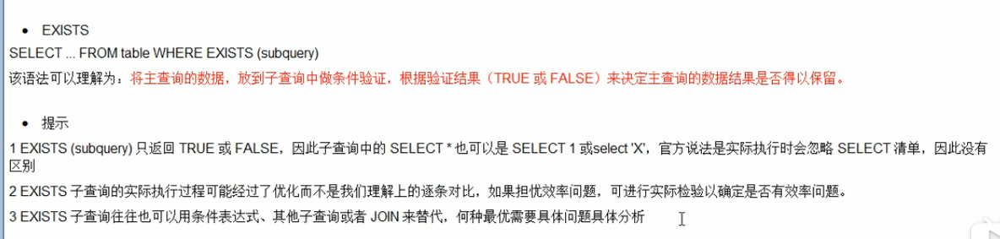
  
    **order by 关键字优化** 
  
  注意：order by 与索引的排序有关， where与索引的查找有关    （提示：*索引是一种排好序的快速查找的数据结构）*
  
  
  
  首先有三种情况：
  
  如果select的列是所有列，且超出建立的索引关联列的范围，where后的条件不满足索引建立的顺序条件则不会用到索引，切会出现Using filesort
  
  1，select的列是否只包含所有列；（没有考虑where条件的情况）
  
  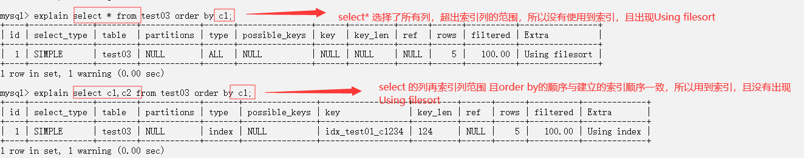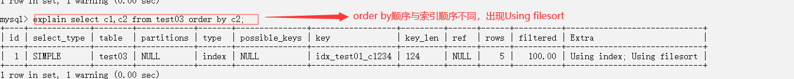
  
  2.select的列是否只包含所有列（考虑where条件 =）
  
  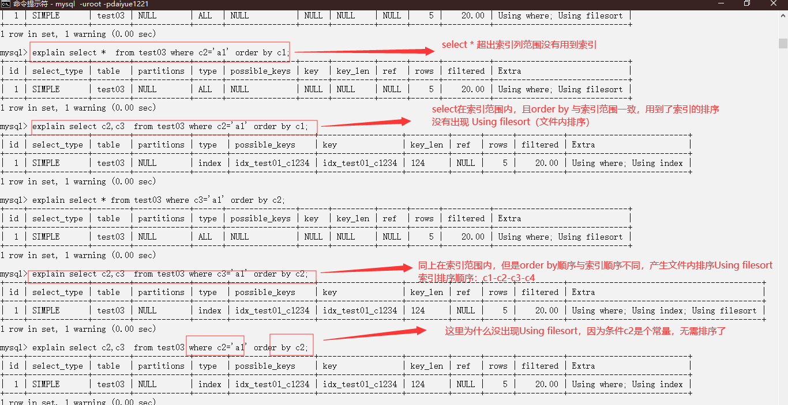
  

​     3.考虑where条件 范围（这里都是以select选中在索引范围列的为前提）

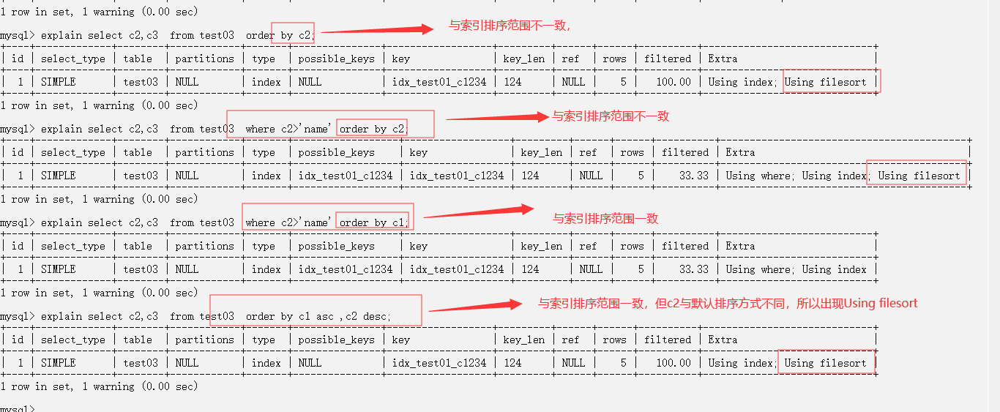

如何提高order by的速度；

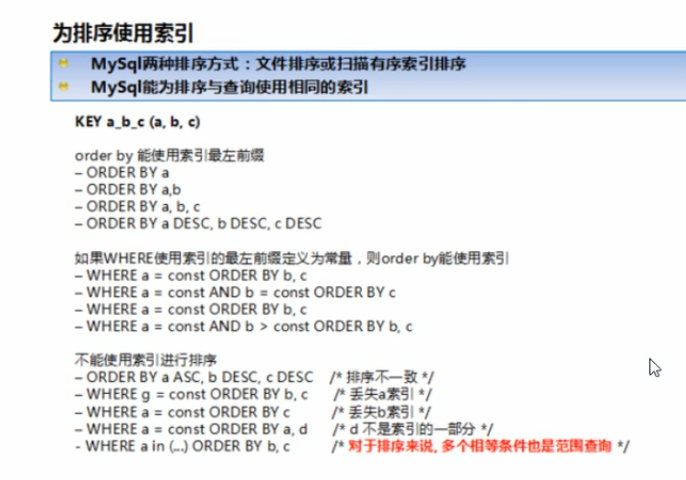

order by排序字段如果不在索引上，就会使用 Using filesort排序，MySQL就会启用两种算法，

双路排序：MySQL4.1之前使用的双路排序，字面意思就是对磁盘进行两次扫描，最终得到数据

​					读取指针和order by列对他们进行排序，然后扫面已经排好序的列表，按照列表中的值重新从列表中					读取对应的数据数据；

​					从磁盘中取排序字段，在buffer中排序，再从磁盘中取需要的字段；

​					缺点：两次扫描磁盘，I/O耗时长，而后对算法改进，出现了单路排序

单路排序：从磁盘读取查询需要的所有列，按照order by列再buffer对他们进行排序，然后扫面排序后的列表对他				    们进行输出，它的效率更快，避免了二次读取数据，并把随机IO变成了顺序IO，但它使用了更多的空					间，因为它把每一行都保存再了内存中；

**双路排序**：是首先根据相应的条件取出相应的排序字段和可以直接定位行数据的行指针信息，然后在sort buffer 中进行排序。

**单路排序**：是一次性取出满足条件行的所有字段，然后在sort buffer中进行排序。


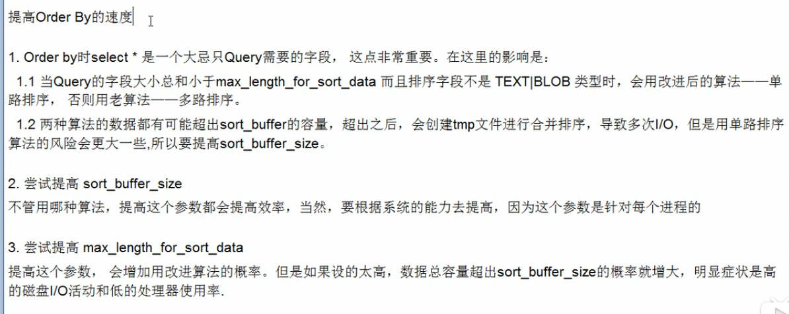

#### **group by关键字优化**

与order by几乎相同，不同的是它是先排序然后分组

然后多了一个Having，能写再where后面的尽量不写在Having后


**慢查询日志**

​	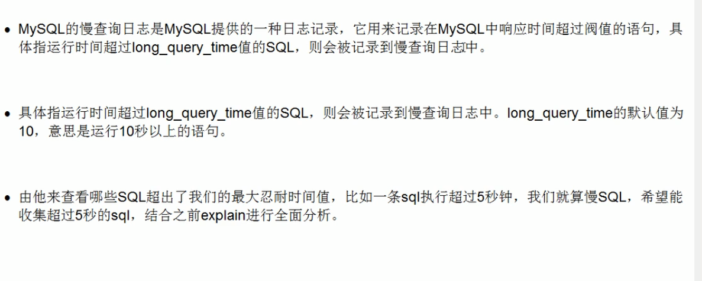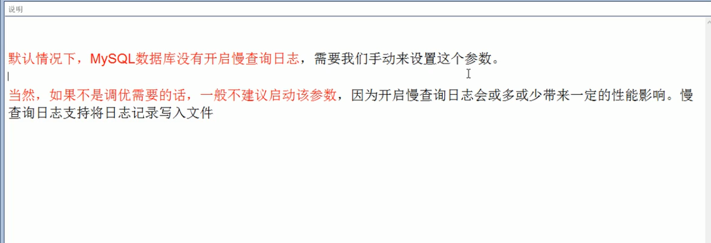

查看是否开启慢日志查询：

- SHOW VARIABLES LIKE 'slow_query_log';

  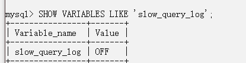

  

- 开启：SET GLOBAL slow_query_log=1;(但是此命令只对当前数据有效，重启数据库后失效)

- 永久开启

  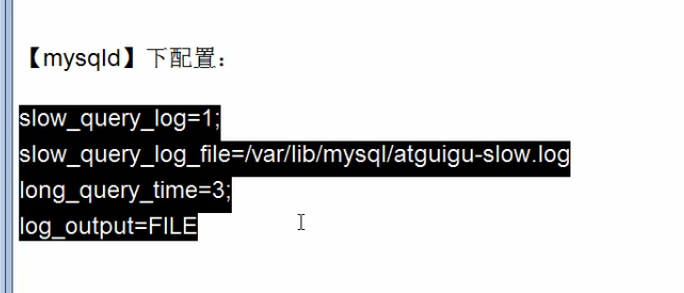

- 长久生效（但是此功能不建议长久生效）

  

- SHOW VARIABLES LIKE 'long_query_time';查看为慢查询的标准

  ​	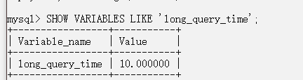

- 设置阈值时间: SET GLOBAL long_query_time=3;  (需退出从登MySQL)

   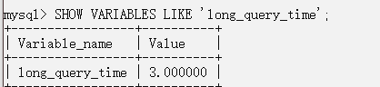

- 执行select sleep（4）函数使时间为4秒：

  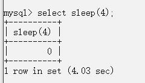

  抓取日志：

  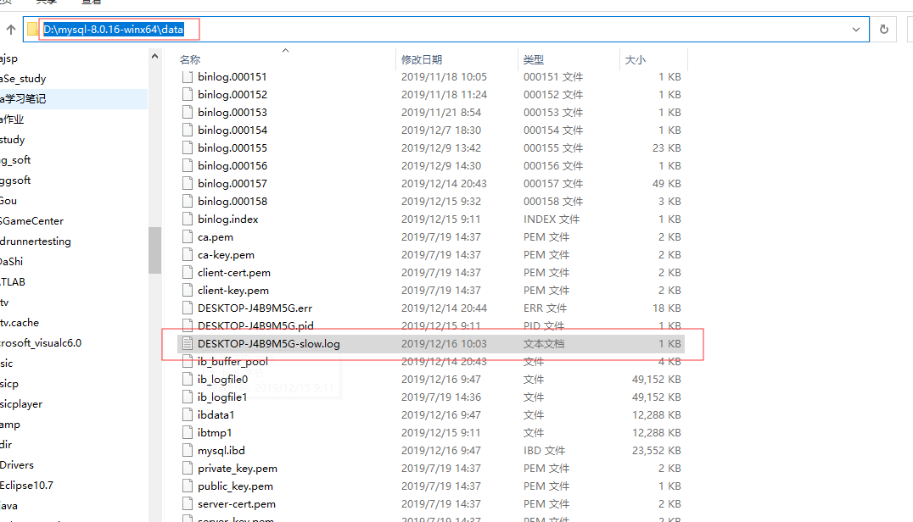

  

-  查询系统中有多少条慢查询记录：    SHOW GLOBAL STATUS LIKE "%slow_queries%";

  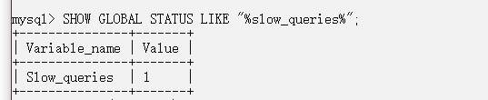

- 日志分析工具：mysqlddumpslow

  

- 查看MySQLdumpslow帮助信息：mysqldumpslow --help;(我这里没有安装这个工具，以后用到再研究)

  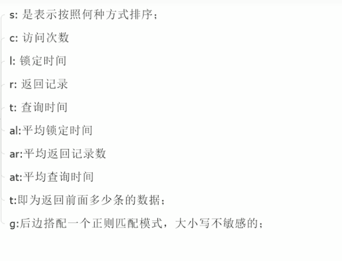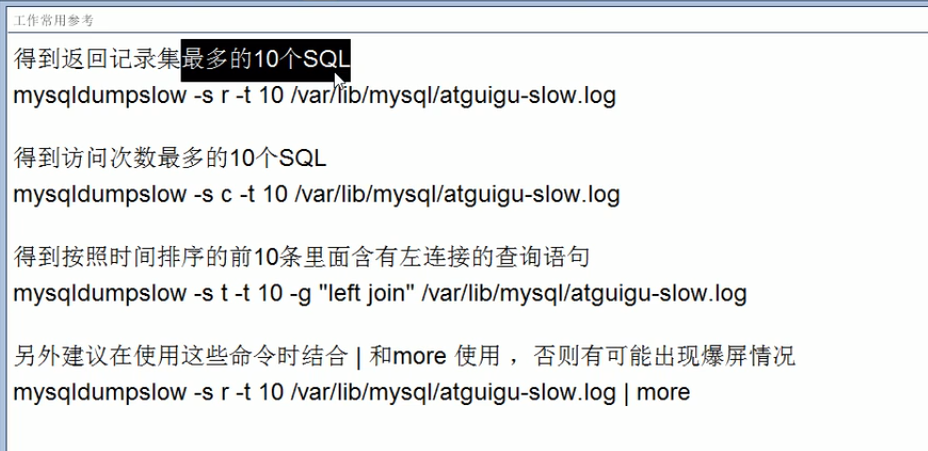

  #### **批量查询插入数据脚本**

  

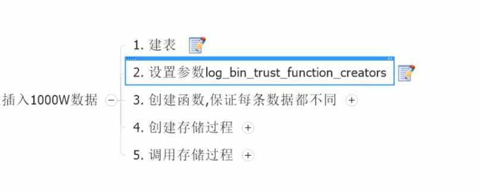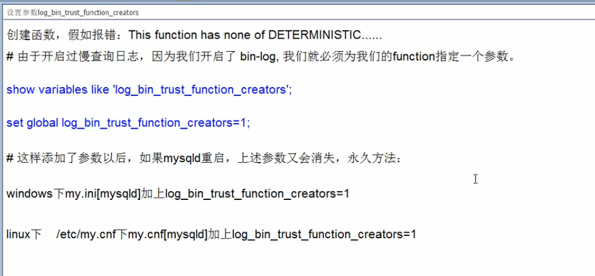

建表

```mysql
CREATE TABLE dept(
id INT UNSIGNED PRIMARY KEY  AUTO_INCREMENT,
deptno MEDIUMINT UNSIGNED NOT NULL DEFAULT 0,
dname VARCHAR(20) NOT NULL DEFAULT '',
loc VARCHAR(13) NOT NULL DEFAULT ''
)ENGINE INNODB DEFAULT CHARSET=GBK;


CREATE TABLE emp(
id INT UNSIGNED PRIMARY KEY  AUTO_INCREMENT,
empno MEDIUMINT UNSIGNED NOT NULL DEFAULT 0,
ename VARCHAR(20) NOT NULL DEFAULT '',
job VARCHAR(9) NOT NULL DEFAULT '',
mgr MEDIUMINT UNSIGNED NOT NULL DEFAULT 0,
hiredate DATE NOT NULL,
sal DECIMAL(7,2) NOT NULL,
comm DECIMAL(7,2) NOT NULL,
deptno MEDIUMINT UNSIGNED NOT NULL DEFAULT 0
)ENGINE INNODB DEFAULT CHARSET=GBK;
```

- 设置参数：

先查看是否开启

SHOW VARIABLES like "log_bin_trust_function_creators";

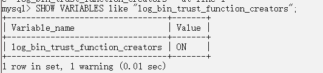

然后开启

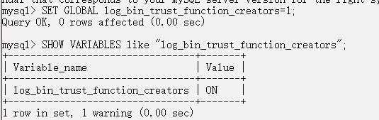


​                 建立数据库函数：


```mysql
#随机生成字符串
DELIMITER $$
CREATE FUNCTION rand_string(n INT) RETURNS VARCHAR(255)
BEGIN
DECLARE char_str VARCHAR(255) DEFAULT 'abcdefghijklmnopqrstuvwxyzABCDEFGHIJKLMNOPQRSTUVWXYZ';
DECLARE return_str VARCHAR(255) DEFAULT '';
DECLARE i INT DEFAULT 0;
WHILE i<n do
SET return_str = CONCAT(return_str,SUBSTRING(char_str,FLOOR(1+RAND()*52),1));
SET i=i+1;
END WHILE;
RETURN return_str;
END$$
#随机生成部门编号
DELIMITER $$
CREATE FUNCTION rand_num() 
RETURNS INT(5)
BEGIN
DECLARE i INT DEFAULT 0;
SET i=FLOOR(100+RAND()*10);
RETURN i;
END$$
#建立存储过程插入dept表数据（生成100到110.120都可）

DELIMITER $$
CREATE PROCEDURE insert_dept(IN START INT(10), IN max_num INT(10))
BEGIN
DECLARE i INT DEFAULT 0;
SET autocommit =0;
REPEAT
	SET i=i+1;
	INSERT INTO dept (deptno,dname,loc) VALUES ((START+i),rand_string(10),rand_string(8));	
UNTIL i= max_num END REPEAT;
COMMIT;
END$$
#建立存储过程插入emp表数据（生成部门编号起始值，和员工数量值）
DELIMITER $$
CREATE PROCEDURE insert_emp(IN START INT(10),IN max_num INT(10))
BEGIN
DECLARE i INT DEFAULT 0;
SET autocommit=0;
REPEAT
	SET i=i+1;
	INSERT INTO emp(empno,ename,job,mgr,hiredate,sal,comm,deptno) VALUES((START+i),rand_string(6),'SALESMAN',001,CURDATE(),2000,400,rand_num());
UNTIL i = max_num END REPEAT;
COMMIT;
END$$

```

点击运行函数，输入开始值，和数量

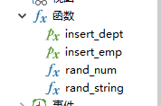

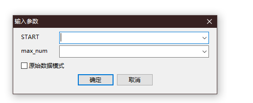


​	

#### show profile

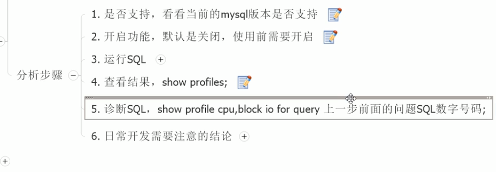

- 查看是否开启：SHOW VARIABLES LIKE "profiling";			

  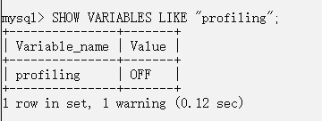									

​     

- 开启show profile：set profiling =on;


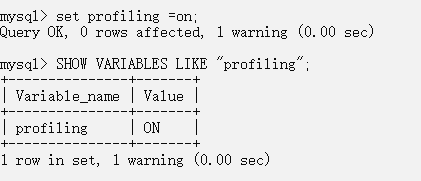


- 执行SQL语句：select * from emp group by id%10 limit 150000;

  

  ​							select * from emp group by id%20 order by 5;

  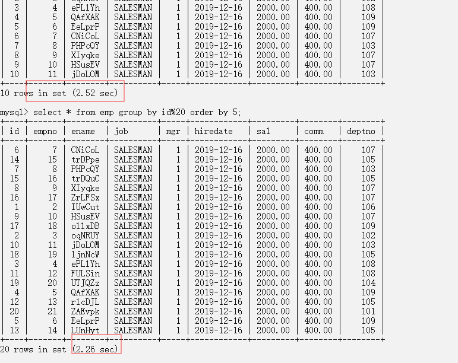

- 查看：show profiles：

  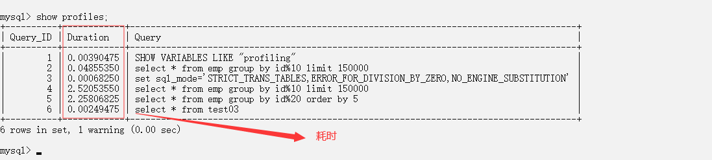

- 诊断SQL:常用语句 show profile cpu,block io for query id;

  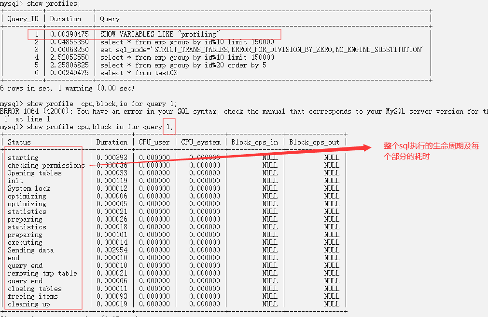

  除了cpu，block io意外还可以通过show profile查看的东西

  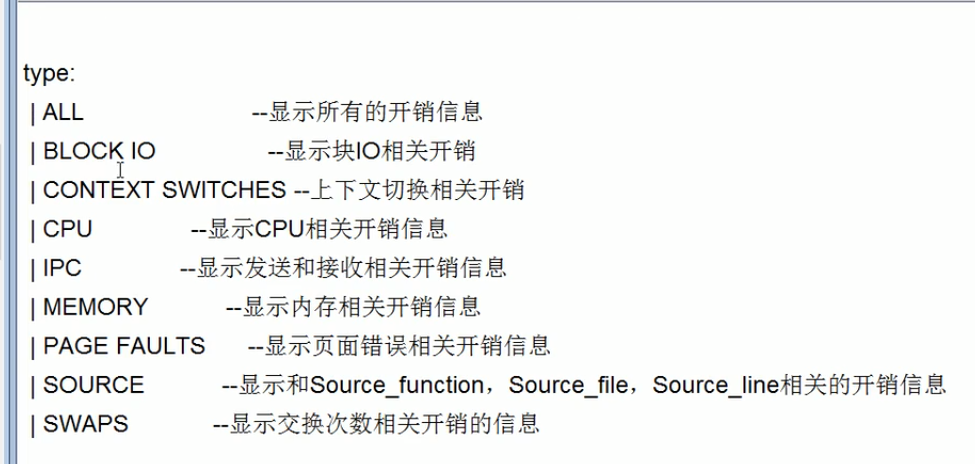

  那么我们通过show file诊断了以后怎么知道哪些有问题呢？

  日常开发需要注意的结论：

  1.converting HEAP to MyISAM:查询结果太大，内存不够

  2.Creating tmp table:创建临时表

  3.Copying to tmp table on disk：把内存中临时表复制到磁盘，危险

  4.locked：锁表

  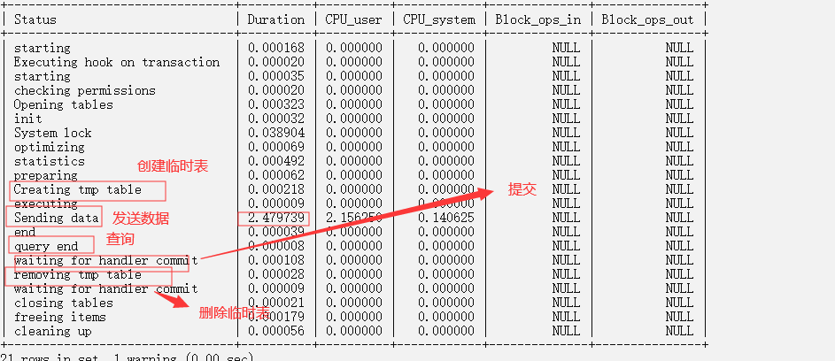

  #### **全日志查询**(永远不要在生产环境下开启该功能)

1.配置启用：

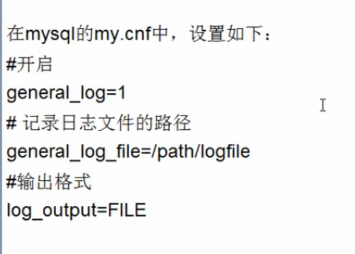

2.编码启用：

开启全局日志 ：set global general_log=1;

将日志输入模式设置为表模式：set global log_output='TABLE';


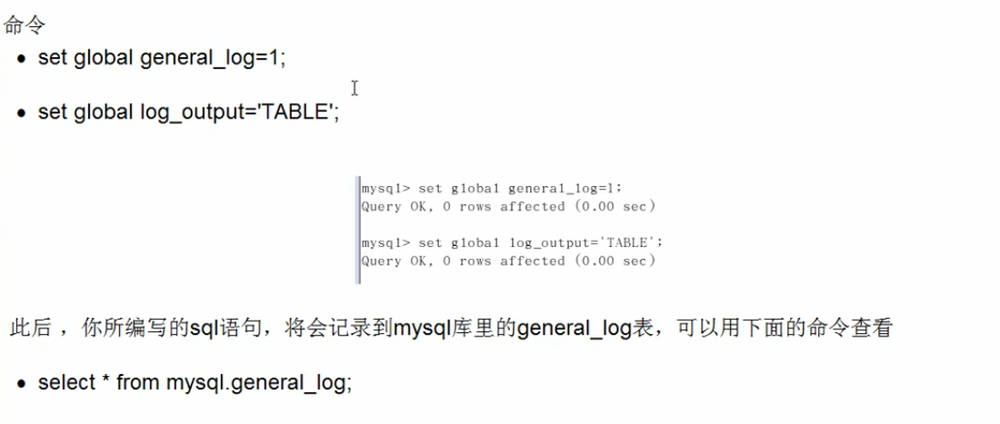

查看日志内容（记录查询的时间和查询语句）:select* from mysql.general_log;

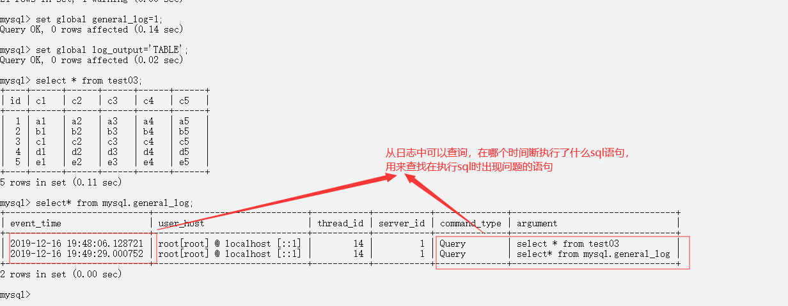


### 八，MySQL锁机制

**问题：库存超卖？**

在高并发的情况下，多个人同时抢购一个库存时，由于数据库的读写可以并行执行的原因，会导致在修改库存时，导致库存不足出现超卖（为负）的情况

**怎么解决呢** 用锁将查询查询库存操作和写入库存操作互斥（也就是说当一个事务在进行写入操作时，另一个事务想要对库存进行查询，那么如果写入操作没有提交，另一个事务时无法查到数据的）

**用悲观锁解决库存问题 :**在select时，将select语句加入一个行锁，和更新库存的语句进行互斥，保证在查询时库存不被修改

**用乐观锁解决问题**：在select时，加入一个版本字段（version），每次更新，查询和更新版本字段，如果版本字段发生变化，那么sql不会执行成功；

select kc，version from sku_info where sku_id = ?;

Update sku_info set kc=kc-1,version=version+1 where sku_id=? and version= version;(如果两个version时相同的话，此次更新成功同时更新version)


##### 1.什么是锁：是计算机协调多个进程或线程并发访问某一资源的机制


##### 2.锁的分类

- **按照对数据的操作类型（读/写）：**

  - 读锁与写锁
  - 

- **对数据操作的粒度（表锁与行锁）：**

  - **表锁（偏读，偏向MyISAM）**

    特点：偏向MyISAM存储引擎（非事务性数据库），开销小，加锁快，无死锁；锁定粒度大，发生锁冲突的概率最高，并发性最低；

    

  - 案列分析：
  
    - 建表语句
  
      ```mysql
      CREATE TABLE mylock(
      id INT NOT NULL PRIMARY KEY AUTO_INCREMENT,
      name varchar(20)
      )engine myisam;
      
      INSERT INTO mylock (name) VALUES('a');
      INSERT INTO mylock (name) VALUES('b');
      INSERT INTO mylock (name) VALUES('c');
      INSERT INTO mylock (name) VALUES('d');
      INSERT INTO mylock (name) VALUES('e');
      
      select * from mylock;
      ```
  
    - 手动增加表锁：lock table tbl_name1  read/write,tbl_name2  read/write,......;    read(共享锁)，write（排它锁）
  
    - 查看表是否枷锁：show open table; 
  
      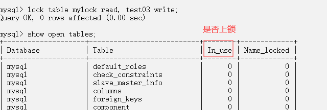
  
      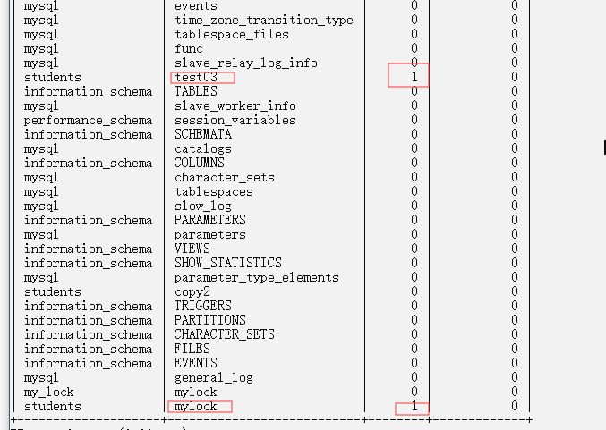           
  
    - 释放锁：unlock tables；
  
      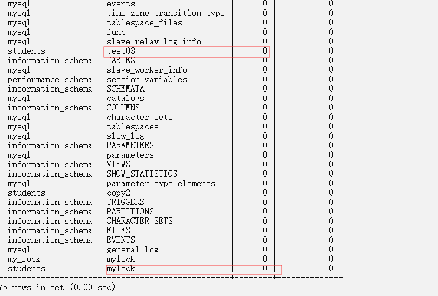
  
    - **读锁案列**：对mylock加读锁（观察当前线程与其他线程的区别）
  
      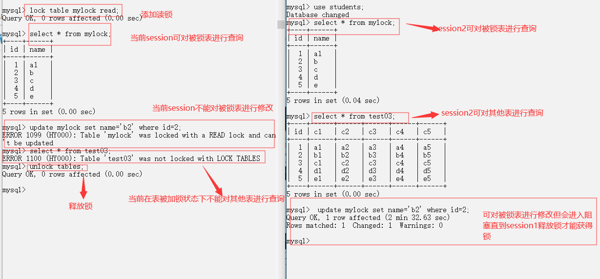           
  
    - **写锁案列:**对mylock加写锁（）
  
      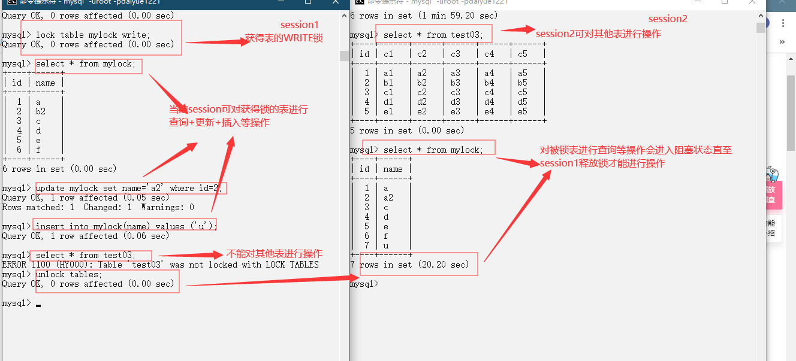
  
    - 案列结论：
  
      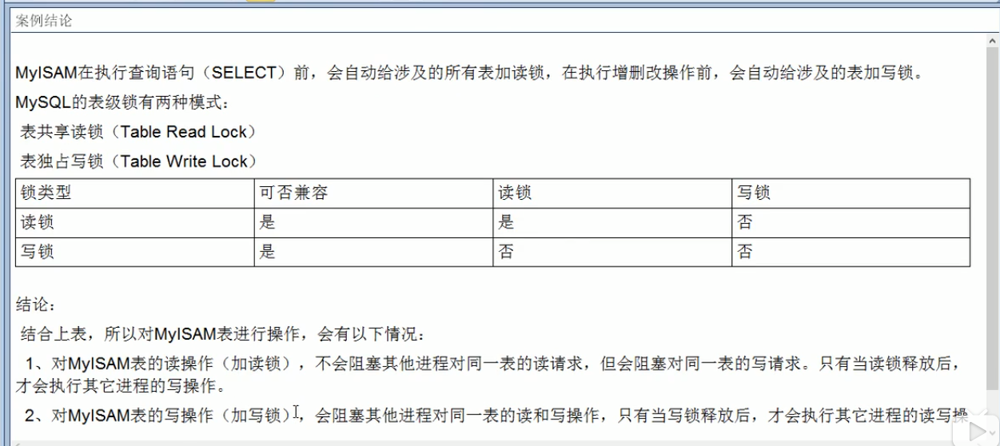                      ***简言之就是：读锁不会阻塞读只会阻塞写，而写锁会把读和写都阻塞；***
  
      
  
    - **表锁分析:** show status like 'table%';
  
      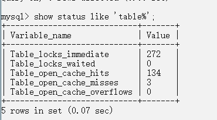
  
      ​          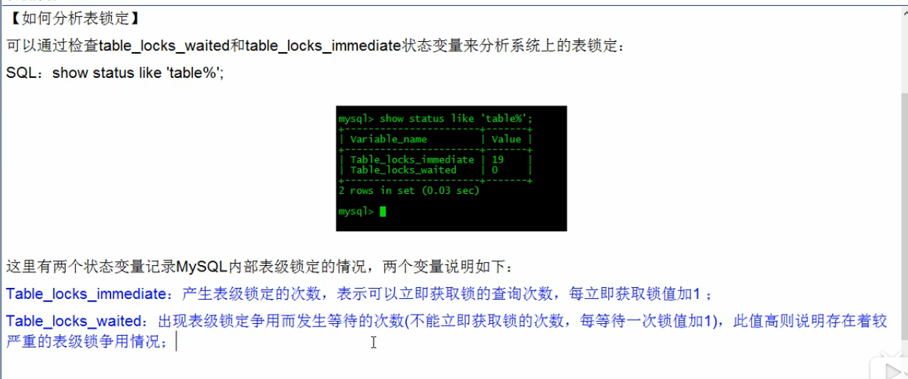
  
      myisam引擎的读写锁调度是写优先，这也是myisam不适合做写锁引擎的原因，因为当写锁后其他线程不能进行任何操作，大量的更新会使查询很难得到锁，最坏可能导致永久阻塞的情况
  
  - **行锁（偏InnoDB）**
  
    - 特点：偏向InnoDB存储引擎（事务型数据库），开销大，加锁快；会出现死锁，锁定颗粒最小，发生锁冲突的概率最低，并发度最高。
  
       InnoDB与MISAM的最大不同有两点：一是支持事务（TRANSACTION），而是采用了行级锁
  
      事务：
  
      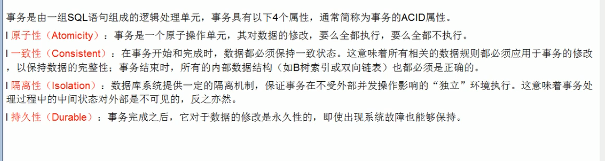
  
      ***并发事务带来的问题：***
  
      1. 更新丢失（Lost Update）
  
         ​	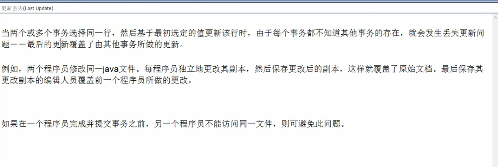
  
      2. 脏读（Dirty Reads）
  
         
  
      3. 不可重复读（Non-Repeattable-Reads）
  
         
  
      4. 幻读（Phantom Reads）
  
         
  
      

​                  ***事务的隔离级别***

​					查看当前数据库的事务隔离级别：SHOW VARIABLES LIKE   'transaction_isolation';

​								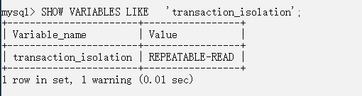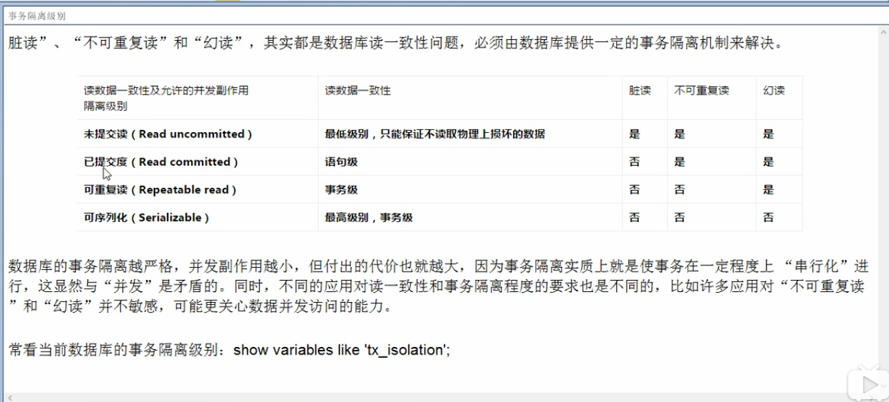

-  行锁案列分析：

  - 建表语句

    ```mysql
    CREATE TABLE test_innodb_lock (
    a INT(11),
    b VARCHAR(16)
    )ENGINE INNODB;
    
    INSERT INTO test_innodb_lock values(1,'b2');
    INSERT INTO test_innodb_lock values(3,'3');
    INSERT INTO test_innodb_lock values(4,'4000');
    INSERT INTO test_innodb_lock values(5,'5000');
    INSERT INTO test_innodb_lock values(6,'6000');
    INSERT INTO test_innodb_lock values(7,'7000');
    INSERT INTO test_innodb_lock values(8,'8000');
    INSERT INTO test_innodb_lock values(9,'9000');
    INSERT INTO test_innodb_lock values(1,'b1');
    
    CREATE INDEX test_innodb_a_ind ON test_innodb_lock(a);
    CREATE INDEX test_innodb_b_ind ON test_innodb_lock(b);
    
    ```

    - 开启数据库事务（关闭事务自动提交）：set autocommit=0;

      **事务使用的就是行锁**

      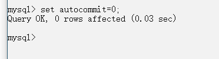

      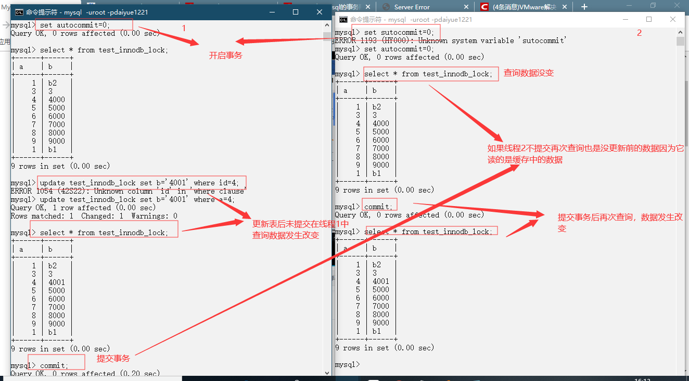

​                            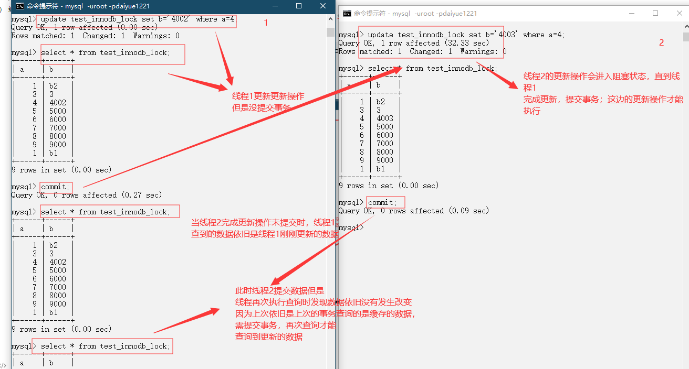

**但是这之外又出现了一个问题 如何解决在事务未提交之前其他线程可读的问题呢？**

在查询语句加行锁：避免查询和更新同时进行，导致读到的数据出现不可重复读错误；

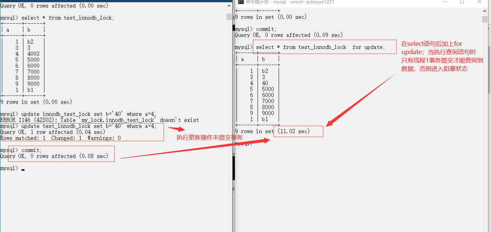


- **无索引行锁导致行锁变表锁（索引失效）**

  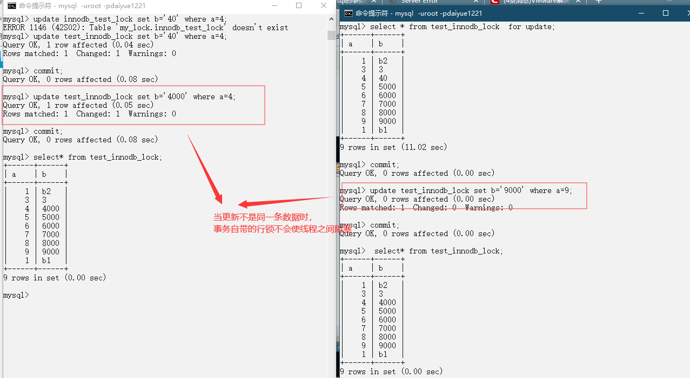


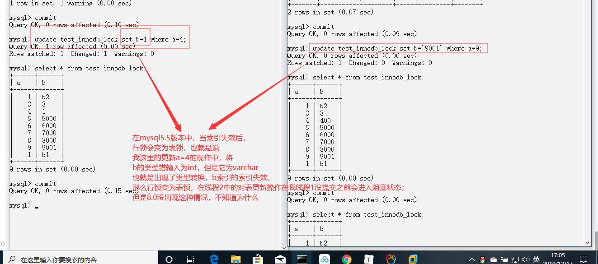

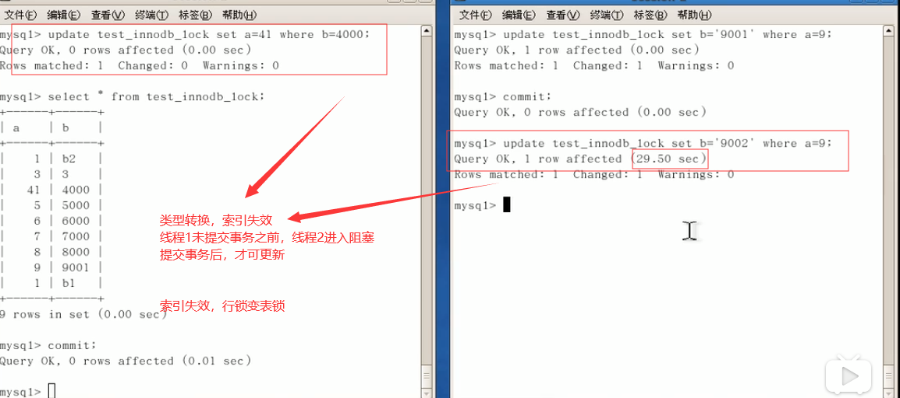

- **间隙锁的危害**

   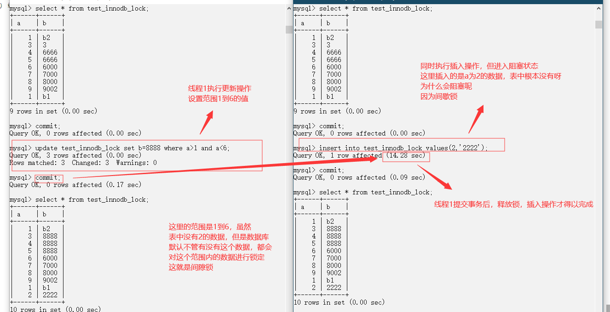

  

- 如何让锁定某一行：在sql语句后加for update

  ​	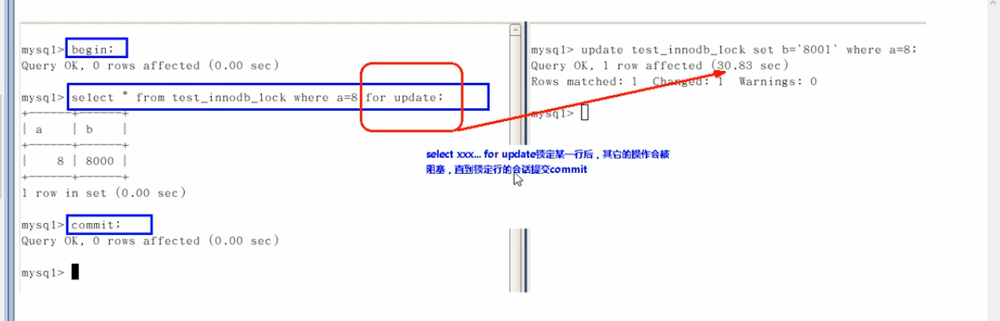

- 如何分析行锁定：SHOW STATUS LIKE "innodb_row_lock%";

  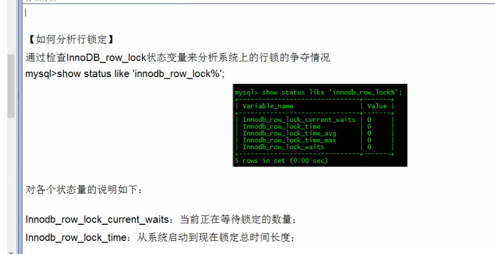

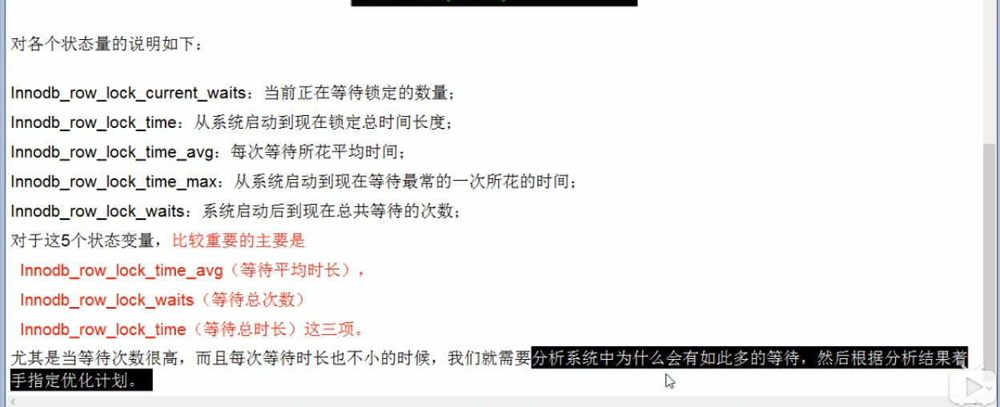

- 优化建议

  

- 页锁：

  


### 九，主从复制

#### 1.复制ide基本原理

salve会从master的binlog日志读取数据来同步；

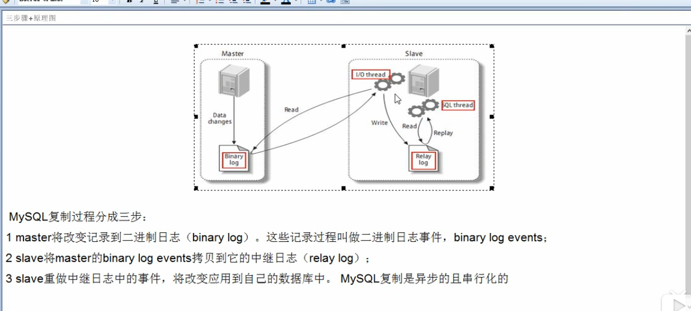

#### 2.复制的基本规则


#### 3.复制的最大问题：延时

#### 4.一主一从常见配置（windows主，Linux从）

- 最好mysql版本一致且后台以服务运行
- 都在mysqld 节点下进行配置，都是小写
- 主机修改my.ini文件

```mysql
[mysqld]
#设置3306端口
port = 3306
# 设置mysql的安装目录
basedir=D:\mysql-8.0.16-winx64
#服务id
server-id=1
#开启二进制日志
log-bin=binlog
#开启错误日志
#数据目录
#设置主机可读写
read-only=0
#设置不要复制的数据库
binlog-ignore-db=mysql
#设置需要复制的数据库
#binlog-do-db=数据库名
```

- 修改从机my.cnf文件

  - 配置从服务器唯一id（必须）

    将server-id=1注释掉

    去掉server-id=2的注释

  - 启动二进制日志（可选：默认启动）

- 重启从主的mysql服务

- 关闭主机防火墙

- 关闭从机防护墙（如何让linix中安装的话）

- 在主机mysql授权给从机用户：GRANT REPLIACTION SLAVE ON  

- 在主机新建用户：
  - mysql> create user 'zs'@'%' identified by '123456';
    Query OK, 0 rows affected (0.12 sec)
  - mysql> grant replication slave on *.* to 'zs'@'%' ;
    Query OK, 0 rows affected (0.22 sec)
  - mysql> flush privileges;（刷新权限）
    Query OK, 0 rows affected (0.03 sec)

- 查看master状态

  - show master status;

  - 记下File和position的值（从机这个位置查找日志）

    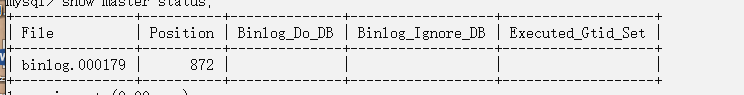

- 在从机（linux）上配置
  - 建立用户：
  
    进入mysql
  
    use mysql；
  
    create user ‘xd’@‘192.168.74.1’ identified by ‘123456’；
  
    给权限：grant all on  星 . 星  to   ‘xd’@‘192.168.74.1’ (这里打不出星字符)
  
    flush privileges；
  
    退出数据库重启数据库
  
    
  
  - use mysql
    
  - change master to master_host='192.168.74.1',master_user='xd',master_password='123456',
    master_log_file='binlog.000184',master_log_pos=854;

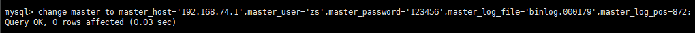

- ​         启动从服务器复制功能：start slave


- 查看主从服务是否配置成功：show slave status \G

在我弄了两天后，卸掉linux上的mysql5.5，从装mysql8.0.16和主机版本一样然后，终于成功了！！！！！！！

总结一下期间遇到的问题：

安装mysql时要注意配置文件不要直接复制粘贴

在设置主机前要先创建主机的的用户详见上边的建立用户👆

结果：之前一直是Slave_IO_Running: Connecting


出现两个YSE连接成功

在主机上建立数据库

在从机上可访问

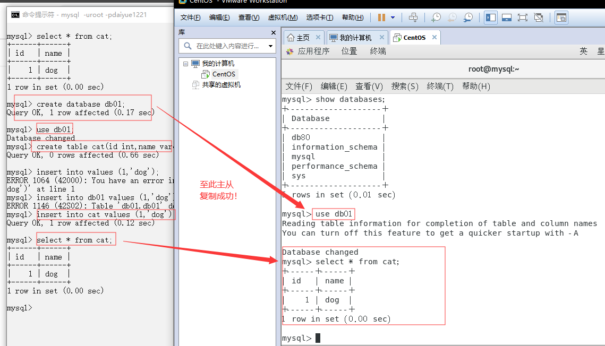

