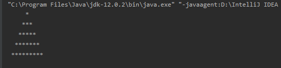

### 利用for循环打印三角形

```java
package method.forcase;

public class demo1 {
    public static void main(String[] args) {
        for (int i=1; i<=5; i++) {
            for(int j=5;j>=i;j--){
                System.out.print(" ");
            }
            for (int j = 1; j <=i; j++) {
                System.out.print("*");
            }
            for (int j = 1; j <i; j++) {
                System.out.print("*");
            }

            System.out.println();
            
        }
    }
}

```




看不懂用debug方式查看原理