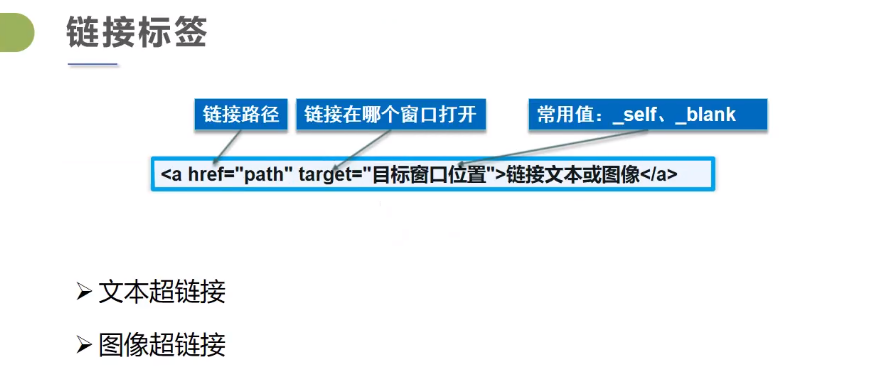

# HTML5学习笔记

## 1.什么是HTML

HTML（Hyper Text Markup Language） 超文本标记语言

超文本：不限于文本，将其他媒体信息如图片，视频等通过超链接的呈现在网页的方式

标记：通过对文本的标记告知浏览器该如何显示文本的内容，这种标记方式叫做标签，分为单标签

```
<hr />,<br />,<input />,,<meta>,<link>,<col>等
```

和双标签

```
<body>,<html>,<p>等
```

HTML它不是编程语言而是一种超文本标记语言，作用是描述网页的基本结构


快捷输入标签方法 例如p+tab键；

## 2.基本结构

```html
<!DOCTYPE html><!---指定文件类型为html-->
<html lang="en">
<head><!--头部-->
    <meta charset="UTF-8"><!--描述标签,指定字符编码utf-8-->
    <title>Title</title><!--标题-->
</head>
<body><!--主体，网页显示的内容-->

</body>
</html>
```

## 3.基本标签	

```html
<!DOCTYPE html>
<html lang="en">
<head>
    <meta charset="UTF-8">
    <title>基本标签</title>
</head>
<body>
<!--标题标签-->
<h1>一级标题</h1>
<h2>二级标题</h2>
<h3>三级标题</h3>
<!--段落标签-->
<p>从明天起，做一个幸福的人</p>
<p>喂马，劈柴，周游世界</p>
<p>从明天起，关心粮食和蔬菜</p>
<p>我有一所房子，面朝大海，春暖花开</p>
<!--换行标签-->
从明天起，和每一个亲人通信 <br/>
告诉他们我的幸福 <br/>
那幸福的闪电告诉我的 <br/>
我将告诉每一个人 <br/>
给每一条河每一座山取一个温暖的名字 <br/>
<!--水平线标签-->
<hr/>
<!--粗体，斜体-->
<strong>粗体：keep studying</strong>
<br/>
<em>斜体：keep going</em>
<!--注释和特殊标签-->
空格便签：空&nbsp;格 空&nbsp;&nbsp;&nbsp;&nbsp;&nbsp;格
<br/>
大于 &gt;
<br/>
小于 &lt;
<br/>
公司 &copy;感恩戴德
</body>
</html>
```

### 3.1图片标签

```html
<!DOCTYPE html>
<html lang="en">
<head>
    <meta charset="UTF-8">
    <title>图片标签学习</title>
</head>
<body>
<!--绝对路径-->
<!--就是写死了的路径，例如：D:\idea\HTML\resource\img\1.jpg-->
<!--相对路径-->  
<!--相对于当前文件的路径，例如../resource/img/1.jpg-->   
<!--../指上级目录-->

</body>
</html>
```

### 3.2链接标签



```html
<!DOCTYPE html>
<html lang="en">
<head>
    <meta charset="UTF-8">
    <title>超链接标签</title>
</head>
<body>
<!--超链接
1.target="_blank" 在新标签中打开
2.target="_self" 在原标签中打开
3.还有其他空格可选择
-->


<a name="top">顶部</a>
<a href="#bottom">回到底部</a>
<a href="https://github.com/daiyuebinJavastudy/JavaStudynote/blob/master/Java%E5%AD%A6%E4%B9%A0%E7%AC%94%E8%AE%B0/HTML5%E5%AD%A6%E4%B9%A0%E7%AC%94%E8%AE%B0.md" target="_blank">
    点击查看我的笔记</a>

<a href="我的第？个网页.html" target="_blank"></a>
<a href="https://baidu.com" target="_self">点击跳转百度</a>
<br/>
<br/><br/><br/><br/><br/><br/><br/>
<!--锚链接
<a  name="top"></a>
1.需要一个锚标记
2.跳转到该标记
-->
<a href="#top">回到顶部</a>
<a name="bottom">底部</a>

<!--功能型链接
1.邮件链接mailto
2.qq推广链接
-->
<a href="mailto:1006285232@qq.com">点击发送qq邮箱</a>
<a target="_blank" href="http://wpa.qq.com/msgrd?v=3&uin=1006285232&site=qq&menu=yes"></a>

</body>
</html><!DOCTYPE html>
<html lang="en">
<head>
    <meta charset="UTF-8">
    <title>超链接标签</title>
</head>
<body>
<!--a标签
    target="_blank" 在新标签中打开
    target="_self" 在原标签中打开
-->


<a name="top">顶部</a>
<a href="#bottom">回到底部</a>
<a href="https://github.com/daiyuebinJavastudy/JavaStudynote/blob/master/Java%E5%AD%A6%E4%B9%A0%E7%AC%94%E8%AE%B0/HTML5%E5%AD%A6%E4%B9%A0%E7%AC%94%E8%AE%B0.md" target="_blank">
    点击查看我的笔记</a>

<a href="我的第？个网页.html" target="_blank"></a>
<a href="https://baidu.com" target="_self">点击跳转百度</a>
<br/>
<br/><br/><br/><br/><br/><br/><br/>
<!--锚标签
    <a  name="top"></a>
    需要一个锚标记
    跳转到该标记
-->
<a href="#top">回到顶部</a>
<a name="bottom">底部</a>
</body>
</html>
```

### 3.3行业元素 块元素

块元素：无论内容多少，都独占一行，开辟一块新的空间 (p,h1-h6)

行内元素：能够单独摆放在一行内的标签（strong, em, a）

### 3.4列表

列表就是信息资源的一种展示形式，它能把信息更加结构化，条理化的展现在我们面前，便于我们更加清楚的浏览信息

列表分为：

有序列表ol

无序列表ul

自定义列表dl

```html
<!DOCTYPE html>
<html lang="en">
<head>
    <meta charset="UTF-8">
    <title>列表学习</title>
</head>
<body>
<!--有序列表
ol（order list）
-->
<ol>
    <li>java基础</li>
    <li>html+css+vue</li>
    <li>javaweb</li>
    <li>ssm</li>
</ol>
<hr/>
<!--无需列表
ul（unordered list）
-->
<ul>
    <li>java基础</li>
    <li>html+css+vue</li>
    <li>javaweb</li>
    <li>ssm</li>
</ul>
<!--自定义列表
dl：标签
dt：列表名称
dd：列表内容
-->
<hr/>
<dl>
    <dt>学习步骤</dt>
    <dd>java基础</dd>
    <dd>html+css+vue</dd>
    <dd>javaweb</dd>
    <dd>ssm</dd>
</dl>
</body>
</html>
```

### 3.5表格

```html
<!DOCTYPE html>
<html lang="en">
<head>
    <meta charset="UTF-8">
    <title>表格标签学习</title>
</head>
<body>
<!--表格标签
    table
    tr：行
    td：列
-->
<table border="1px">
    <tr>
    <!--colspan:跨列-->
        <td colspan="3" align="center">成绩</td>
    </tr>
    <tr>
        <!-- rowspan ：跨行      -->
        <td rowspan="2" align="center">daiyuebin</td>
        <td>英语</td>
        <td>120</td>
    </tr>
    <tr>
        <td>java</td>
        <td>130</td>
    </tr>
    <tr>
        <td rowspan="2" align="center">戴粤斌</td>
        <td>英语</td>
        <td>130</td>
    </tr>
    <tr>
        <td>java</td>
        <td>140</td>
    </tr>

</table>
</body>
</html>
```

