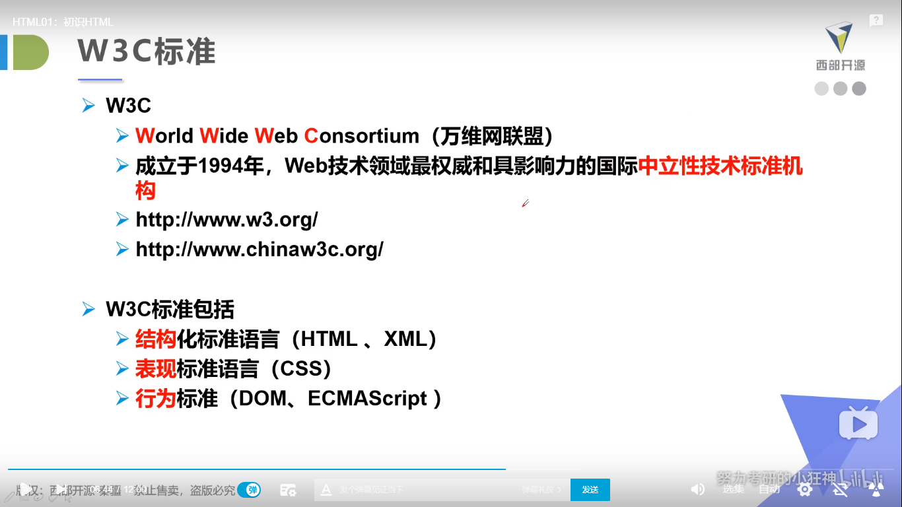

# HTML5学习笔记

## 1.什么是HTML

HTML（Hyper Text Markup Language） 超文本标记语言

超文本：不限于文本，将其他媒体信息如图片，视频等通过超链接的呈现在网页的方式

标记：通过对文本的标记告知浏览器该如何显示文本的内容，这种标记方式叫做标签，分为单标签

```
<hr />,<br />,<input />,,<meta>,<link>,<col>等
```

和双标签

```
<body>,<html>,<p>等
```

HTML它不是编程语言而是一种超文本标记语言，作用是描述网页的基本结构



快捷输入标签方法 例如p+tab键；

## 2.基本结构

```html
<!DOCTYPE html><!---指定文件类型为html-->
<html lang="en">
<head><!--头部-->
    <meta charset="UTF-8"><!--描述标签,指定字符编码utf-8-->
    <title>Title</title><!--标题-->
</head>
<body><!--主体，网页显示的内容-->

</body>
</html>
```

## 3.基本标签	

```html
<!DOCTYPE html>
<html lang="en">
<head>
    <meta charset="UTF-8">
    <title>基本标签</title>
</head>
<body>
<!--标题标签-->
<h1>一级标题</h1>
<h2>二级标题</h2>
<h3>三级标题</h3>
<!--段落标签-->
<p>从明天起，做一个幸福的人</p>
<p>喂马，劈柴，周游世界</p>
<p>从明天起，关心粮食和蔬菜</p>
<p>我有一所房子，面朝大海，春暖花开</p>
<!--换行标签-->
从明天起，和每一个亲人通信 <br/>
告诉他们我的幸福 <br/>
那幸福的闪电告诉我的 <br/>
我将告诉每一个人 <br/>
给每一条河每一座山取一个温暖的名字 <br/>
<!--水平线标签-->
<hr/>
<!--粗体，斜体-->
<strong>粗体：keep studying</strong>
<br/>
<em>斜体：keep going</em>
<!--注释和特殊标签-->
空格便签：空&nbsp;格 空&nbsp;&nbsp;&nbsp;&nbsp;&nbsp;格
<br/>
大于 &gt;
<br/>
小于 &lt;
<br/>
公司 &copy;感恩戴德
</body>
</html>
```

