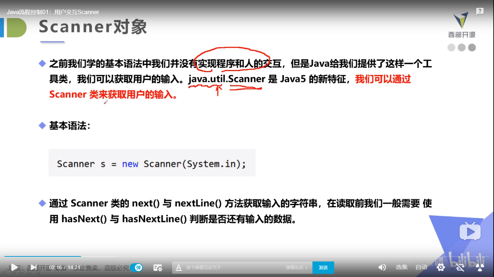
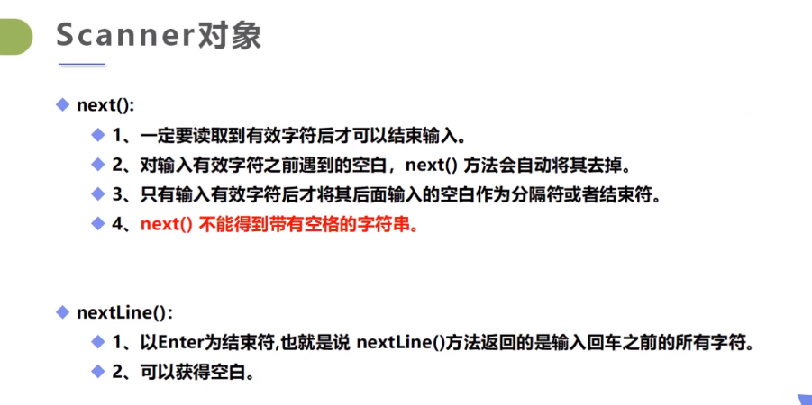
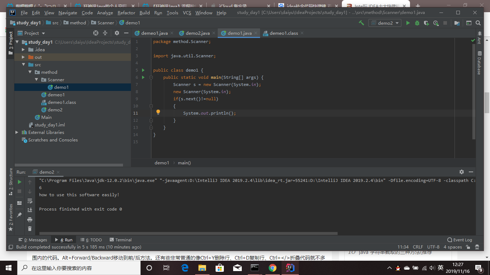
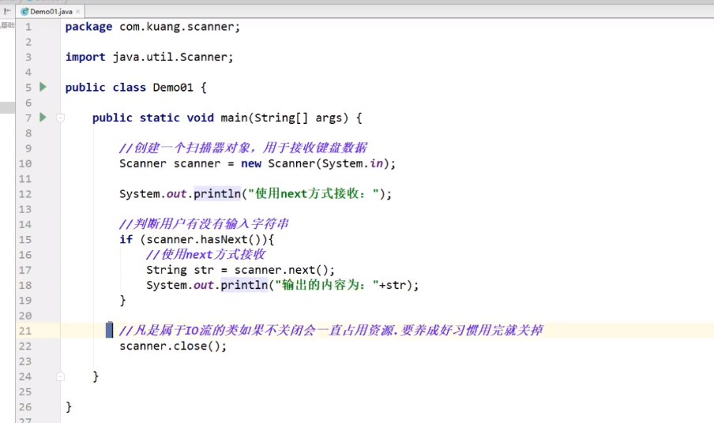

## Scanner类的用法

```java

package method.Scanner;

import java.awt.*;
import java.util.Scanner;

public class demo2 {
    public static void main(String[] args) {
        //从键盘输入多个数字，求其和与平均数，通过输入非数字来结束
        Scanner scanner = new Scanner(System.in);
        double sum = 0;
        int m = 0;

        while(scanner.hasNextDouble()){
            double x  = scanner.nextDouble();
            m = m+1;
            sum = sum + x;
        }
        System.out.println("一共输入 " + m + "个数");
        System.out.println("他们的和是：" + sum + " 平均数是 " + sum/m );
        nner.close();
    }
}

```








