# JavaWeb学习笔记

### 1.什么是web？

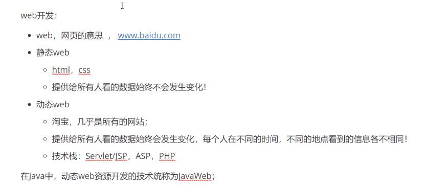

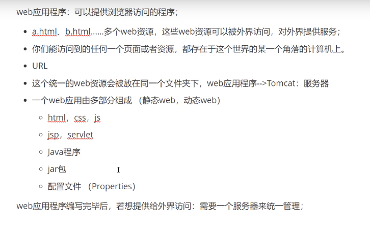

##### 1.1静态web？

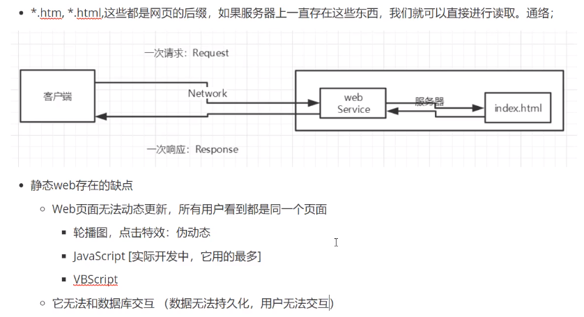

web页面无法更新，用户看到的是同一个界面

无法与数据交互，数据无法持久化，用户无法交互

**https走的是443端口**

**http走的是80 端口**


##### 1.2动态web？

web页面随时更新，在不同时间地点，用户看到的界面都不一样

可以访问数据库（与后台进行数据交互）

它的内部原理是？

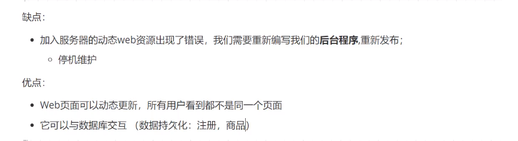

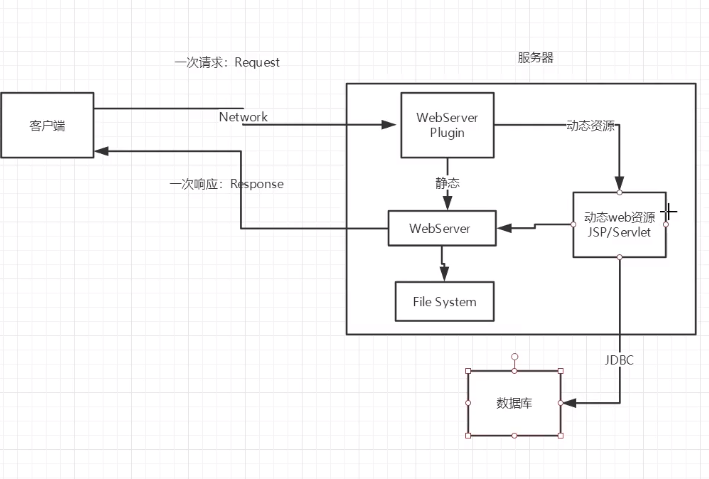

### 2.web服务器

##### 2.1技术讲解

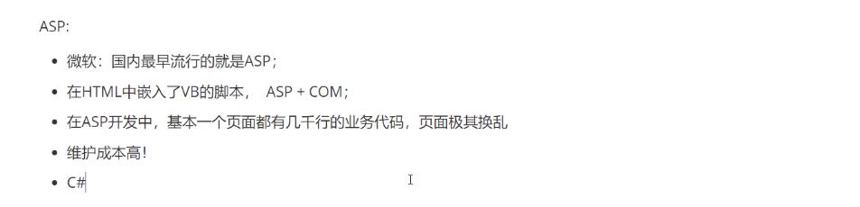

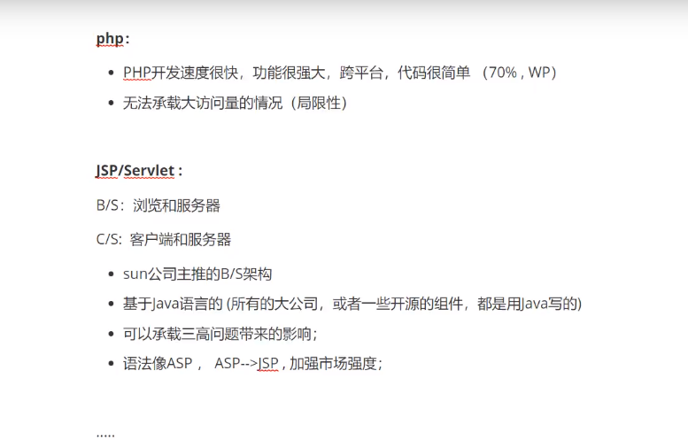

##### 2.2web服务器

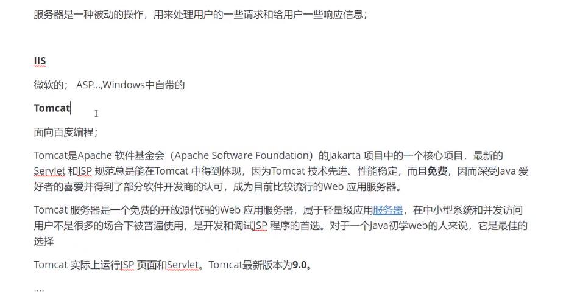

**什么是tomcat？**

Tomcat是Apache 软件基金会（Apache Software Foundation）的Jakarta 项目中的一个核心项目，最新的Servlet 和JSP 规范总是能在Tomcat 中得到体现。因为Tomcat 技术先进、性能稳定，而且免费，因而深受Java 爱好者的喜爱并得到了部分软件开发商的认可，成为目前比较流行的Web 应用服务器。

Tomcat 服务器是一个免费的开放源代码的Web 应用服务器，属于轻量级应用[服务器](https://baike.baidu.com/item/服务器)，在中小型系统和并发访问用户不是很多的场合下被普遍使用，是开发和调试JSP 程序的首选。

Tomcat 实际上运行JSP 页面和Servlet。目前Tomcat最新版本为**9.0.27。**

**java**

1.下载安装

2.了解配置文件和目录结构

**jdk/**

java软件开发工具包

bin：执行文件

include：一些c语言写的的头文件，win32：一些系统的底层

**jre/**

java运行时环境

lib：jar包，Java核心jar包：rt.jar 

面试会问：java的根加载机制:那些类从哪里来的-->rt.jar

3 .这个东西的作用

### 3.tomcat

##### 3.1安装tomcat

1.下载安装

2.了解配置文件和目录结构

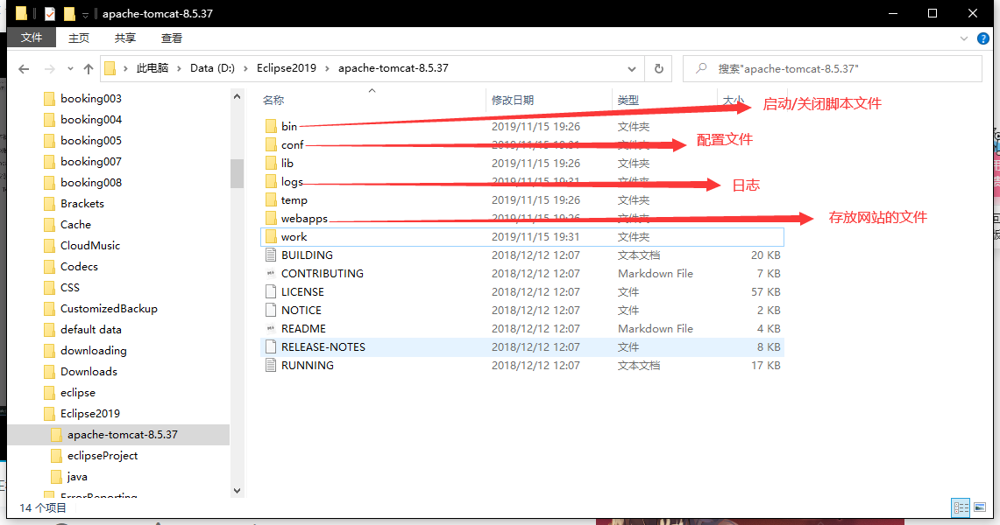

**webapps：一个文件夹代表一个应用**

3.这个东西时干嘛的：服务器

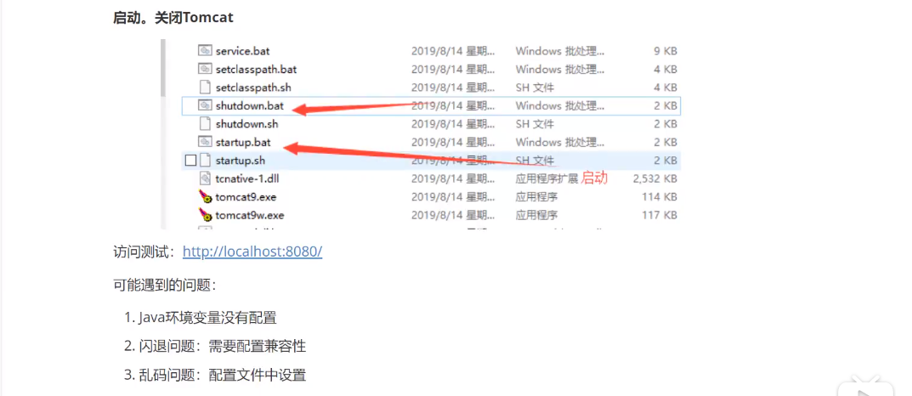

##### 3.2配置

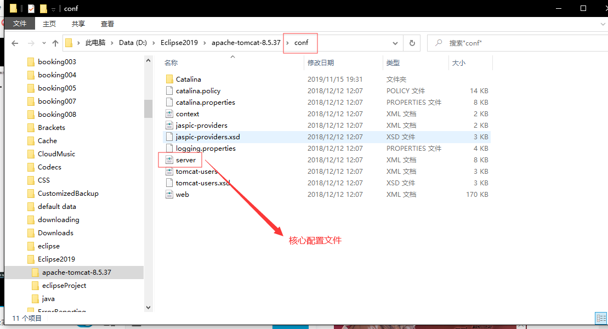

可以配置主机的端口号：

- tomcat的默认端口号为：8080
- mysql：3306
- http：80
- https：443

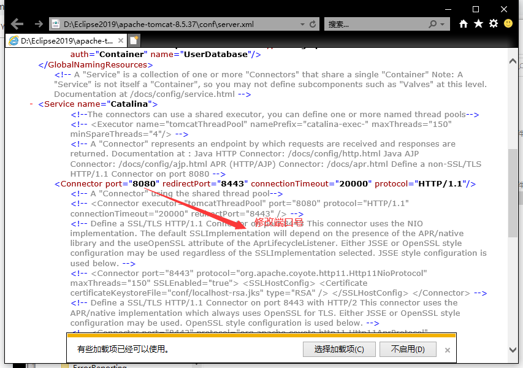

可以配置主机的名称：需要先去底层映射

- 默认的主机名称为：localhost--->127.0.01
- 默认的网站应用存放地为：webapps；

在C:\Windows\System32\drivers\etc\hosts配置文件下修改

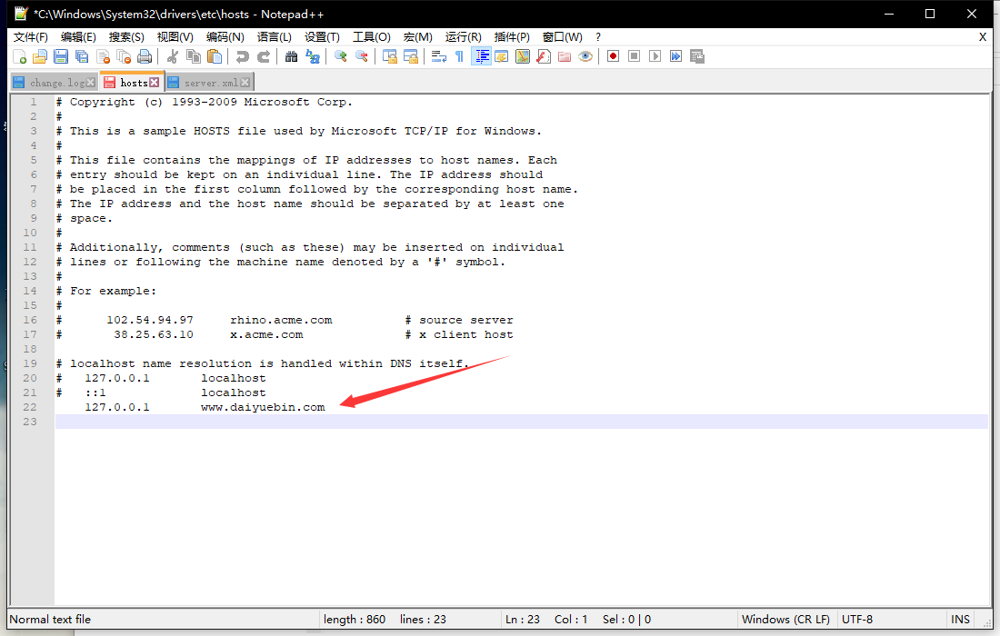

然后在配置文件修改域名

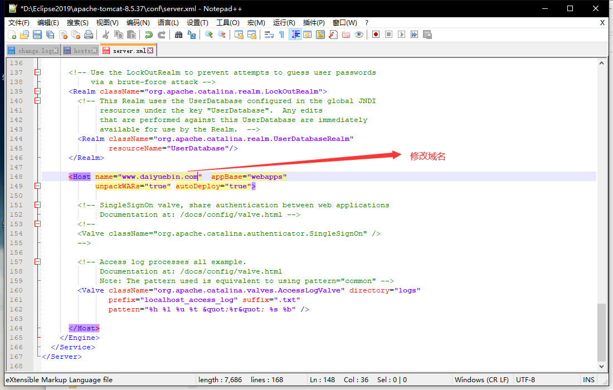

##### 高难度面试题

网站时如何进行访问的?

1.输入一个域名点击回车

2.首先检查本机的C:\Windows\System32\drivers\etc\hosts配置文件下有没有域名的映射

有：直接返回对应的ip地址，在这个地址中，有我们要访问的web程序

没有：去DNS服务器上去找，找到就直接返回，找不到就返回找不到

DNS服务器：全世界的域名都在这里管理

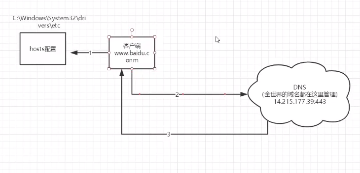

##### 3.3发布一个web网站

不会就先模仿

- 将自己写的网站，放到服务器（Tomcat）中的指定的web应用文件夹(webapps)下，然后就可以进行访问了

  ```java
  --webapps:Tomcat服务器的web目录
      -ROOT
      -dybweb：网站的目录名
      	-WEB-INF
      		-classes:java程序
              -lib:web应用所依赖的jar包
              -web.xml网站配置文件
          -index.html默认的首页
          -static
               -css
                  -style.css
               -js
               -img
           -....
  ```

  

