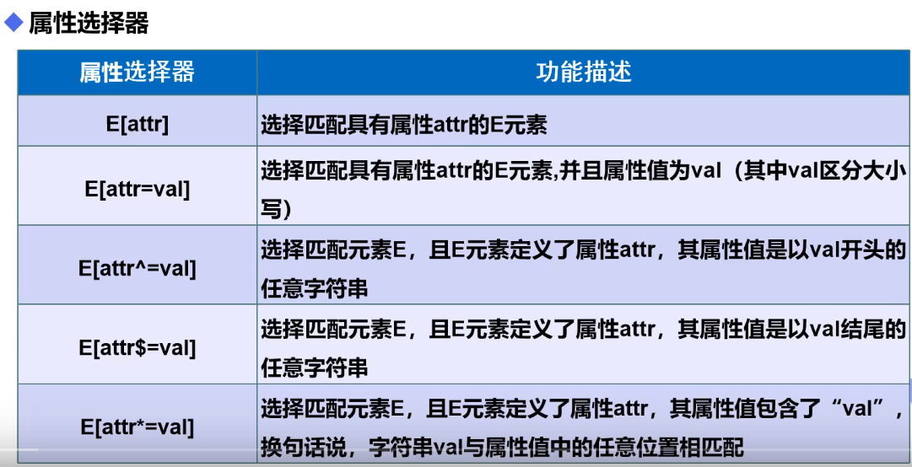
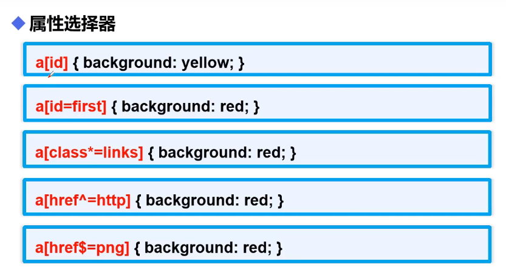

# css学习

### 1.什么是css


### 2.导入css的方式

1.内部样式表   *style标签*

2.链接外部样式  *link标签*

3.导入式  *style标签**@impotr url();* 

4.行内样式 ：*在标签内部添加style熟悉 style=“ color：red；...”*

```html
<!DOCTYPE html>
<html lang="en">
<head>
    <meta charset="UTF-8">
    <title>2.css的导入方式</title>
    <!--内部样式表-->
    <style type="text/css">
        h1{
            color: #7e86ff;
            font-size: 30px;
        }
    </style>
    <!--链接外部样式-->
    <link rel="stylesheet" href="../resource/css/style.css" type="text/css">
    <!--导入式-->
    <style>
        /*@import url(../resource/css/style.css);*/
    </style>
</head>
<body>
    <!--行内样式-->
    <h1>hello,戴粤斌</h1>
    <h2>hello,css</h2>
    <h3 style="color: red;font-size: small">hello,vue</h3>
</body>

```


### 3.基本选择器

1.标签选择器：通过标签选择

2.类选择器：通过在标签里面加class=“name”属性，.name可以选中这一类进行css样式的设置

3.id选择器：全场唯一，和class的通过名字选择这一类不同

**基本选择器优先级**

id选择器>类选择器>标签选择器

```html
<!DOCTYPE html>
<html lang="en">
<head>
    <meta charset="UTF-8">
    <title>3.基本选择器</title>
    <style type="text/css">
    .a{
        color: red;
        font-size:x-large;
    }
    #id{
        color: #7e86ff;
        font-size: xx-large;
    }
    </style>
</head>
<body>
<!--标签选择器-->
<h1 style="color:#6c4297; font-size: large;">标签选择器</h1>
<!--类选择器-->
<P class="a">类选择器</P>
<a class="a">类选择器</a>
<div class="a">类选择器</div>
<span class="a">类选择器</span>
<!--id 选择器:全局唯一-->
<h2 id="id">id选择器</h2>
</body>
</html>
```

### 4.高级选择器

##### 4.1层次选择器

body p{background：pink；}选择body里的所有p标签

4.2子选择器：只选择子元素

4.3相邻兄弟选择器：选择相邻的元素

4.4通用兄弟选择器：选择除了它后边的兄弟元素



