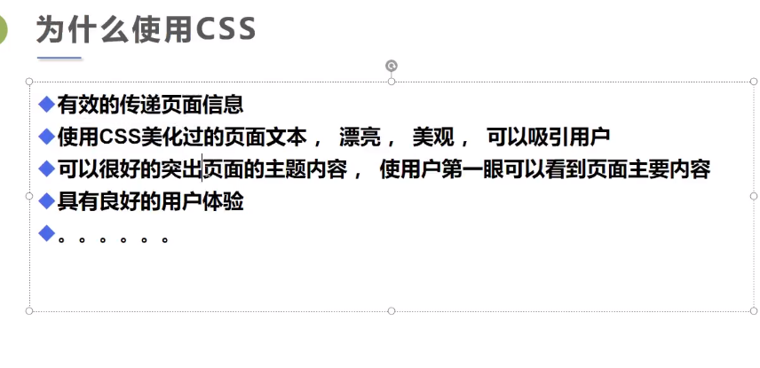
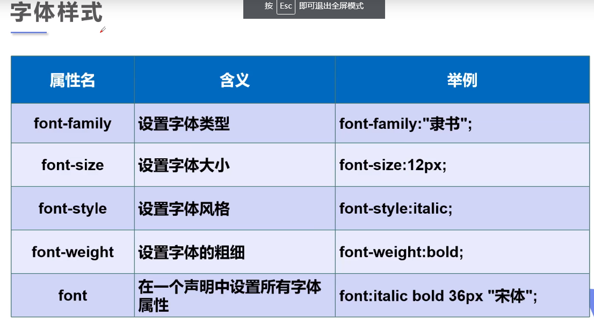
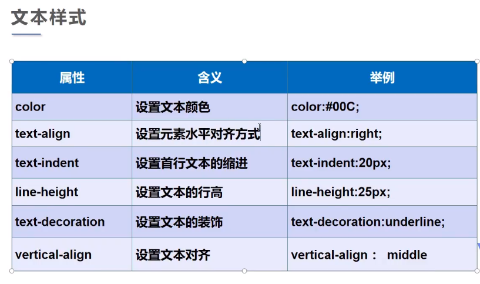
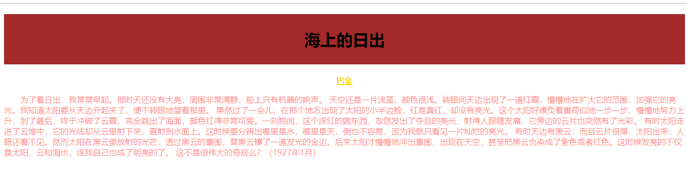

# css学习

### 1.什么是css


### 2.导入css的方式

1.内部样式表   *style标签*

2.链接外部样式  *link标签*

3.导入式  *style标签**@impotr url();* 

4.行内样式 ：*在标签内部添加style熟悉 style=“ color：red；...”*

```html
<!DOCTYPE html>
<html lang="en">
<head>
    <meta charset="UTF-8">
    <title>2.css的导入方式</title>
    <!--内部样式表-->
    <style type="text/css">
        h1{
            color: #7e86ff;
            font-size: 30px;
        }
    </style>
    <!--链接外部样式-->
    <link rel="stylesheet" href="../resource/css/style.css" type="text/css">
    <!--导入式-->
    <style>
        /*@import url(../resource/css/style.css);*/
    </style>
</head>
<body>
    <!--行内样式-->
    <h1>hello,戴粤斌</h1>
    <h2>hello,css</h2>
    <h3 style="color: red;font-size: small">hello,vue</h3>
</body>

```


### 3.基本选择器

1.标签选择器：通过标签选择

2.类选择器：通过在标签里面加class=“name”属性，.name可以选中这一类进行css样式的设置

3.id选择器：全场唯一，和class的通过名字选择这一类不同

**基本选择器优先级**

id选择器>类选择器>标签选择器

```html
<!DOCTYPE html>
<html lang="en">
<head>
    <meta charset="UTF-8">
    <title>3.基本选择器</title>
    <style type="text/css">
    .a{
        color: red;
        font-size:x-large;
    }
    #id{
        color: #7e86ff;
        font-size: xx-large;
    }
    </style>
</head>
<body>
<!--标签选择器-->
<h1 style="color:#6c4297; font-size: large;">标签选择器</h1>
<!--类选择器-->
<P class="a">类选择器</P>
<a class="a">类选择器</a>
<div class="a">类选择器</div>
<span class="a">类选择器</span>
<!--id 选择器:全局唯一-->
<h2 id="id">id选择器</h2>
</body>
</html>
```

### 4.高级选择器

##### 4.1层次选择器

body p{background：pink；}选择body里的所有p标签

4.2子选择器：只选择子元素

4.3相邻兄弟选择器：选择相邻的元素

4.4通用兄弟选择器：选择除了它后边的兄弟元素


##### 5.span标签



span标签：行内元素，对于有些要凸显的文字，我们用span标签进行渲染

```html
<!DOCTYPE html>
<html lang="en">
<head>
    <meta charset="UTF-8">
    <title>span标签</title>
    <style>
        #first{
            font-size: 50px;
            color: #7e86ff;
            font-width: bold;
        }
        .second{
            font-size: 50px;
            color: red;
            font-weight: bold;
        }
        .f span{
            font-size: 60px;
            color: #7e86ff;
            font-weight: bold;
        }
    </style>
</head>
<body>
<p>溪水急著要<span id="first">流向海洋</span>,浪潮却渴望重回土地  </p>
<p>在绿树白花的篱前,曾那样轻易地<span class="second">挥手道别</span></p>
<p class="f">而沧桑了二十年後,我们的魂魄却<span class="s">夜夜归来</span>微风拂过时,便化作满园的郁香</p>
</body>
</html>
```

##### 6.字体样式



```html
<!DOCTYPE html>
<html lang="en">
<head>
    <meta charset="UTF-8">
    <title>Title</title>
    <link rel="stylesheet" href="../resource/css/style2.css" type="text/css">
</head>
<body>
<h1 id="title">海上的日出</h1>
<p id="writer">巴金</p>
<p class="part1">
    <span>为了看日出</span>，我常常早起。那时天还没有大亮，周围非常清静，船上只有机器的响声。
    天空还是一片浅蓝，颜色很浅。转眼间天边出现了一道红霞，慢慢地在扩大它的范围，加强它的亮光。我知道太阳要从天边升起来了，便不转眼地望着那里。
    果然过了一会儿，在那个地方出现了太阳的小半边脸，红是真红，却没有亮光。这个太阳好像负着重荷似地一步一步、慢慢地努力上升，到了最后，终于冲破了云霞，完全跳出了海面，颜色红得非常可爱。一刹那间，这个深红的圆东西，忽然发出了夺目的亮光，射得人眼睛发痛，它旁边的云片也突然有了光彩。
    有时太阳走进了云堆中，它的光线却从云里射下来，直射到水面上。这时候要分辨出哪里是水，哪里是天，倒也不容易，因为我就只看见一片灿烂的亮光。
    有时天边有黑云，而且云片很厚，太阳出来，人眼还看不见。然而太阳在黑云里放射的光芒，透过黑云的重围，替黑云镶了一道发光的金边。后来太阳才慢慢地冲出重围，出现在天空，甚至把黑云也染成了紫色或者红色。这时候发亮的不仅是太阳、云和海水，连我自己也成了明亮的了。
    这不是很伟大的奇观么？（1927年1月）</p>
</body>

```


font开头的样式都是字体样式

```html
body{
    /*设置字体样式*/
    font-family: 华文楷体;
}
#title{
    font-size: 50px;
    color: aqua;
    font-weight: bold;

}
#writer{
    font-size: 30px;
    color:gold;
    font-weight: bold;
}

.part1{
    /*font： 字体风格-粗细-大小-字体类型*/
    font: italic lighter 20px "宋体";
}
.part1 span{
    font-style: italic;
    color: gold;
}
```


##### 7.文本样式

text开头的为文本样式




```HTML
.indent{
    /*文本缩进*/
    text-indent: 2em;
}
#col{
    /*rgb:0~255
    color: rgb(255,0,0);
    rgba:0~!   a代表透明度
    color: rgba(255,0,0,0.5);
    */
    color: rgba(255,0,0,0.5);
}
h1{
    /*设置文本对齐方式*/
    /*文本居中*/
    text-align: center;
    /*文本背景*/
    background: brown;
    /*文本高度*/
    height: 100px;
    /*行高*/
    line-height: 100px;

}
.p1{
    text-align: center;
    /*文本装饰*/
    text-decoration: underline;
    color: gold;
    font-weight: bold;
}
```

```HTML
<!DOCTYPE html>
<html lang="en">
<head>
    <meta charset="UTF-8">
    <title>Title</title>
    <link rel="stylesheet" href="../resource/css/style3.css">
</head>
<body>
<h1 >海上的日出</h1>
<p  class="p1">巴金</p>
<p class="indent" id="col">
    为了看日出，我常常早起。那时天还没有大亮，周围非常清静，船上只有机器的响声。
    天空还是一片浅蓝，颜色很浅。转眼间天边出现了一道红霞，慢慢地在扩大它的范围，加强它的亮光。我知道太阳要从天边升起来了，便不转眼地望着那里。
    果然过了一会儿，在那个地方出现了太阳的小半边脸，红是真红，却没有亮光。这个太阳好像负着重荷似地一步一步、慢慢地努力上升，到了最后，终于冲破了云霞，完全跳出了海面，颜色红得非常可爱。一刹那间，这个深红的圆东西，忽然发出了夺目的亮光，射得人眼睛发痛，它旁边的云片也突然有了光彩。
    有时太阳走进了云堆中，它的光线却从云里射下来，直射到水面上。这时候要分辨出哪里是水，哪里是天，倒也不容易，因为我就只看见一片灿烂的亮光。
    有时天边有黑云，而且云片很厚，太阳出来，人眼还看不见。然而太阳在黑云里放射的光芒，透过黑云的重围，替黑云镶了一道发光的金边。后来太阳才慢慢地冲出重围，出现在天空，甚至把黑云也染成了紫色或者红色。这时候发亮的不仅是太阳、云和海水，连我自己也成了明亮的了。
    这不是很伟大的奇观么？（1927年1月）</p>
</body>
</html>
```



##### 